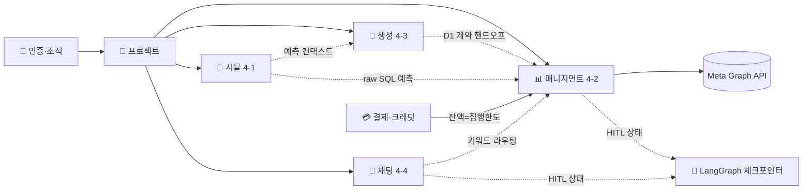
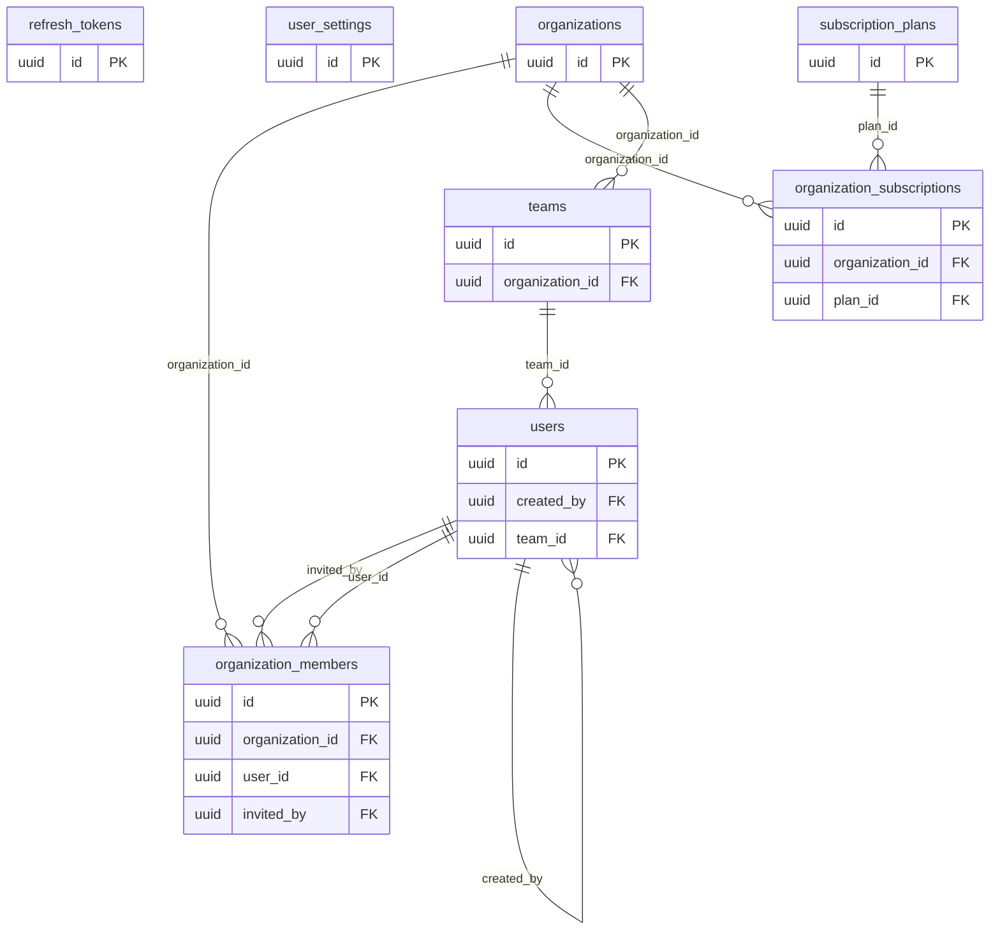
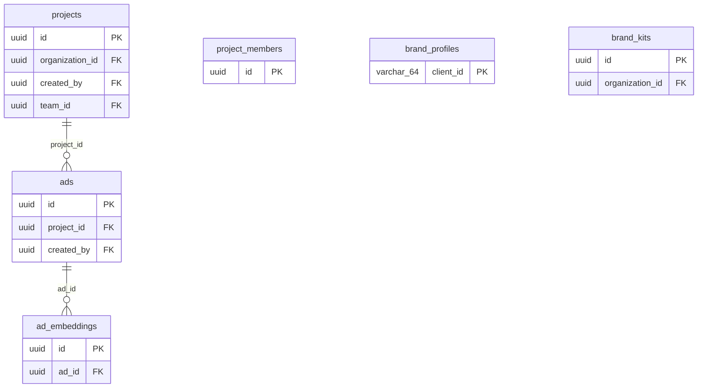
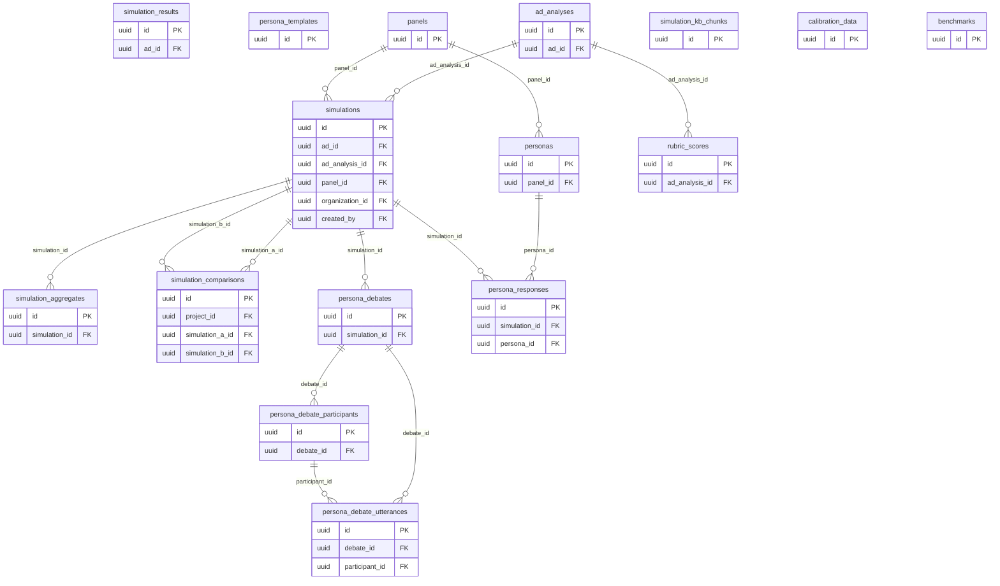
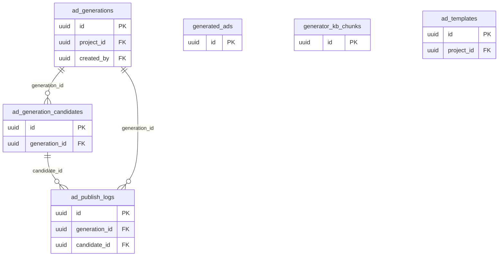
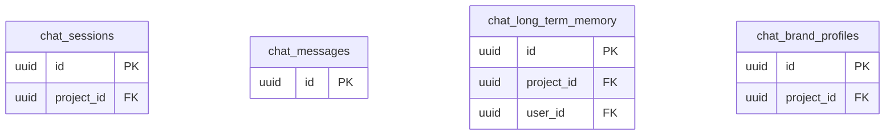
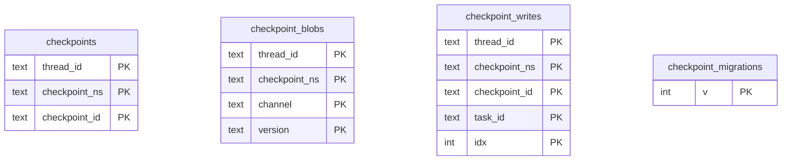
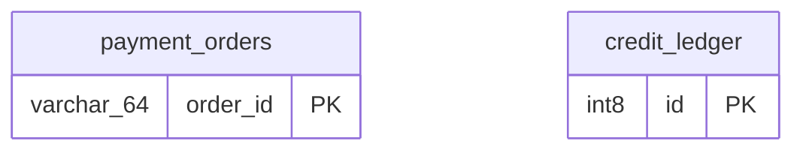
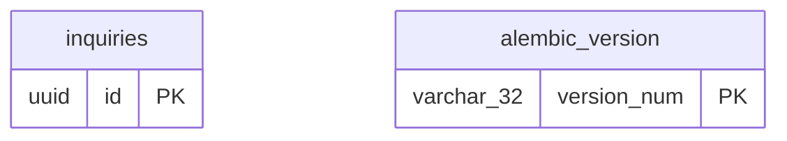

# ClickMe DB ERD (실 DB 기준)

> 개인 NeonDB(공용 DB 복제본)를 직접 introspection해 자동 생성. 레포의 `docs/db-schema.md`보다 최신이며 실제 운영 스키마와 일치한다.
>
> 레포 마이그레이션 현행 head는 `0004_generator_kb_search_vector`(`0001_baseline` squash 체인, 구 3자리 리비전 제거됨). 이 스냅샷은 운영 DB에서 뜬 것으로, 라이브러리 관리 테이블(LangGraph 체크포인터 등)까지 포함해 마이그레이션이 만드는 테이블보다 많다.

- **총 테이블** 70개 · **FK 관계** 56개 · **Enum 타입** 10종

## 읽는 법

- 각 도메인마다 **Mermaid ERD**(엔티티 = 테이블, `PK`=기본키, `FK`=외래키)와 **컬럼 표**가 있다.

- ERD에는 가독성을 위해 **PK·FK 컬럼만** 그렸다. 전체 컬럼은 아래 표 참고.

- `||--o{` 는 1:N 관계(부모 → 자식). 도메인을 가로지르는 FK는 마지막 **도메인 간 연결**에 모았다.

- 행수 0인 테이블은 표에 `(비어있음)`으로 표시 — 스키마는 있으나 아직 미사용일 수 있다.

## 도메인 한눈에

| 도메인 | 테이블 수 | 핵심 역할 |
|---|---|---|
| 🔐 인증 · 조직 · 플랜 | 8 | 사용자 계정과 조직(=결제 단위), 팀, 플랜/구독. JWT 인증의 주체와 권한 위계(ADMIN/COMPANY/USER)가 여기서 나온다. |
| 📁 프로젝트 · 콘텐츠 | 6 | 캠페인 단위인 프로젝트와 그 협업 멤버, 광고 소재(ads)와 임베딩, 브랜드 프로필/킷. 시뮬·생성·매니지먼트가 모두 이 위에 붙는다. |
| 🧪 시뮬레이션 (4-1) | 16 | 집행 전 AI 가상 소비자 반응 예측. 페르소나 패널 → 반응(persona_responses) → 가중 집계(simulation_aggregates) → 4대 KPI. 토론(debate)·루브릭·광고해석 포함. |
| 🎨 광고 생성 (4-3) | 6 | 예측을 반영해 개선 시안 생성. 생성 작업(ad_generations) → 후보들(ad_generation_candidates) → 선택·게시(ad_publish_logs). |
| 📊 광고 매니지먼트 (4-2) | 22 | 집행·성과 관리. 감지(diagnoses)→제안(action_proposals)→승인(approvals)→집행(execution_runs)의 단일 지출 경로 + 멱등·감사. Meta 연동·캠페인·에스컬레이션·어시스턴트 KB. |
| 💬 채팅 어시스턴트 (4-4) | 4 | 사용자 자유질문 채팅. 세션·메시지·장기기억·브랜드 프로필. (매니지먼트 어시스턴트 전용 대화는 management_chat_* 참고.) |
| 🧩 LangGraph 체크포인터 | 4 | LangGraph 그래프 실행 상태 저장(HITL interrupt 재개용). 앱이 직접 쓰지 않고 LangGraph 라이브러리가 관리한다. |
| 💳 결제 · 크레딧 | 2 | 토스페이먼츠(테스트 키) 충전 주문과 append-only 크레딧 원장. 잔액(delta 합)이 곧 매니지먼트 광고 집행 한도. |
| 🗂 기타 | 2 | 문의 등 분류 외 테이블. |

## 전체 지도 — 도메인 간 데이터 흐름

## 🔐 인증 · 조직 · 플랜

사용자 계정과 조직(=결제 단위), 팀, 플랜/구독. JWT 인증의 주체와 권한 위계(ADMIN/COMPANY/USER)가 여기서 나온다.

### `users` · 11행
사용자 계정. role(ADMIN/COMPANY/USER), status(`ACTIVE`|`PENDING`|`INACTIVE`), must_change_password. admin 소프트삭제 시 `INACTIVE`(+ Cognito disable)로 두고 데이터는 보존, auth 미들웨어가 `status != ACTIVE`면 401 차단.

| 컬럼 | 타입 | NULL | 키 | 기본값 |
|---|---|---|---|---|
| id | uuid | NOT NULL | PK |  |
| login_id | varchar(255) | NOT NULL |  |  |
| password_hash | varchar(255) | NOT NULL |  |  |
| name | varchar(100) | NOT NULL |  |  |
| role | varchar(20) | NOT NULL |  |  |
| status | varchar(20) | NOT NULL |  | 'ACTIVE'::character varying |
| created_by | uuid |  | FK→users.id |  |
| last_login_at | timestamp |  |  |  |
| created_at | timestamp | NOT NULL |  | now() |
| updated_at | timestamp | NOT NULL |  | now() |
| must_change_password | bool | NOT NULL |  | false |
| team_id | uuid |  | FK→teams.id |  |
| phone_num | varchar(30) |  |  |  |
| user_email | varchar(255) |  |  |  |

### `refresh_tokens` · `(비어있음)`
JWT 리프레시 토큰.

| 컬럼 | 타입 | NULL | 키 | 기본값 |
|---|---|---|---|---|
| user_id | uuid | NOT NULL |  |  |
| token_hash | varchar(255) | NOT NULL |  |  |
| expires_at | timestamptz | NOT NULL |  |  |
| revoked | bool | NOT NULL |  |  |
| created_at | timestamptz | NOT NULL |  | now() |
| id | uuid | NOT NULL | PK | gen_random_uuid() |

### `user_settings` · `(비어있음)`

| 컬럼 | 타입 | NULL | 키 | 기본값 |
|---|---|---|---|---|
| user_id | uuid | NOT NULL |  |  |
| theme | varchar(10) | NOT NULL |  |  |
| notifications | jsonb | NOT NULL |  |  |
| id | uuid | NOT NULL | PK | gen_random_uuid() |
| created_at | timestamptz | NOT NULL |  | now() |
| updated_at | timestamptz | NOT NULL |  | now() |

### `organizations` · 5행
조직 = 결제/플랜 단위. plan(free|professional|enterprise), status(`ACTIVE`|`INACTIVE`). admin 소프트삭제 시 조직·소속 유저를 함께 `INACTIVE`로 두고, 복원 시 `ACTIVE`, 영구삭제(purge) 시에만 실제 행 삭제.

| 컬럼 | 타입 | NULL | 키 | 기본값 |
|---|---|---|---|---|
| id | uuid | NOT NULL | PK |  |
| name | varchar(255) | NOT NULL |  |  |
| slug | varchar(100) | NOT NULL |  |  |
| status | varchar(20) | NOT NULL |  | 'ACTIVE'::character varying |
| created_at | timestamp | NOT NULL |  | now() |
| updated_at | timestamp | NOT NULL |  | now() |
| plan | varchar(50) |  |  | 'free'::character varying |
| default_landing_url | varchar(2048) |  |  |  |

### `organization_members` · 10행
조직-사용자 N:M 멤버십.

| 컬럼 | 타입 | NULL | 키 | 기본값 |
|---|---|---|---|---|
| id | uuid | NOT NULL | PK |  |
| organization_id | uuid | NOT NULL | FK→organizations.id |  |
| user_id | uuid | NOT NULL | FK→users.id |  |
| role | varchar(20) | NOT NULL |  |  |
| invited_by | uuid |  | FK→users.id |  |
| status | varchar(20) | NOT NULL |  | 'PENDING'::character varying |
| joined_at | timestamp |  |  |  |
| created_at | timestamp | NOT NULL |  | now() |

### `teams` · 5행
조직 내 팀(프로젝트 협업 단위).

| 컬럼 | 타입 | NULL | 키 | 기본값 |
|---|---|---|---|---|
| id | uuid | NOT NULL | PK | gen_random_uuid() |
| organization_id | uuid | NOT NULL | FK→organizations.id |  |
| name | varchar(100) | NOT NULL |  |  |
| created_at | timestamp | NOT NULL |  | now() |

### `organization_subscriptions` · `(비어있음)`
조직별 구독 상태.

| 컬럼 | 타입 | NULL | 키 | 기본값 |
|---|---|---|---|---|
| id | uuid | NOT NULL | PK |  |
| organization_id | uuid | NOT NULL | FK→organizations.id |  |
| plan_id | uuid | NOT NULL | FK→subscription_plans.id |  |
| status | varchar(20) | NOT NULL |  |  |
| started_at | timestamp | NOT NULL |  |  |
| expires_at | timestamp |  |  |  |
| created_at | timestamp | NOT NULL |  | now() |

### `subscription_plans` · `(비어있음)`
플랜 정의(마스터).

| 컬럼 | 타입 | NULL | 키 | 기본값 |
|---|---|---|---|---|
| id | uuid | NOT NULL | PK |  |
| plan_type | varchar(20) | NOT NULL |  |  |
| name | varchar(100) | NOT NULL |  |  |
| simulation_limit | int | NOT NULL |  |  |
| price_monthly | numeric | NOT NULL |  | 0 |
| price_yearly | numeric | NOT NULL |  | 0 |
| features | jsonb | NOT NULL |  |  |
| is_active | bool | NOT NULL |  | true |
| created_at | timestamp | NOT NULL |  | now() |

## 📁 프로젝트 · 콘텐츠

캠페인 단위인 프로젝트와 그 협업 멤버, 광고 소재(ads)와 임베딩, 브랜드 프로필/킷. 시뮬·생성·매니지먼트가 모두 이 위에 붙는다.

### `projects` · 9행
캠페인 단위. 시안+매니지먼트가 묶이는 루트. organization_id로 소유.

| 컬럼 | 타입 | NULL | 키 | 기본값 |
|---|---|---|---|---|
| id | uuid | NOT NULL | PK |  |
| organization_id | uuid | NOT NULL | FK→organizations.id |  |
| name | varchar(255) | NOT NULL |  |  |
| description | text |  |  |  |
| status | varchar(20) | NOT NULL |  | 'ACTIVE'::character varying |
| created_by | uuid | NOT NULL | FK→users.id |  |
| created_at | timestamp | NOT NULL |  | now() |
| updated_at | timestamp | NOT NULL |  | now() |
| deleted_at | timestamp |  |  |  |
| team_id | uuid |  | FK→teams.id |  |

### `project_members` · `(비어있음)`
프로젝트 협업 멤버(viewer/editor/owner).

| 컬럼 | 타입 | NULL | 키 | 기본값 |
|---|---|---|---|---|
| project_id | uuid | NOT NULL |  |  |
| user_id | uuid | NOT NULL |  |  |
| role | project_member_role | NOT NULL |  |  |
| joined_at | timestamptz | NOT NULL |  | now() |
| id | uuid | NOT NULL | PK | gen_random_uuid() |

### `ads` · 19행
광고 소재(카피+이미지). 시뮬·생성의 입출력 대상.

| 컬럼 | 타입 | NULL | 키 | 기본값 |
|---|---|---|---|---|
| id | uuid | NOT NULL | PK |  |
| project_id | uuid | NOT NULL | FK→projects.id |  |
| title | varchar(255) | NOT NULL |  |  |
| media_type | varchar(20) | NOT NULL |  |  |
| asset_url | varchar(500) |  |  |  |
| copy_text | text |  |  |  |
| industry_category | varchar(100) |  |  |  |
| product_category | varchar(100) |  |  |  |
| ad_objective | varchar(50) |  |  |  |
| target_filter | jsonb |  |  |  |
| status | varchar(20) | NOT NULL |  | 'DRAFT'::character varying |
| created_by | uuid |  | FK→users.id |  |
| created_at | timestamp | NOT NULL |  | now() |
| updated_at | timestamp | NOT NULL |  | now() |

### `ad_embeddings` · `(비어있음)`
광고 임베딩 vector(1536) — 유사도/검색.

| 컬럼 | 타입 | NULL | 키 | 기본값 |
|---|---|---|---|---|
| id | uuid | NOT NULL | PK | gen_random_uuid() |
| ad_id | uuid | NOT NULL | FK→ads.id |  |
| content | text |  |  |  |
| embedding | vector |  |  |  |
| created_at | timestamp |  |  | now() |

### `brand_profiles` · 5행
브랜드 프로필(생성 시 톤/제약).

| 컬럼 | 타입 | NULL | 키 | 기본값 |
|---|---|---|---|---|
| client_id | varchar(64) | NOT NULL | PK |  |
| brand_color | varchar(20) |  |  |  |
| brand_logo_key | varchar(512) |  |  |  |
| tone_and_manner | text |  |  |  |
| created_at | timestamptz | NOT NULL |  | now() |
| updated_at | timestamptz | NOT NULL |  | now() |

### `brand_kits` · 3행
브랜드 자산 모음(로고/색).

| 컬럼 | 타입 | NULL | 키 | 기본값 |
|---|---|---|---|---|
| id | uuid | NOT NULL | PK | gen_random_uuid() |
| organization_id | uuid | NOT NULL | FK→organizations.id |  |
| name | varchar(100) | NOT NULL |  |  |
| brand_color | varchar(20) |  |  |  |
| brand_logo_key | varchar(512) |  |  |  |
| tone_and_manner | text |  |  |  |
| created_by | uuid |  |  |  |
| created_at | timestamptz | NOT NULL |  | now() |
| updated_at | timestamptz | NOT NULL |  | now() |

## 🧪 시뮬레이션 (4-1)

집행 전 AI 가상 소비자 반응 예측. 페르소나 패널 → 반응(persona_responses) → 가중 집계(simulation_aggregates) → 4대 KPI. 토론(debate)·루브릭·광고해석 포함.

### `simulations` · 25행
시뮬 실행 1건(상태·요청). ⚠ 별도 SimBase metadata.

| 컬럼 | 타입 | NULL | 키 | 기본값 |
|---|---|---|---|---|
| id | uuid | NOT NULL | PK |  |
| ad_id | uuid | NOT NULL | FK→ads.id |  |
| ad_analysis_id | uuid | NOT NULL | FK→ad_analyses.id |  |
| panel_id | uuid |  | FK→panels.id |  |
| organization_id | uuid | NOT NULL | FK→organizations.id |  |
| target_filter | jsonb |  |  |  |
| target_mode | varchar(10) | NOT NULL |  | 'AUTO'::character varying |
| sample_size | int | NOT NULL |  |  |
| qa_passed_count | int |  |  |  |
| low_sample_warning | bool | NOT NULL |  | false |
| status | varchar(20) | NOT NULL |  | 'QUEUED'::character varying |
| model_version | varchar(50) | NOT NULL |  | 'gpt-4o-mini'::character varying |
| error_detail | jsonb |  |  |  |
| created_by | uuid |  | FK→users.id |  |
| started_at | timestamp |  |  |  |
| completed_at | timestamp |  |  |  |
| created_at | timestamp | NOT NULL |  | now() |
| deleted_at | timestamp |  |  |  |

### `simulation_aggregates` · 22행
시뮬 4대 KPI 가중 집계 결과(분포·CI).

| 컬럼 | 타입 | NULL | 키 | 기본값 |
|---|---|---|---|---|
| id | uuid | NOT NULL | PK |  |
| simulation_id | uuid | NOT NULL | FK→simulations.id |  |
| click_intent_rate | numeric | NOT NULL |  |  |
| ci_low | numeric | NOT NULL |  |  |
| ci_high | numeric | NOT NULL |  |  |
| purchase_intent_avg | numeric | NOT NULL |  |  |
| trust_avg | numeric | NOT NULL |  |  |
| rejection_rate | numeric | NOT NULL |  |  |
| variance_warning | bool | NOT NULL |  | false |
| payload | jsonb | NOT NULL |  |  |
| engine_version | varchar(50) | NOT NULL |  |  |
| created_at | timestamp | NOT NULL |  | now() |
| effective_n | numeric | NOT NULL |  | 0.0 |
| brand_recognition_rate | numeric | NOT NULL |  | 0.0 |

### `simulation_results` · `(비어있음)`

| 컬럼 | 타입 | NULL | 키 | 기본값 |
|---|---|---|---|---|
| id | uuid | NOT NULL | PK | gen_random_uuid() |
| ad_id | uuid | NOT NULL | FK→ads.id |  |
| persona_count | int |  |  |  |
| distribution | jsonb |  |  |  |
| personas | jsonb |  |  |  |
| created_at | timestamp |  |  | now() |

### `simulation_comparisons` · `(비어있음)`

| 컬럼 | 타입 | NULL | 키 | 기본값 |
|---|---|---|---|---|
| id | uuid | NOT NULL | PK |  |
| project_id | uuid | NOT NULL | FK→projects.id |  |
| simulation_a_id | uuid | NOT NULL | FK→simulations.id |  |
| simulation_b_id | uuid | NOT NULL | FK→simulations.id |  |
| result | jsonb |  |  |  |
| created_at | timestamp | NOT NULL |  | now() |

### `personas` · 51행
샘플링된 가상 소비자(OCEAN·인구속성).

| 컬럼 | 타입 | NULL | 키 | 기본값 |
|---|---|---|---|---|
| id | uuid | NOT NULL | PK |  |
| panel_id | uuid | NOT NULL | FK→panels.id |  |
| age | int | NOT NULL |  |  |
| gender | varchar(10) | NOT NULL |  |  |
| region | varchar(50) | NOT NULL |  |  |
| ocean | jsonb | NOT NULL |  |  |
| media_behavior | jsonb | NOT NULL |  |  |
| consumption_values | jsonb | NOT NULL |  |  |
| profile_narrative | text | NOT NULL |  |  |
| created_at | timestamp | NOT NULL |  | now() |
| socioeconomic | jsonb | NOT NULL |  | '{}'::jsonb |

### `persona_templates` · `(비어있음)`

| 컬럼 | 타입 | NULL | 키 | 기본값 |
|---|---|---|---|---|
| name | varchar(100) |  |  |  |
| cluster_id | varchar(50) |  |  |  |
| attributes | jsonb | NOT NULL |  |  |
| embedding | vector |  |  |  |
| is_public | bool | NOT NULL |  |  |
| id | uuid | NOT NULL | PK | gen_random_uuid() |
| created_at | timestamptz | NOT NULL |  | now() |

### `panels` · 2행
고정 페르소나 패널 캐시.

| 컬럼 | 타입 | NULL | 키 | 기본값 |
|---|---|---|---|---|
| id | uuid | NOT NULL | PK |  |
| version | varchar(20) | NOT NULL |  |  |
| size | int | NOT NULL |  |  |
| seed | varchar(50) | NOT NULL |  |  |
| model_version | varchar(50) | NOT NULL |  |  |
| grounding_meta | jsonb | NOT NULL |  |  |
| status | varchar(20) | NOT NULL |  | 'BUILDING'::character varying |
| built_at | timestamp |  |  |  |
| created_at | timestamp | NOT NULL |  | now() |

### `persona_debates` · 21행
토론 세션(시뮬 보강).

| 컬럼 | 타입 | NULL | 키 | 기본값 |
|---|---|---|---|---|
| id | uuid | NOT NULL | PK | gen_random_uuid() |
| simulation_id | uuid | NOT NULL | FK→simulations.id |  |
| topic | text |  |  |  |
| rounds_run | int |  |  |  |
| stop_reason | varchar(20) |  |  |  |
| judge_model | varchar(50) |  |  |  |
| engines | jsonb |  |  |  |
| judge_log | jsonb |  |  |  |
| final | jsonb |  |  |  |
| status | varchar(20) | NOT NULL |  | 'PENDING'::character varying |
| created_at | timestamptz | NOT NULL |  | now() |

### `persona_debate_participants` · 145행
토론 참가 페르소나.

| 컬럼 | 타입 | NULL | 키 | 기본값 |
|---|---|---|---|---|
| id | uuid | NOT NULL | PK | gen_random_uuid() |
| debate_id | uuid | NOT NULL | FK→persona_debates.id |  |
| persona_id | varchar(50) | NOT NULL |  |  |
| persona_name | varchar(50) |  |  |  |
| persona_profile | text |  |  |  |
| role | varchar(20) |  |  |  |
| engine | varchar(20) |  |  |  |

### `persona_debate_utterances` · 500행
토론 발화 로그.

| 컬럼 | 타입 | NULL | 키 | 기본값 |
|---|---|---|---|---|
| id | uuid | NOT NULL | PK | gen_random_uuid() |
| debate_id | uuid | NOT NULL | FK→persona_debates.id |  |
| participant_id | uuid |  | FK→persona_debate_participants.id |  |
| round | int | NOT NULL |  |  |
| phase | varchar(10) |  |  |  |
| stance | varchar(10) |  |  |  |
| text | text |  |  |  |
| reason | text |  |  |  |
| lever | text |  |  |  |
| created_at | timestamptz | NOT NULL |  | now() |

### `persona_responses` · 581행
페르소나별 AISAS·KPI 반응(집계 입력).

| 컬럼 | 타입 | NULL | 키 | 기본값 |
|---|---|---|---|---|
| id | uuid | NOT NULL | PK |  |
| simulation_id | uuid | NOT NULL | FK→simulations.id |  |
| persona_id | uuid | NOT NULL | FK→personas.id |  |
| exposure_context | varchar(50) |  |  |  |
| aisas | jsonb | NOT NULL |  |  |
| drop_stage | varchar(20) |  |  |  |
| drop_reason_tag | varchar(50) |  |  |  |
| purchase_intent | int | NOT NULL |  |  |
| trust | int | NOT NULL |  |  |
| rejected | bool | NOT NULL |  | false |
| rejection_reason_tag | varchar(50) |  |  |  |
| emotion_tag | varchar(50) | NOT NULL |  |  |
| perceived_message | text |  |  |  |
| perceived_target | varchar(100) |  |  |  |
| utterance | text |  |  |  |
| qa_passed | bool | NOT NULL |  |  |
| qa_fail_reason | varchar(100) |  |  |  |
| created_at | timestamp | NOT NULL |  | now() |
| weight | numeric | NOT NULL |  | 1.0 |
| brand_recognized | bool | NOT NULL |  | false |
| perceived_brand | varchar(200) |  |  |  |

### `rubric_scores` · 65행
광고 의도정합 등 루브릭 채점.

| 컬럼 | 타입 | NULL | 키 | 기본값 |
|---|---|---|---|---|
| id | uuid | NOT NULL | PK |  |
| ad_analysis_id | uuid | NOT NULL | FK→ad_analyses.id |  |
| dimension | varchar(50) | NOT NULL |  |  |
| score | int | NOT NULL |  |  |
| evidence | jsonb | NOT NULL |  |  |
| created_at | timestamp | NOT NULL |  | now() |

### `ad_analyses` · 23행
광고 소재 VLM 분석 결과.

| 컬럼 | 타입 | NULL | 키 | 기본값 |
|---|---|---|---|---|
| id | uuid | NOT NULL | PK |  |
| ad_id | uuid | NOT NULL | FK→ads.id |  |
| structured_analysis | jsonb | NOT NULL |  |  |
| detected_industry | varchar(100) |  |  |  |
| detected_target | varchar(100) |  |  |  |
| detected_message | text |  |  |  |
| intent_mismatch | bool | NOT NULL |  | false |
| mismatch_detail | jsonb |  |  |  |
| model_version | varchar(50) | NOT NULL |  |  |
| created_at | timestamp | NOT NULL |  | now() |
| detected_objective | varchar(50) |  |  |  |

### `simulation_kb_chunks` · 6행

| 컬럼 | 타입 | NULL | 키 | 기본값 |
|---|---|---|---|---|
| id | uuid | NOT NULL | PK | gen_random_uuid() |
| source | varchar(128) | NOT NULL |  |  |
| title | varchar(256) | NOT NULL |  |  |
| chunk | text | NOT NULL |  |  |
| embedding | vector | NOT NULL |  |  |
| created_at | timestamp |  |  | now() |

### `calibration_data` · `(비어있음)`

| 컬럼 | 타입 | NULL | 키 | 기본값 |
|---|---|---|---|---|
| simulation_id | uuid |  |  |  |
| predicted_ctr_score | float8 |  |  |  |
| actual_ctr_percent | float8 |  |  |  |
| industry | varchar(50) |  |  |  |
| platform | varchar(50) |  |  |  |
| ad_format | varchar(30) |  |  |  |
| submitted_by | uuid |  |  |  |
| verified | bool | NOT NULL |  |  |
| id | uuid | NOT NULL | PK | gen_random_uuid() |
| created_at | timestamptz | NOT NULL |  | now() |

### `benchmarks` · `(비어있음)`

| 컬럼 | 타입 | NULL | 키 | 기본값 |
|---|---|---|---|---|
| id | uuid | NOT NULL | PK |  |
| industry | varchar(100) | NOT NULL |  |  |
| metric | varchar(50) | NOT NULL |  |  |
| value_low | numeric | NOT NULL |  |  |
| value_high | numeric | NOT NULL |  |  |
| unit | varchar(20) | NOT NULL |  |  |
| source_name | varchar(255) | NOT NULL |  |  |
| source_year | int | NOT NULL |  |  |
| created_at | timestamp | NOT NULL |  | now() |

## 🎨 광고 생성 (4-3)

예측을 반영해 개선 시안 생성. 생성 작업(ad_generations) → 후보들(ad_generation_candidates) → 선택·게시(ad_publish_logs).

### `ad_generations` · 140행
생성 작업 1건(create/improve).

| 컬럼 | 타입 | NULL | 키 | 기본값 |
|---|---|---|---|---|
| id | uuid | NOT NULL | PK | gen_random_uuid() |
| project_id | uuid |  | FK→projects.id |  |
| status | varchar(20) |  |  | 'pending'::character varying |
| input | jsonb |  |  |  |
| product_analysis | jsonb |  |  |  |
| strategies | jsonb |  |  |  |
| selected_candidate_id | uuid |  |  |  |
| error_message | text |  |  |  |
| created_at | timestamp |  |  | now() |
| updated_at | timestamp |  |  | now() |
| created_by | uuid |  | FK→users.id |  |
| deleted_at | timestamp |  |  |  |

### `ad_generation_candidates` · 289행
생성된 후보 시안(A/B/C).

| 컬럼 | 타입 | NULL | 키 | 기본값 |
|---|---|---|---|---|
| id | uuid | NOT NULL | PK | gen_random_uuid() |
| generation_id | uuid | NOT NULL | FK→ad_generations.id |  |
| idx | int2 |  |  |  |
| strategy | jsonb |  |  |  |
| template_id | varchar(10) |  |  |  |
| copy | jsonb |  |  |  |
| image_prompt | text |  |  |  |
| s3_key | varchar(512) |  |  |  |
| qa_result | jsonb |  |  |  |
| qa_passed | bool |  |  |  |
| explanation | jsonb |  |  |  |
| created_at | timestamp |  |  | now() |

### `ad_publish_logs` · 7행
후보 Instagram 게시 로그.

| 컬럼 | 타입 | NULL | 키 | 기본값 |
|---|---|---|---|---|
| id | uuid | NOT NULL | PK | gen_random_uuid() |
| generation_id | uuid |  | FK→ad_generations.id |  |
| candidate_id | uuid |  | FK→ad_generation_candidates.id |  |
| platform | varchar(20) |  |  | 'instagram'::character varying |
| status | varchar(20) |  |  |  |
| ig_container_id | varchar(100) |  |  |  |
| ig_media_id | varchar(100) |  |  |  |
| caption | text |  |  |  |
| request_payload | jsonb |  |  |  |
| response_payload | jsonb |  |  |  |
| error_message | text |  |  |  |
| created_at | timestamp |  |  | now() |

### `generated_ads` · `(비어있음)`

| 컬럼 | 타입 | NULL | 키 | 기본값 |
|---|---|---|---|---|
| project_id | uuid | NOT NULL |  |  |
| created_by | uuid | NOT NULL |  |  |
| prompt | text | NOT NULL |  |  |
| style | varchar(50) |  |  |  |
| aspect_ratio | varchar(10) | NOT NULL |  |  |
| status | ad_status | NOT NULL |  |  |
| image_url | text |  |  |  |
| storage_path | text |  |  |  |
| is_saved | bool | NOT NULL |  |  |
| saved_at | timestamptz |  |  |  |
| generation_model | varchar(50) |  |  |  |
| error_message | text |  |  |  |
| id | uuid | NOT NULL | PK | gen_random_uuid() |
| created_at | timestamptz | NOT NULL |  | now() |

### `generator_kb_chunks` · `(비어있음)`

| 컬럼 | 타입 | NULL | 키 | 기본값 |
|---|---|---|---|---|
| id | uuid | NOT NULL | PK | gen_random_uuid() |
| source | varchar(128) | NOT NULL |  |  |
| title | varchar(256) | NOT NULL |  |  |
| chunk | text | NOT NULL |  |  |
| embedding | vector | NOT NULL |  |  |
| created_at | timestamp |  |  | now() |

### `ad_templates` · `(비어있음)`

| 컬럼 | 타입 | NULL | 키 | 기본값 |
|---|---|---|---|---|
| id | uuid | NOT NULL | PK | gen_random_uuid() |
| project_id | uuid | NOT NULL | FK→projects.id |  |
| name | varchar(100) | NOT NULL |  |  |
| template_type | varchar(10) | NOT NULL |  |  |
| content | jsonb | NOT NULL |  |  |
| created_at | timestamptz | NOT NULL |  | now() |

## 📊 광고 매니지먼트 (4-2)

집행·성과 관리. 감지(diagnoses)→제안(action_proposals)→승인(approvals)→집행(execution_runs)의 단일 지출 경로 + 멱등·감사. Meta 연동·캠페인·에스컬레이션·어시스턴트 KB.

```mermaid
erDiagram
  action_proposals {
    uuid id PK
  }
  approvals {
    uuid id PK
  }
  diagnoses {
    uuid id PK
    uuid simulation_id FK
  }
  recommendations {
    uuid id PK
    uuid simulation_id FK
    uuid diagnosis_id FK
  }
  execution_runs {
    uuid id PK
  }
  idempotency_keys {
    varchar_80 key PK
  }
  audit_events {
    uuid id PK
  }
  audit_logs {
    uuid id PK
  }
  remediation_escalations {
    uuid id PK
  }
  created_campaigns {
    uuid id PK
  }
  campaign_kpi_overrides {
    uuid id PK
    uuid organization_id FK
    uuid updated_by FK
  }
  meta_connections {
    uuid id PK
    uuid organization_id FK
  }
  ad_campaign_logs {
    uuid id PK
    uuid generation_id FK
    uuid candidate_id FK
  }
  reports {
    uuid id PK
    uuid simulation_id FK
  }
  rag_chunks {
    varchar_100 chunk_id PK
  }
  management_kb_documents {
    uuid id PK
  }
  management_kb_chunks {
    uuid id PK
    uuid document_id FK
  }
  management_kb_eval_cases {
    uuid id PK
  }
  management_kb_feedback {
    uuid id PK
  }
  management_agent_runs {
    uuid id PK
    uuid session_id FK
  }
  management_chat_sessions {
    uuid id PK
  }
  management_chat_messages {
    uuid id PK
    uuid session_id FK
  }
  management_chat_sessions ||--o{ management_agent_runs : "session_id"
  management_chat_sessions ||--o{ management_chat_messages : "session_id"
  management_kb_documents ||--o{ management_kb_chunks : "document_id"
  diagnoses ||--o{ recommendations : "diagnosis_id"
```

### `action_proposals` · `(비어있음)`
매니지먼트 조치 제안(Tier·proposal_hash).

| 컬럼 | 타입 | NULL | 키 | 기본값 |
|---|---|---|---|---|
| id | uuid | NOT NULL | PK | gen_random_uuid() |
| proposal_id | varchar(64) | NOT NULL |  |  |
| tenant_id | varchar(64) | NOT NULL |  |  |
| ad_account_id | varchar(64) | NOT NULL |  |  |
| action_type | varchar(48) | NOT NULL |  |  |
| action_tier | int | NOT NULL |  |  |
| status | varchar(24) | NOT NULL |  |  |
| budget_before_krw | int8 | NOT NULL |  |  |
| budget_after_krw | int8 | NOT NULL |  |  |
| max_total_spend_krw | int8 | NOT NULL |  |  |
| expected_state_version | varchar(48) | NOT NULL |  |  |
| proposal_hash | varchar(64) | NOT NULL |  |  |
| approval_policy_version | varchar(16) | NOT NULL |  |  |
| expires_at | timestamptz | NOT NULL |  |  |
| payload | jsonb | NOT NULL |  |  |
| created_at | timestamptz | NOT NULL |  | now() |

### `approvals` · `(비어있음)`
제안 승인 기록(HITL).

| 컬럼 | 타입 | NULL | 키 | 기본값 |
|---|---|---|---|---|
| id | uuid | NOT NULL | PK | gen_random_uuid() |
| approval_id | varchar(64) | NOT NULL |  |  |
| proposal_id | varchar(64) | NOT NULL |  |  |
| proposal_hash | varchar(64) | NOT NULL |  |  |
| tenant_id | varchar(64) | NOT NULL |  |  |
| approver_id | varchar(64) | NOT NULL |  |  |
| action_tier | int | NOT NULL |  |  |
| approval_policy_version | varchar(16) | NOT NULL |  |  |
| expected_state_version | varchar(48) | NOT NULL |  |  |
| execution_mode | varchar(20) | NOT NULL |  |  |
| expires_at | timestamptz | NOT NULL |  |  |
| approved_at | timestamptz | NOT NULL |  | now() |

### `diagnoses` · `(비어있음)`
게재 이상 진단 결과.

| 컬럼 | 타입 | NULL | 키 | 기본값 |
|---|---|---|---|---|
| id | uuid | NOT NULL | PK |  |
| simulation_id | uuid | NOT NULL | FK→simulations.id |  |
| dimension | varchar(50) | NOT NULL |  |  |
| rubric_score | int | NOT NULL |  |  |
| benchmark_key | varchar(100) |  |  |  |
| diagnosis_text | text | NOT NULL |  |  |
| consensus_type | varchar(20) | NOT NULL |  |  |
| dissent_block | jsonb |  |  |  |
| evidence_refs | jsonb | NOT NULL |  |  |
| created_at | timestamp | NOT NULL |  | now() |

### `recommendations` · `(비어있음)`

| 컬럼 | 타입 | NULL | 키 | 기본값 |
|---|---|---|---|---|
| id | uuid | NOT NULL | PK |  |
| simulation_id | uuid | NOT NULL | FK→simulations.id |  |
| diagnosis_id | uuid | NOT NULL | FK→diagnoses.id |  |
| dimension | varchar(50) | NOT NULL |  |  |
| grade | varchar(20) | NOT NULL |  |  |
| priority | int | NOT NULL |  |  |
| recommendation_text | text | NOT NULL |  |  |
| diagnosis_evidence | jsonb | NOT NULL |  |  |
| prescription_evidence | jsonb |  |  |  |
| created_at | timestamp | NOT NULL |  | now() |

### `execution_runs` · `(비어있음)`
집행 실행 기록(단일 지출 경로).

| 컬럼 | 타입 | NULL | 키 | 기본값 |
|---|---|---|---|---|
| id | uuid | NOT NULL | PK | gen_random_uuid() |
| run_id | varchar(64) | NOT NULL |  |  |
| approval_id | varchar(64) | NOT NULL |  |  |
| proposal_id | varchar(64) | NOT NULL |  |  |
| status | varchar(24) | NOT NULL |  |  |
| result_status | varchar(24) |  |  |  |
| failure_reason | varchar(48) |  |  |  |
| platform_snapshot | jsonb | NOT NULL |  |  |
| executed_at | timestamptz | NOT NULL |  | now() |

### `idempotency_keys` · 12행
집행 멱등 키(중복 방지).

| 컬럼 | 타입 | NULL | 키 | 기본값 |
|---|---|---|---|---|
| key | varchar(80) | NOT NULL | PK |  |
| approval_id | varchar(64) | NOT NULL |  |  |
| claimed | bool | NOT NULL |  | true |
| created_at | timestamptz | NOT NULL |  | now() |
| result | jsonb |  |  |  |

### `audit_events` · 24행
감사 이벤트(집행/승인 추적).

| 컬럼 | 타입 | NULL | 키 | 기본값 |
|---|---|---|---|---|
| id | uuid | NOT NULL | PK | gen_random_uuid() |
| tenant_id | varchar(64) | NOT NULL |  |  |
| proposal_id | varchar(64) | NOT NULL |  |  |
| approval_id | varchar(64) |  |  |  |
| stage | varchar(24) |  |  |  |
| outcome | varchar(48) |  |  |  |
| detail | jsonb | NOT NULL |  |  |
| at | timestamptz | NOT NULL |  | now() |
| event_id | varchar(64) |  |  |  |
| category | varchar(64) |  |  |  |
| run_id | varchar(64) |  |  |  |

### `audit_logs` · `(비어있음)`

| 컬럼 | 타입 | NULL | 키 | 기본값 |
|---|---|---|---|---|
| user_id | uuid |  |  |  |
| action | varchar(100) | NOT NULL |  |  |
| resource | varchar(50) |  |  |  |
| resource_id | uuid |  |  |  |
| metadata | jsonb |  |  |  |
| ip_address | varchar(45) |  |  |  |
| id | uuid | NOT NULL | PK | gen_random_uuid() |
| created_at | timestamptz | NOT NULL |  | now() |

### `remediation_escalations` · `(비어있음)`
시간축 자동 에스컬레이션 상태.

| 컬럼 | 타입 | NULL | 키 | 기본값 |
|---|---|---|---|---|
| id | uuid | NOT NULL | PK | gen_random_uuid() |
| run_id | varchar(64) | NOT NULL |  |  |
| tenant_id | varchar(64) | NOT NULL |  |  |
| ad_account_id | varchar(64) | NOT NULL |  |  |
| campaign_id | varchar(64) | NOT NULL |  |  |
| anomaly_type | varchar(48) | NOT NULL |  |  |
| ladder | jsonb | NOT NULL |  |  |
| current_rung_index | int | NOT NULL |  | 0 |
| rung_status | varchar(16) | NOT NULL |  |  |
| rung_executed_at | timestamptz |  |  |  |
| last_proposal_id | varchar(64) |  |  |  |
| last_approval_id | varchar(64) |  |  |  |
| status | varchar(16) | NOT NULL |  |  |
| opened_at | timestamptz | NOT NULL |  | now() |
| last_evaluated_at | timestamptz |  |  |  |
| updated_at | timestamptz | NOT NULL |  | now() |

### `created_campaigns` · 63행
Meta에 생성된 캠페인 매핑.

| 컬럼 | 타입 | NULL | 키 | 기본값 |
|---|---|---|---|---|
| id | uuid | NOT NULL | PK | gen_random_uuid() |
| tenant_id | varchar(64) | NOT NULL |  |  |
| meta_campaign_id | varchar(64) |  |  |  |
| name | varchar(255) | NOT NULL |  |  |
| objective | varchar(20) | NOT NULL |  |  |
| ad_account_id | varchar(64) | NOT NULL |  |  |
| daily_budget_krw | int | NOT NULL |  |  |
| status | varchar(20) | NOT NULL |  |  |
| execution_mode | varchar(20) | NOT NULL |  |  |
| created_at | timestamptz | NOT NULL |  | now() |
| deleted_at | timestamptz |  |  |  |
| creative_ad_id | varchar(64) |  |  |  |

### `campaign_kpi_overrides` · 1행
캠페인 KPI 수동 입력(CVR/ROAS).

| 컬럼 | 타입 | NULL | 키 | 기본값 |
|---|---|---|---|---|
| id | uuid | NOT NULL | PK | gen_random_uuid() |
| organization_id | uuid | NOT NULL | FK→organizations.id |  |
| campaign_id | varchar(64) | NOT NULL |  |  |
| cvr | float8 |  |  |  |
| roas | float8 |  |  |  |
| updated_by | uuid |  | FK→users.id |  |
| created_at | timestamptz | NOT NULL |  | now() |
| updated_at | timestamptz | NOT NULL |  | now() |

### `meta_connections` · 3행
조직별 Meta OAuth 토큰(AES-256 암호화).

| 컬럼 | 타입 | NULL | 키 | 기본값 |
|---|---|---|---|---|
| id | uuid | NOT NULL | PK | gen_random_uuid() |
| organization_id | uuid | NOT NULL | FK→organizations.id |  |
| access_token_enc | text | NOT NULL |  |  |
| ad_account_id | varchar(64) |  |  |  |
| page_id | varchar(64) |  |  |  |
| ig_user_id | varchar(64) |  |  |  |
| scopes | jsonb |  |  |  |
| token_expires_at | timestamptz |  |  |  |
| status | varchar(16) | NOT NULL |  | 'active'::character varying |
| created_at | timestamptz | NOT NULL |  | now() |
| updated_at | timestamptz | NOT NULL |  | now() |

### `ad_campaign_logs` · 2행

| 컬럼 | 타입 | NULL | 키 | 기본값 |
|---|---|---|---|---|
| id | uuid | NOT NULL | PK | gen_random_uuid() |
| generation_id | uuid |  | FK→ad_generations.id |  |
| candidate_id | uuid |  | FK→ad_generation_candidates.id |  |
| status | varchar(20) | NOT NULL |  |  |
| mocked | bool | NOT NULL |  | false |
| campaign_id | varchar(100) |  |  |  |
| adset_id | varchar(100) |  |  |  |
| creative_id | varchar(100) |  |  |  |
| ad_id | varchar(100) |  |  |  |
| budget | int |  |  |  |
| objective | varchar(50) |  |  |  |
| targeting | jsonb |  |  |  |
| request_payload | jsonb |  |  |  |
| response_payload | jsonb |  |  |  |
| error_message | text |  |  |  |
| created_at | timestamptz | NOT NULL |  | now() |

### `reports` · `(비어있음)`

| 컬럼 | 타입 | NULL | 키 | 기본값 |
|---|---|---|---|---|
| id | uuid | NOT NULL | PK |  |
| simulation_id | uuid | NOT NULL | FK→simulations.id |  |
| template_version | varchar(20) | NOT NULL |  |  |
| panel_version | varchar(20) | NOT NULL |  |  |
| model_version | varchar(50) | NOT NULL |  |  |
| payload | jsonb | NOT NULL |  |  |
| file_url | varchar(500) |  |  |  |
| created_at | timestamp | NOT NULL |  | now() |

### `rag_chunks` · `(비어있음)`

| 컬럼 | 타입 | NULL | 키 | 기본값 |
|---|---|---|---|---|
| chunk_id | varchar(100) | NOT NULL | PK |  |
| tier | varchar(10) | NOT NULL |  |  |
| dimension | varchar(50) | NOT NULL |  |  |
| media_type | varchar(20) | NOT NULL |  |  |
| industry | varchar(100) |  |  |  |
| source_name | varchar(255) | NOT NULL |  |  |
| content | text | NOT NULL |  |  |
| created_at | timestamp | NOT NULL |  | now() |

### `management_kb_documents` · 4행
어시스턴트 RAG 지식 문서.

| 컬럼 | 타입 | NULL | 키 | 기본값 |
|---|---|---|---|---|
| id | uuid | NOT NULL | PK | gen_random_uuid() |
| tenant_id | varchar(64) |  |  |  |
| visibility | varchar(16) | NOT NULL |  | 'global'::character varying |
| source_type | varchar(32) | NOT NULL |  |  |
| source_url | text |  |  |  |
| title | varchar(512) | NOT NULL |  |  |
| version | varchar(64) |  |  |  |
| language | varchar(16) | NOT NULL |  | 'ko'::character varying |
| status | varchar(16) | NOT NULL |  | 'active'::character varying |
| content_hash | varchar(64) |  |  |  |
| published_at | timestamptz |  |  |  |
| retrieved_at | timestamptz |  |  |  |
| effective_from | timestamptz |  |  |  |
| expires_at | timestamptz |  |  |  |
| verified_by | varchar(128) |  |  |  |
| metadata | jsonb | NOT NULL |  | '{}'::jsonb |
| created_at | timestamptz | NOT NULL |  | now() |

### `management_kb_chunks` · 17행
어시스턴트 RAG 청크 vector(1536).

| 컬럼 | 타입 | NULL | 키 | 기본값 |
|---|---|---|---|---|
| id | uuid | NOT NULL | PK | gen_random_uuid() |
| source | varchar(128) | NOT NULL |  |  |
| title | varchar(256) | NOT NULL |  |  |
| chunk | text | NOT NULL |  |  |
| embedding | vector | NOT NULL |  |  |
| created_at | timestamptz | NOT NULL |  | now() |
| document_id | uuid |  | FK→management_kb_documents.id |  |
| tenant_id | varchar(64) |  |  |  |
| chunk_index | int |  |  |  |
| heading_path | text |  |  |  |
| content_hash | varchar(64) |  |  |  |
| token_count | int |  |  |  |
| embedding_model | varchar(64) |  |  |  |
| embedding_dimensions | int |  |  |  |
| search_vector | tsvector |  |  |  |

### `management_kb_eval_cases` · 6행

| 컬럼 | 타입 | NULL | 키 | 기본값 |
|---|---|---|---|---|
| id | uuid | NOT NULL | PK | gen_random_uuid() |
| tenant_id | varchar(64) |  |  |  |
| question | text | NOT NULL |  |  |
| expected_tools | jsonb |  |  |  |
| expected_points | jsonb |  |  |  |
| expected_citations | jsonb |  |  |  |
| expected_campaign_id | varchar(64) |  |  |  |
| expected_anomaly_type | varchar(32) |  |  |  |
| fixture_version | varchar(32) |  |  |  |
| created_at | timestamptz | NOT NULL |  | now() |

### `management_kb_feedback` · 1행

| 컬럼 | 타입 | NULL | 키 | 기본값 |
|---|---|---|---|---|
| id | uuid | NOT NULL | PK | gen_random_uuid() |
| tenant_id | varchar(64) |  |  |  |
| session_id | uuid |  |  |  |
| message_id | uuid |  |  |  |
| question | text |  |  |  |
| answer | text |  |  |  |
| rating | int2 |  |  |  |
| failure_type | varchar(32) |  |  |  |
| corrected_answer | text |  |  |  |
| created_at | timestamptz | NOT NULL |  | now() |

### `management_agent_runs` · 2행
어시스턴트 실행 로그.

| 컬럼 | 타입 | NULL | 키 | 기본값 |
|---|---|---|---|---|
| id | uuid | NOT NULL | PK | gen_random_uuid() |
| session_id | uuid |  | FK→management_chat_sessions.id |  |
| thread_id | varchar(128) |  |  |  |
| message_id | uuid |  |  |  |
| tools_used | jsonb | NOT NULL |  | '[]'::jsonb |
| retrieved_chunks | jsonb | NOT NULL |  | '[]'::jsonb |
| citations | jsonb | NOT NULL |  | '[]'::jsonb |
| steps | int |  |  |  |
| error | text |  |  |  |
| interrupt_state | jsonb |  |  |  |
| suggested_action | jsonb |  |  |  |
| approved_by | varchar(64) |  |  |  |
| approved_at | timestamptz |  |  |  |
| created_at | timestamptz | NOT NULL |  | now() |

### `management_chat_sessions` · 2행
매니지먼트 어시스턴트 대화 세션.

| 컬럼 | 타입 | NULL | 키 | 기본값 |
|---|---|---|---|---|
| id | uuid | NOT NULL | PK | gen_random_uuid() |
| tenant_id | varchar(64) |  |  |  |
| user_id | varchar(64) |  |  |  |
| project_id | varchar(64) |  |  |  |
| thread_id | varchar(128) | NOT NULL |  |  |
| campaign_id | varchar(64) |  |  |  |
| ad_id | varchar(64) |  |  |  |
| created_at | timestamptz | NOT NULL |  | now() |
| last_active_at | timestamptz | NOT NULL |  | now() |

### `management_chat_messages` · 4행
매니지먼트 어시스턴트 대화 메시지.

| 컬럼 | 타입 | NULL | 키 | 기본값 |
|---|---|---|---|---|
| id | uuid | NOT NULL | PK | gen_random_uuid() |
| session_id | uuid |  | FK→management_chat_sessions.id |  |
| thread_id | varchar(128) |  |  |  |
| role | varchar(16) | NOT NULL |  |  |
| content | text |  |  |  |
| model | varchar(64) |  |  |  |
| prompt_version | varchar(64) |  |  |  |
| tokens_in | int |  |  |  |
| tokens_out | int |  |  |  |
| latency_ms | int |  |  |  |
| campaign_id | varchar(64) |  |  |  |
| created_at | timestamptz | NOT NULL |  | now() |

## 💬 채팅 어시스턴트 (4-4)

사용자 자유질문 채팅. 세션·메시지·장기기억·브랜드 프로필. (매니지먼트 어시스턴트 전용 대화는 management_chat_* 참고.)

### `chat_sessions` · 3행
채팅 세션(프로젝트 연계).

| 컬럼 | 타입 | NULL | 키 | 기본값 |
|---|---|---|---|---|
| id | uuid | NOT NULL | PK | gen_random_uuid() |
| project_id | uuid |  | FK→projects.id |  |
| created_at | timestamp |  |  | now() |
| messages | jsonb |  |  |  |

### `chat_messages` · `(비어있음)`
채팅 메시지 로그.

| 컬럼 | 타입 | NULL | 키 | 기본값 |
|---|---|---|---|---|
| session_id | uuid | NOT NULL |  |  |
| role | chat_role | NOT NULL |  |  |
| content | text | NOT NULL |  |  |
| metadata | jsonb |  |  |  |
| tokens_used | int |  |  |  |
| id | uuid | NOT NULL | PK | gen_random_uuid() |
| created_at | timestamptz | NOT NULL |  | now() |

### `chat_long_term_memory` · `(비어있음)`
채팅 장기 기억.

| 컬럼 | 타입 | NULL | 키 | 기본값 |
|---|---|---|---|---|
| id | uuid | NOT NULL | PK | gen_random_uuid() |
| project_id | uuid |  | FK→projects.id |  |
| user_id | uuid |  | FK→users.id |  |
| memory_type | varchar(32) | NOT NULL |  |  |
| content | jsonb | NOT NULL |  |  |
| created_at | timestamptz | NOT NULL |  | now() |

### `chat_brand_profiles` · `(비어있음)`
채팅용 브랜드 프로필.

| 컬럼 | 타입 | NULL | 키 | 기본값 |
|---|---|---|---|---|
| id | uuid | NOT NULL | PK | gen_random_uuid() |
| project_id | uuid | NOT NULL | FK→projects.id |  |
| brand_name | varchar(200) |  |  |  |
| tone | varchar(100) |  |  |  |
| target_audience | varchar(200) |  |  |  |
| product_category | varchar(100) |  |  |  |
| keywords | jsonb |  |  |  |
| updated_at | timestamptz | NOT NULL |  | now() |

## 🧩 LangGraph 체크포인터

LangGraph 그래프 실행 상태 저장(HITL interrupt 재개용). 앱이 직접 쓰지 않고 LangGraph 라이브러리가 관리한다.

### `checkpoints` · 10행
LangGraph 체크포인트(그래프 상태).

| 컬럼 | 타입 | NULL | 키 | 기본값 |
|---|---|---|---|---|
| thread_id | text | NOT NULL | PK |  |
| checkpoint_ns | text | NOT NULL | PK | ''::text |
| checkpoint_id | text | NOT NULL | PK |  |
| parent_checkpoint_id | text |  |  |  |
| type | text |  |  |  |
| checkpoint | jsonb | NOT NULL |  |  |
| metadata | jsonb | NOT NULL |  | '{}'::jsonb |

### `checkpoint_blobs` · 16행

| 컬럼 | 타입 | NULL | 키 | 기본값 |
|---|---|---|---|---|
| thread_id | text | NOT NULL | PK |  |
| checkpoint_ns | text | NOT NULL | PK | ''::text |
| channel | text | NOT NULL | PK |  |
| version | text | NOT NULL | PK |  |
| type | text | NOT NULL |  |  |
| blob | bytea |  |  |  |

### `checkpoint_writes` · 26행

| 컬럼 | 타입 | NULL | 키 | 기본값 |
|---|---|---|---|---|
| thread_id | text | NOT NULL | PK |  |
| checkpoint_ns | text | NOT NULL | PK | ''::text |
| checkpoint_id | text | NOT NULL | PK |  |
| task_id | text | NOT NULL | PK |  |
| idx | int | NOT NULL | PK |  |
| channel | text | NOT NULL |  |  |
| type | text |  |  |  |
| blob | bytea | NOT NULL |  |  |
| task_path | text | NOT NULL |  | ''::text |

### `checkpoint_migrations` · 10행

| 컬럼 | 타입 | NULL | 키 | 기본값 |
|---|---|---|---|---|
| v | int | NOT NULL | PK |  |

## 💳 결제 · 크레딧

토스페이먼츠(테스트 키) 충전 주문과 append-only 크레딧 원장. 잔액(delta 합)이 곧 매니지먼트 광고 집행 한도.

### `payment_orders` · 2행
토스 충전 주문(서버 기억 금액).

| 컬럼 | 타입 | NULL | 키 | 기본값 |
|---|---|---|---|---|
| order_id | varchar(64) | NOT NULL | PK |  |
| org_id | varchar(64) | NOT NULL |  |  |
| amount_krw | int | NOT NULL |  |  |
| status | varchar(16) | NOT NULL |  |  |
| payment_key | varchar(128) |  |  |  |
| raw_response | jsonb |  |  |  |
| cancel_response | jsonb |  |  |  |
| created_at | timestamptz | NOT NULL |  | now() |
| approved_at | timestamptz |  |  |  |
| canceled_at | timestamptz |  |  |  |

### `credit_ledger` · `(비어있음)`
크레딧 원장(append-only, 잔액=delta 합).

| 컬럼 | 타입 | NULL | 키 | 기본값 |
|---|---|---|---|---|
| id | int8 | NOT NULL | PK | nextval('credit_ledger_id_seq'::regcl… |
| org_id | varchar(64) | NOT NULL |  |  |
| delta_krw | int | NOT NULL |  |  |
| balance_after_krw | int | NOT NULL |  |  |
| reason | varchar(16) | NOT NULL |  |  |
| ref_id | varchar(128) | NOT NULL |  |  |
| created_at | timestamptz | NOT NULL |  | now() |

## 🗂 기타

문의 등 분류 외 테이블.

### `inquiries` · `(비어있음)`
인앱 문의 폼.

| 컬럼 | 타입 | NULL | 키 | 기본값 |
|---|---|---|---|---|
| id | uuid | NOT NULL | PK | gen_random_uuid() |
| name | varchar(255) |  |  |  |
| email | varchar(255) |  |  |  |
| message | text |  |  |  |
| created_at | timestamp |  |  | now() |

### `alembic_version` · 1행
현재 마이그레이션 리비전(스탬프).

| 컬럼 | 타입 | NULL | 키 | 기본값 |
|---|---|---|---|---|
| version_num | varchar(32) | NOT NULL | PK |  |

## 도메인 간 연결 (cross-domain FK)

| 자식 테이블 (도메인) | 컬럼 | → 부모 테이블 (도메인) |
|---|---|---|
| ad_analyses (simulation) | ad_id | ads.id (project) |
| ad_campaign_logs (management) | candidate_id | ad_generation_candidates.id (generator) |
| ad_campaign_logs (management) | generation_id | ad_generations.id (generator) |
| ad_generations (generator) | created_by | users.id (auth) |
| ad_generations (generator) | project_id | projects.id (project) |
| ad_templates (generator) | project_id | projects.id (project) |
| ads (project) | created_by | users.id (auth) |
| brand_kits (project) | organization_id | organizations.id (auth) |
| campaign_kpi_overrides (management) | organization_id | organizations.id (auth) |
| campaign_kpi_overrides (management) | updated_by | users.id (auth) |
| chat_brand_profiles (chat) | project_id | projects.id (project) |
| chat_long_term_memory (chat) | project_id | projects.id (project) |
| chat_long_term_memory (chat) | user_id | users.id (auth) |
| chat_sessions (chat) | project_id | projects.id (project) |
| diagnoses (management) | simulation_id | simulations.id (simulation) |
| meta_connections (management) | organization_id | organizations.id (auth) |
| projects (project) | created_by | users.id (auth) |
| projects (project) | organization_id | organizations.id (auth) |
| projects (project) | team_id | teams.id (auth) |
| recommendations (management) | simulation_id | simulations.id (simulation) |
| reports (management) | simulation_id | simulations.id (simulation) |
| simulation_comparisons (simulation) | project_id | projects.id (project) |
| simulation_results (simulation) | ad_id | ads.id (project) |
| simulations (simulation) | ad_id | ads.id (project) |
| simulations (simulation) | created_by | users.id (auth) |
| simulations (simulation) | organization_id | organizations.id (auth) |

## Enum 타입 참조

| Enum | 값 |
|---|---|
| `ad_input_type` | `image`, `text`, `video`, `url` |
| `ad_status` | `pending`, `analyzing`, `completed`, `failed` |
| `campaign_objective` | `awareness`, `conversion`, `lead_gen`, `app_install`, `retention`, `product_launch`, `promotion` |
| `chat_role` | `user`, `assistant` |
| `plan_type` | `free`, `professional`, `enterprise` |
| `project_member_role` | `owner`, `editor`, `viewer` |
| `project_status` | `active`, `archived` |
| `simulation_status` | `pending`, `running`, `completed`, `failed` |
| `simulation_type` | `ad_reaction`, `survey` |
| `user_role` | `admin`, `user` |
