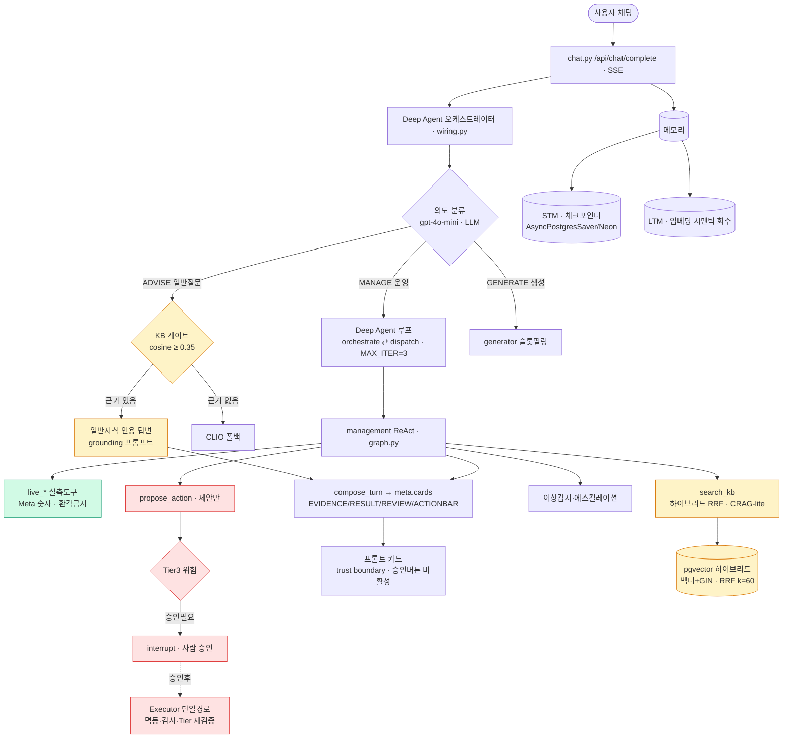
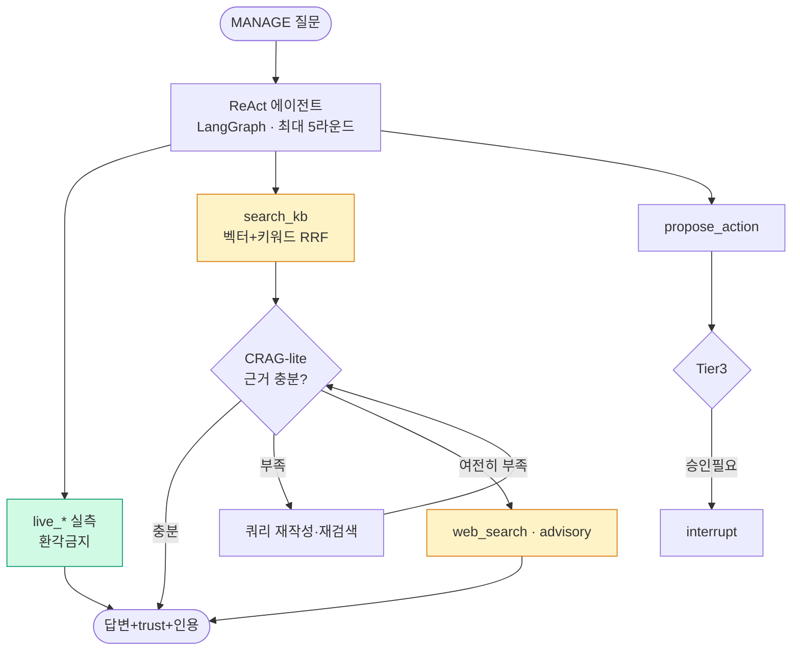
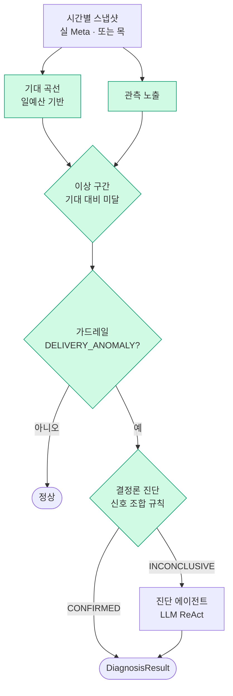

# 매니지먼트 AI 에이전트 — 종합 공유 문서

> 2026-06-28 · **이 문서 하나로 전체가 보인다.** 최근 작업 → 기반 시스템 → 지표 → 트러블슈팅 → 역할 순.
> 깊이 필요 시 §부록의 deep-dive 링크. 작성: 강경구(매니지먼트 A파트).

---

## 0. 한 장 요약 (TL;DR)

집행 전후 광고를 하나의 채팅에서 **분석·진단·조치 제안**하는 에이전틱 AI. "사람과 똑같은 대화"가 아니라 **직감보다 나은 의사결정 근거** 제공이 목표.

| 항목 | 결과 | 검증 |
|---|---|---|
| 에이전틱 RAG(ReAct+CRAG+HITL) | 도구 자율선택·근거 자기교정·승인 게이트 | 매니지먼트 테스트 통과 |
| 채팅 통합(Deep Agent·게이트·카드·메모리) | 갭 12개 자율 구현 | **501 passed** |
| 검색 품질 | Hit@5 **0.95** / MRR 0.84 / CP 0.84 | `rag_eval.py` ✅ |
| 풀 에이전트 환각(Faithfulness) | **0.778** (judge×3) | `evals/` ✅ |
| ADVISE 게이트 환각(개선전→후) | **0.920 → 1.000** | `hallucination_eval.py` ✅ |
| Meta 호출 절감 | **~86%↓** (43→6) | 커밋 코드 ✅ |
| 리눅스 PG 체크포인터 | round-trip 성공 | docker 실증 ✅ |

---

## 1. 시스템 아키텍처 (전체 그림)

**핵심 원칙** — 숫자는 실측도구(`live_*`)에서만, 해석·정책은 KB에서. 운영 변경은 **제안만**(실행은 사람 승인 Executor 단일경로).

---

## 2. 최근 작업 — 채팅 통합 (2026-06-27~28)

경구 Deep Agent 베이스에 팀 강점(보은 카드/RAG · 도연 일반KB/시맨틱LTM · 태호 체크포인터)을 흡수해 12갭을 자율 구현·검증. **추측이 아니라 데이터가 설계 구멍을 드러내게** 했다.

### 2-1. 무엇을 통합했나

| 갭 | 내용 | 검증 |
|---|---|---|
| G1 | KB 서브디렉토리 적재 + 시뮬 도메인 오염 차단 | DB 실측 |
| G4 | **ADVISE KB 게이트** — cosine≥0.35면 인용, 미달이면 CLIO | "ROAS"→KB / "날씨"→CLIO |
| G5 | **source_type 스코핑** — 일반↔특화 검색 분리 | CP 0.735→0.835 회복 |
| G2·G3·G6 | suggested_action 캐리 + 어댑터 + **카드 UI**(trust boundary) | 브라우저 시각 검증 |
| G7 | 체크포인터 단일화 + 견고 config | **docker 리눅스 round-trip** |
| M1·M3 | 장기기억 **recall 배선 복구** + anon 격리 | 테스트 |
| M2 | **LLM 추출 게이트** — 선호·결정만 저장·dedup | 선호 저장/잡담 skip |
| M4·M6 | 단기 중복 차단 + **임베딩 시맨틱 회수** | "목표 뭐였지?"→의미 회수 |

### 2-2. ADVISE 환각 — 게이트가 막는 것(유형별 개선전/후)

| 유형 | 개선전(CLIO) | 개선후(게이트) |
|---|---|---|
| C1 KB-답변가능 | 1.000 | 1.000 |
| C2 KB-밖 | 1.000 | 1.000 |
| C3 거짓전제 | 1.000 | 1.000 |
| **C4 수치함정** | 0.875 | **1.000** |
| **C5 도메인-밖** | 0.556 | **1.000** |
| **전체** | **0.920** | **1.000** |

> gpt-4o-mini는 이미 일반개념·거부·전제교정(C1~C3)을 잘함 → 게이트 가치는 **도메인-밖(C5)·수치 날조(C4)**. **grounding 프롬프트**가 fabrication을 막은 것.

---

## 3. 기반 — 에이전틱 RAG 에이전트

- **하이브리드 검색** — pgvector 코사인(의미) + GIN tsvector(정확 토큰) → RRF(k=60) 융합.
- **신뢰도(trust) 라벨** — `system_backed`(단정 가능)·`advisory`(참고·단서 필수)·`reference`(구성만). 인용까지 전달.
- **CRAG-lite 자기교정** — 검색 후 LLM이 근거 충분성을 스스로 평가 → 부족하면 재작성·재검색·웹폴백.
- **행동·HITL** — `propose_action`(제안만) → Tier3은 `interrupt`로 멈춤 → 사람 승인 → Executor 단일경로(멱등·감사·Tier 재검증).
- **메모리** — STM=체크포인터(thread·HITL 재개), LTM=`management_user_memory`(임베딩 시맨틱 회수).

---

## 4. 이상감지·에스컬레이션

- **source-agnostic** — `run_detection`은 스냅샷만 입력 → 실데이터·목 양쪽 동일 로직.
- **판정 기준** — REVIEW_DELAY/REJECTED(0 노출 패턴), BID_LOSS(CPM 앵커×1.3), AUDIENCE_TOO_NARROW(빈도≥3.0). **도메인 신호 매핑 + 실측 앵커**(통계 캘리브 아님 — 과장 금지).
- **에스컬레이션 사다리** — 파괴도 낮은 조치 먼저, 마지막은 항상 CREATE_CAMPAIGN. Tier3은 항상 사람 승인.

---

## 5. 지표 (출처·검증 병기)

> 측정 파일·라이브로 입증되는 것만 적는다.

| 지표 | 값 | 측정 대상 | 출처 |
|---|---|---|---|
| 검색 Hit@5 / MRR / CP | 0.95 / 0.84 / 0.84 | management KB 검색 | `rag_eval.py` ✅ |
| 풀 에이전트 Faithfulness | **0.778** (21/27) | 실 에이전트 답변 vs KB | `evals/_faithfulness_results.jsonl` ✅ |
| ADVISE 게이트 환각 | **0.920→1.000** | ADVISE 경로(KB+gpt-4o-mini) | `hallucination_eval.py` ✅ |
| Meta 호출 절감 | 43→~6 (86%↓) | 1회 새로고침(캠페인 20개) | 커밋 코드 ✅ |
| 백엔드 테스트 | 501 passed | management+assistant+orchestration | pytest 3회 ✅ |

**⚠️ 두 환각 지표는 다른 파이프라인** — 풀 에이전트 0.778(live+KB+일반지식) vs ADVISE 게이트 0.92→1.0(KB 제약 단순경로). 혼동 금지. (구 "1.00"은 judge 단종으로 인한 측정 오류 — §6 참조.)

---

## 6. 트러블슈팅 3선 (AI 엔지니어 관점 — 발표 하이라이트)

### ① 가짜 지표를 잡았다 — "Faithfulness 1.00"은 측정 오류
- **증상:** 환각 지표가 1.00(완벽) → "끝났다" 착각.
- **원인:** judge 모델 `gemini-2.0-flash-lite` **단종(404)** → 판정이 다 실패하는데 에러를 **faithful로 오집계**.
- **해결:** judge 교체 + 에러를 not_faithful 보수처리(`n_error` 노출).
- **교훈:** **지표 자체를 의심하라.** 측정 인프라가 고장나면 좋은 숫자가 가장 위험하다.

### ② RAG 코퍼스 오염 — 좋은 KB를 더했더니 검색이 나빠졌다
- **증상:** 일반 마케팅 KB(162청크) 추가 → 특화 검색 **CP 0.835→0.735(목표 미달)**.
- **원인:** 일반 청크가 특화 질문에서 정답을 밀어냄(의미적으로 가깝지만 정답 아님).
- **해결:** **source_type 스코핑** — ADVISE는 일반, MANAGE는 특화만. 풀 분리 → **0.835 완전 회복.**
- **교훈:** **코퍼스 확장이 항상 이득은 아니다.** 검색 풀을 용도별로 격리.

### ③ 감 대신 측정 — 리랭커·grounding 게이트를 데이터로 기각
- **해결:** 넣기 전에 측정 → recall@3=0.93(노이즈 없음) → **리랭커 기각**, grounding 게이트 개선 0 → **revert**.
- **교훈:** **음성 결과도 결과다.** 과투자 방지. 같은 레버로 트레이드오프 반복(프롬프트 천장)이면 레버를 바꾼다(KB/모델).

> 보너스: docker 리눅스로 PG 체크포인터 검증(Windows 한계 돌파) · 임베딩 시맨틱 LTM 회수.

---

## 7. 엔지니어링 교훈 (포트폴리오 포인트)

1. **감 대신 측정** — 리랭커·CRAG·grounding 게이트를 넣기 전에 측정해 2개를 데이터로 기각(과투자 방지).
2. **음성 결과도 결과** — 무효를 측정으로 확인하고 되돌림(복잡도·지연 제거).
3. **측정 정밀도가 먼저** — 소표본·단일 judge 노이즈에 안 속게 n 확대 + judge×3 + 증분 적재.
4. **천장 인지** — 같은 레버로 트레이드오프가 반복되면 멈추고 레버를 바꾼다.

---

## 8. 내 역할 (A파트 — 매니지먼트)

> 역할·계약 정본 → `structure-and-roles.md`(🅰/🅱 분담·계약·기능).

| 영역 | 내가 구현/주도 |
|---|---|
| 에이전틱 RAG(ReAct+CRAG+HITL) | 도구 자율선택·자기교정·승인 게이트 |
| 이상감지·에스컬레이션 | source-agnostic 탐지 + 시간축 사다리 |
| 채팅 통합(Deep Agent·게이트·카드·메모리) | 12갭 자율 구현·검증 |
| 예측↔실측 연결·인증강화·Meta 실연동 | 토대·보안·연동 |
| 리소스 최적화 | Meta N+1 호출 86%↓ |

---

## 9. 정직성 노트 (발표 시 과장 금지)

- **임계 출처** — cosine 0.35·CPM×1.3·빈도 3.0은 **도메인 신호 매핑 + 실측 앵커**. "실 이상 데이터셋 통계 캘리브"가 아니다.
- **이상감지 목(mock)** — 온디맨드 이상 부재·장중 부분데이터 때문에 시나리오 재현은 통제 고장이 필요(숨기지 말고 "통제된 재현"으로).
- **개선 델타** — ADVISE 환각은 before/after 둘 다 측정(0.92→1.0). 풀 에이전트 faithfulness는 단일 스냅샷(0.778)만 검증(before 파일 미보존).

---

## 부록 — 핵심 파일 + deep-dive

| 컴포넌트 | 파일 |
|---|---|
| 채팅·카드·메모리 배선 | `backend/api/routers/chat.py` |
| 오케스트레이터·ADVISE 게이트 | `backend/api/assistant/wiring.py`·`deep_agent.py` |
| management ReAct(CRAG·HITL) | `backend/domain/management/assistant/graph.py`·`agent.py` |
| 하이브리드 검색(스코핑) | `backend/domain/management/assistant/retriever.py` |
| 메모리(시맨틱 LTM) | `backend/domain/management/assistant/memory_store.py` |
| 환각 측정 | `backend/domain/management/evals/hallucination_eval.py`·`faithfulness_eval.py` |
| 이상감지 | `backend/domain/management/detection/`·`escalation.py` |

**더 깊이 (deep-dive 문서):**
- 채팅 통합 작업 로그(갭별 개선전/후) → `superpowers/plans/2026-06-27-채팅-통합-계획.md`
- RAG 에이전트 포트폴리오(엔지니어링 교훈 상세) → `superpowers/specs/2026-06-25-매니지먼트-RAG에이전트-포트폴리오.md`
- RAG 구조·지표(점수분포·N+1 상세) → `superpowers/specs/2026-06-26-매니지먼트-RAG-구조-지표.md`
- 이상감지 구조(판정기준·정직성) → `superpowers/specs/2026-06-26-매니지먼트-이상감지-구조.md`
