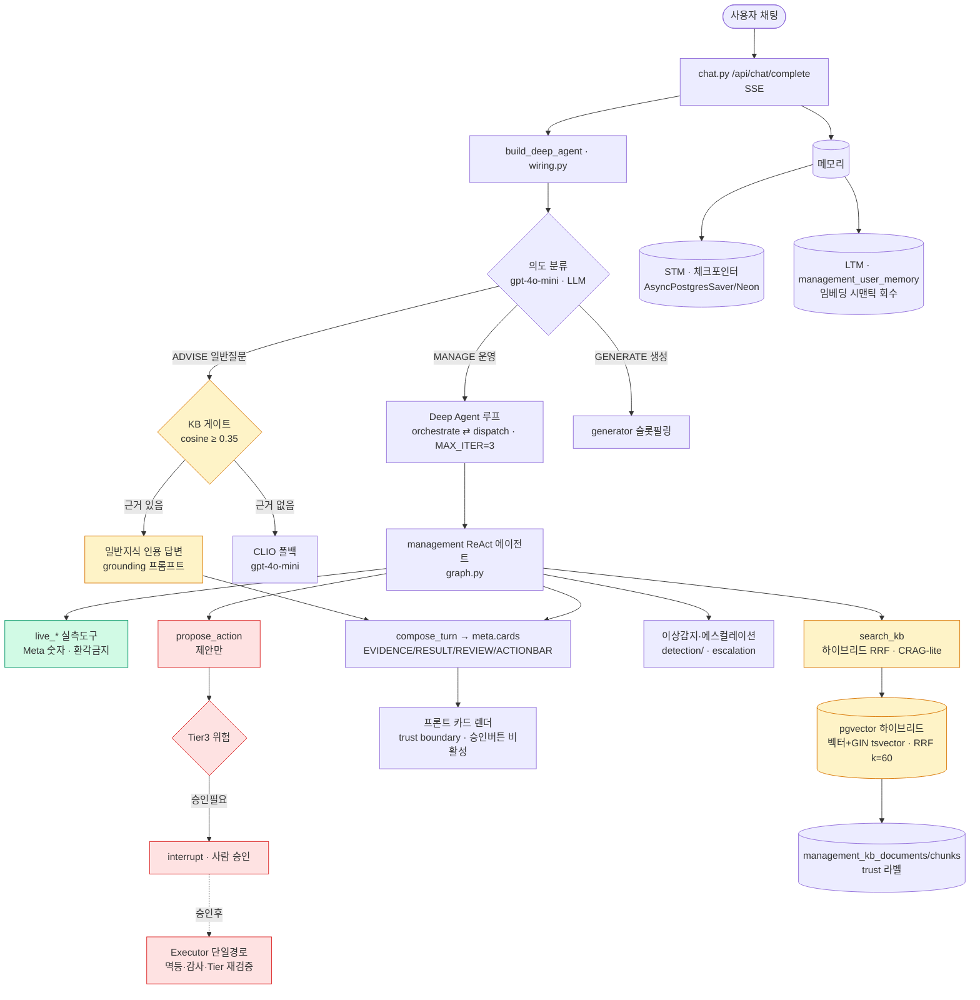

# 매니지먼트 · 채팅 통합 아키텍처 (마스터)

> 최종 업데이트 2026-06-28 · 도메인 management(4-2) + 채팅(4-4) · 브랜치 `feat/management` = `feat/management-3k`
> **이 문서가 단일 진입점(master).** 상세는 deep-dive 링크 참조. 모든 수치는 출처·검증 상태 병기(과장 금지).

---

## 0. Deep-dive 지도 (어디에 뭐가 있나)

| 주제 | 문서 | 성격 |
|---|---|---|
| **이 문서** | 매니지먼트·채팅 통합 아키텍처 | 전체 그림 + 현행 수치 + 링크 |
| 채팅 통합 작업 로그(갭별 개선전/후·테스트 3회) | `superpowers/plans/2026-06-27-채팅-통합-계획.md` | 실행 기록 |
| 채팅 RAG·메모리·표준 정합 설계 | `superpowers/specs/2026-06-27-채팅-KB-RAG-구조도.md` | 설계·갭 정의 |
| 매니지먼트 RAG 에이전트 포트폴리오(엔지니어링 교훈) | `superpowers/specs/2026-06-25-매니지먼트-RAG에이전트-포트폴리오.md` | 발표 핵심 |
| 매니지먼트 RAG 구조·지표(풀에이전트 faithfulness·Meta N+1) | `superpowers/specs/2026-06-26-매니지먼트-RAG-구조-지표.md` | RAG deep-dive |
| 이상감지·에스컬레이션 구조 | `superpowers/specs/2026-06-26-매니지먼트-이상감지-구조.md` | 탐지 deep-dive |
| 테이블 역할 | `superpowers/specs/2026-06-26-매니지먼트-테이블-역할.md` | DB 레퍼런스 |

> ⚠️ `management/2026-06-27-deep-agent-구현-완료-보고.md`는 **이 문서로 대체(삭제됨)** — 당시 Faithfulness "1.00"은 judge 모델 단종으로 인한 **측정 오류(가짜)**였다(§3 참조).

---

## 1. 전체 시스템 아키텍처

**핵심 원칙** — 숫자는 실측도구(`live_*`)에서만, 해석·정책은 KB에서. 운영 변경은 제안만(실행은 사람 승인 Executor 단일경로). 일반질문은 KB 게이트로 근거 있을 때만 인용 답변.

---

## 2. 4대 능력 구성 (chat ↔ management)

| 능력 | 구현 | 상태 |
|---|---|---|
| 멀티역량 라우팅(Supervisor) | LLM 의도분류 + Deep Agent tool-calling(ask_management/ask_generator) | ✅ |
| 에이전틱 RAG(ReAct + CRAG-lite) | `graph.py` — 도구 자율선택·근거 자기교정 | ✅ |
| 일반지식 KB 게이트(ADVISE) | `wiring.py:_try_kb_advise` — cosine 게이트 + 인용검증 | ✅ |
| 행동·HITL | `propose_action` → interrupt → Executor(Tier 재검증) | ✅ |
| 이상감지·에스컬레이션 | `detection/` source-agnostic + 시간축 사다리 | ✅ |
| 단기·장기 메모리 | 체크포인터(STM) + 임베딩 시맨틱 LTM | ✅ |
| 카드 UI(trust boundary) | composer → meta.cards → 프론트 렌더 | ✅ |
| 측정·피드백 루프 | `history.py` + `evals/` + 👍👎 | ✅ |

> RAG·이상감지 내부 mermaid·판정기준 → 각 deep-dive 문서. 채팅 통합 갭별 기록 → 작업 로그.

---

## 3. 현행 지표 (출처·검증 병기)

> **수치는 측정 파일·라이브로 입증되는 것만 적는다.** "1.00 신화" 정정 포함.

| 지표 | 값 | 측정 대상 | 출처·검증 |
|---|---|---|---|
| **검색 Hit Rate@5** | **0.95** | management KB 검색 | `rag_eval.py` 라이브 ✅ |
| 검색 MRR | 0.84 | 〃 | 〃 |
| 검색 Context Precision | 0.84 | 〃 | 〃 |
| **풀 에이전트 Faithfulness** | **0.778** (21/27) | 실 에이전트 답변 vs KB | `evals/_faithfulness_results.jsonl` · judge×3 ✅ |
| **ADVISE 게이트 환각(개선전→후)** | **0.920 → 1.000** | ADVISE 경로(KB+gpt-4o-mini) | `evals/hallucination_eval.py` C1~C5 · judge×3 ✅ |
| Meta 호출 절감 | 43 → ~6 (**~86%↓**) | 1회 새로고침(캠페인 20개) | 커밋 `045d0b1` 코드 ✅ |
| 백엔드 테스트 | **501 passed, 0 failed** | management+assistant+orchestration | pytest 3회 ✅ |
| 리눅스 PG 체크포인터 | round-trip 성공 | AsyncPostgresSaver/Neon | docker python:3.11 ✅ |

### ⚠️ "Faithfulness 1.00" 정정 (중요)
- 구 deep-agent 보고의 "1.00"은 judge `gemini-2.0-flash-lite` **단종(404)** → 모든 판정 실패를 faithful로 오집계한 **가짜값**이었다.
- 수정: judge `gemini-2.5-flash-lite` 교체 + 에러 보수처리(`n_error` 노출). 이후 측정이 진짜 동작.
- **두 환각 지표는 다른 파이프라인:** 풀 에이전트 0.778(live+KB+일반지식 포함) vs ADVISE 게이트 0.92→1.0(KB 제약 단순경로). 혼동 금지.

---

## 4. 구현 상태 — 채팅 통합 (2026-06-28 완료)

설계서 갭 12개 전부 구현·검증(상세·개선전/후는 작업 로그).

| 갭 | 내용 | 검증 |
|---|---|---|
| G1 | kb_ingest 서브디렉토리 적재 + 시뮬 오염 차단 | DB 실측 |
| G2 | Deep Agent suggested_action 캐리(카드 버그) | 합성 state |
| G3 | SubagentResult→AskResult 어댑터 | compose_turn→4카드 |
| G4 | ADVISE KB 게이트 + 환각 골든셋(C1~C5) | "ROAS"→KB / "날씨"→CLIO + 0.92→1.0 |
| G5 | source_type 스코핑(일반↔특화 오염 차단) | CP 0.735→0.835 회복 |
| G6 | 카드 직렬화 + 프론트 렌더러 | 브라우저 시각 검증 |
| G7 | 체크포인터 단일화 + 견고 config | docker 리눅스 round-trip |
| M1/M3 | recall 배선 복구 + anon 격리 | 테스트 |
| M2 | LLM 추출 게이트 + dedup upsert | 선호 저장/잡담 skip |
| M4 | 단기 히스토리 중복 차단(요청별 thread) | orchestrator 3회 |
| M6 + 029 | 세션 요약 + **임베딩 시맨틱 회수** | "목표 뭐였지?"→의미 회수 |

**의도적 설계 이탈 3건:** G6 SSE는 풀 TurnEnvelope 대신 중간경로(meta.cards, 회귀위험↓) · G4 임계값 규칙 정정(C1통과+C2폴백 최대) · M5는 G7에 흡수. (사유 상세 → 작업 로그)

---

## 5. 데이터 출처 정직성 (발표 기준)

- **환각 임계·이상감지 임계**(cosine 0.35, CPM×1.3, 빈도 3.0)는 **도메인 신호 매핑 + 실측 앵커**다. "실 이상 데이터셋 통계 캘리브"가 아니므로 그렇게 주장하지 않는다.
- **이상감지 목(mock)의 정당성** — 온디맨드 이상 부재·장중 부분데이터 때문에 시나리오 재현은 통제 고장이 본질적으로 필요(이상감지 deep-dive §3·6).
- **개선 델타** — ADVISE 환각은 before/after 둘 다 측정(0.92→1.0). 풀 에이전트 faithfulness는 단일 스냅샷(0.778)만 검증(before 파일 미보존, RAG-지표 §5).

---

## 부록 — 핵심 파일

| 컴포넌트 | 파일 |
|---|---|
| 채팅 엔드포인트·카드·메모리 배선 | `backend/api/routers/chat.py` |
| 오케스트레이터(Deep Agent + ADVISE 게이트) | `backend/api/assistant/wiring.py` · `deep_agent.py` |
| management ReAct(CRAG·HITL) | `backend/domain/management/assistant/graph.py` · `agent.py` |
| 하이브리드 검색(source_type 스코핑) | `backend/domain/management/assistant/retriever.py` |
| 메모리(시맨틱 LTM) | `backend/domain/management/assistant/memory_store.py` |
| 환각 측정(골든셋·judge) | `backend/domain/management/evals/hallucination_eval.py` · `hallucination_cases.py` · `faithfulness_eval.py` |
| 이상감지·에스컬레이션 | `backend/domain/management/detection/` · `escalation.py` |
| 카드 컴포저 | `backend/domain/management/assistant/composer.py` · `chat_cards/` |
