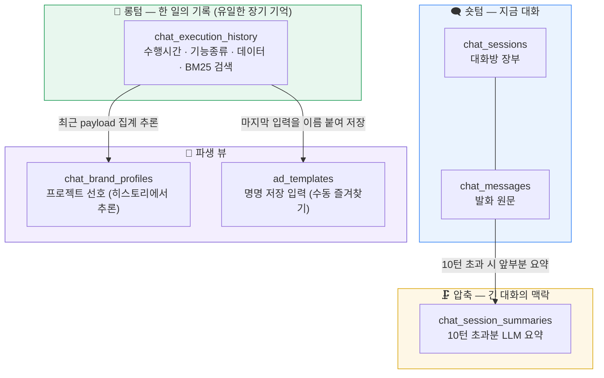
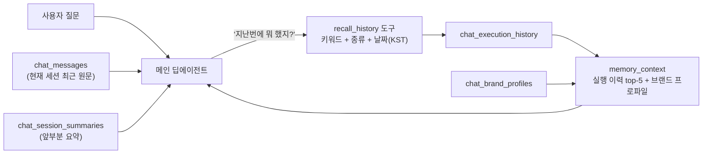
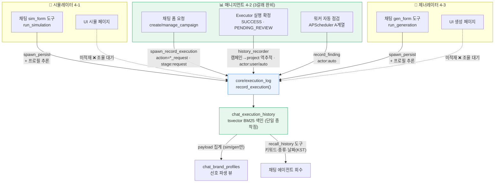
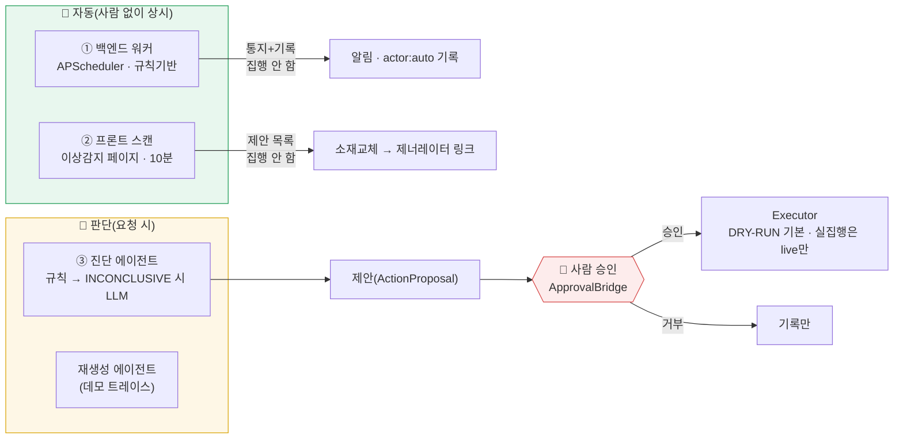
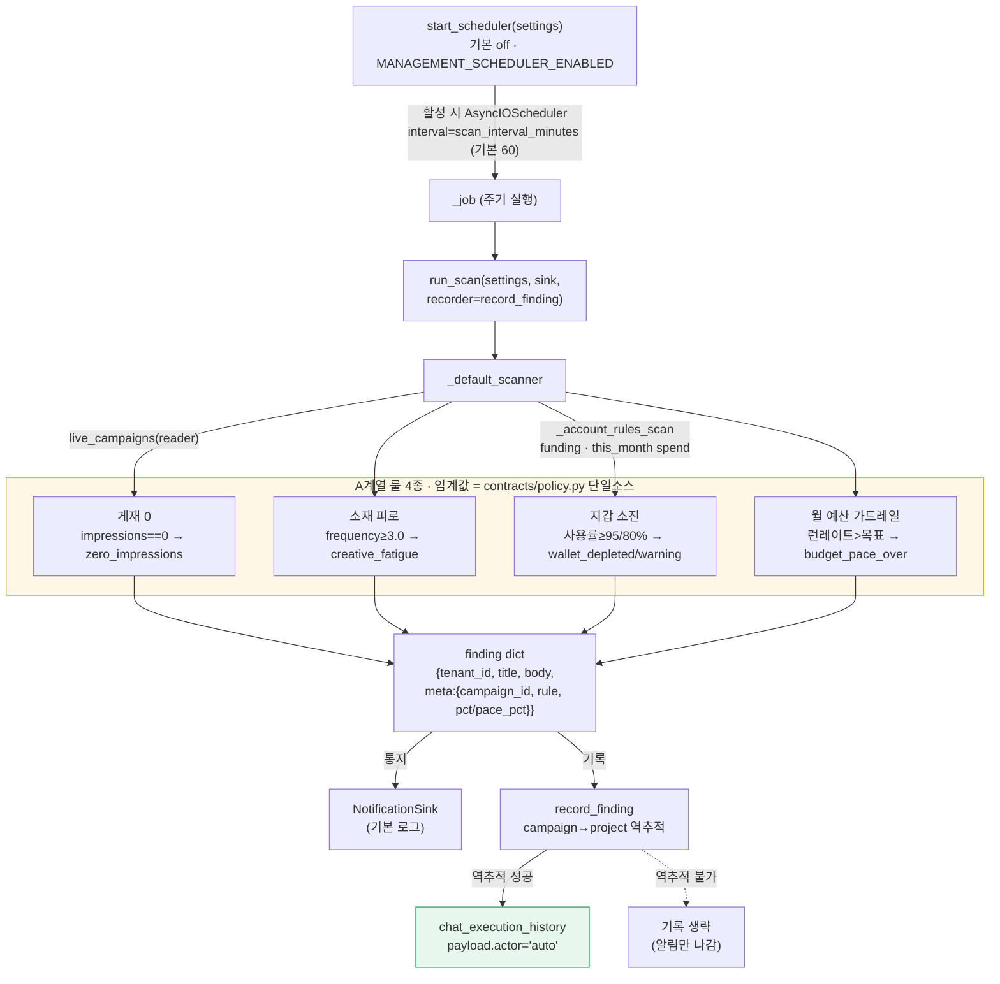
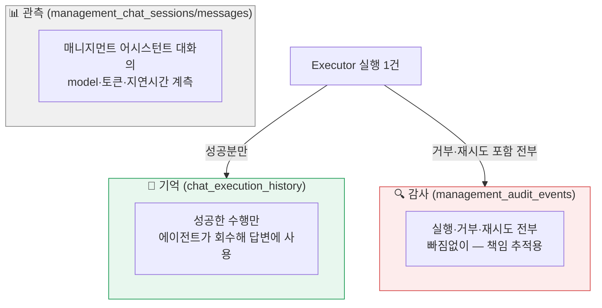

# 메모리 구조 — 전체 그림 · 도메인별 현황 · 의도적 구분

작성일 2026-07-03 (2026-07-04 dev pull 반영 갱신) · 목적 확정된 메모리 테이블 구조와 시뮬/생성/매니지먼트 각 도메인의 연결 현황을 한 장으로 박제.

> 핵심 한 줄. **기억의 원본은 "실제로 한 일"뿐** — 기능이 확정되는 지점에서 코드가 기계적으로 기록하고(롱텀 1테이블), LLM은 요약·선호 추론·회수에만 쓴다.

---

## 1. 메모리 3층 구조

**한 턴의 컨텍스트 조립** — 에이전트가 받는 것은 [최근 원문 + 요약 + memory_context], 과거 수행 질문은 recall_history가 처리.

## 2. 테이블별 역할 · 필요한 이유 · 관리 주체

| 층 | 테이블 | 역할 | 필요한 이유 | 관리 주체(코드) |
|---|---|---|---|---|
| 숏텀 | `chat_sessions` | 대화방 1개=1행. 제목·프로젝트 귀속·읽음 시각 (내용 없음, LLM 미주입) | 세션 속성을 메시지마다 중복 저장하지 않는 1:N 정규화 — 목록 화면·미확인 배지·CASCADE 삭제 | `domain/chat/history.py` |
| 숏텀 | `chat_messages` | 발화 1개=1행. role·본문·위젯 meta — 영속 원본 | 새로고침·재접속 복원. 원문은 사용자용이라 훼손 없이 보존(요약으로 치환 불가) | `domain/chat/history.py` (append_turn) |
| 압축 | `chat_session_summaries` | 10턴 초과 대화의 앞부분을 3~5문장 요약 → 다음 턴 주입 | 매 턴 전체 재전송의 토큰 비용·컨텍스트 한계 해소(표준 압축). 롱텀과 분리 = "무슨 얘기(맥락)"가 "뭘 했나(사실)" 검색을 오염시키지 않게 | `domain/chat/history.py` (summarize_and_compress) |
| 롱텀 | `chat_execution_history` ★ | 기능 수행 1건=1행. executed_at·feature_type·action·summary(BM25)·payload. actor(user/auto)·요청(`*_request`) 라벨 규약 | "지난번/몇월 며칠에/자동으로 뭐 했지"의 유일한 근거. 코드가 확정 지점에 기록하므로 누락·오염 없음 | `core/execution_log.py` (3도메인 공용) |
| 파생 | `chat_brand_profiles` | 프로젝트 1개=1행. 톤·타깃·카테고리 | 선호는 별도 기억이 아니라 히스토리에서 파생되는 뷰 — 원본이 있으니 틀려도 재계산 가능. 이벤트(누적)가 아닌 상태(최신값)라 롱텀과 분리 | `domain/chat/history.py` (infer_profile·extract_brand) |
| 파생 | `ad_templates` | "이 설정 저장해줘"로 명명 저장한 입력 | 자동 기억이 아닌 수동 즐겨찾기 — 이름으로 재사용 | `domain/chat/history.py` (save/load_template 도구) |

## 3. 도메인별 기록 구조 — 3개 도메인이 롱텀에 남기는 서로 다른 방식

도메인마다 "언제·무엇을·어떤 라벨로" 남기는지가 다르다. 핵심은 **쓰기 경로는 다양해도 종착점은 `chat_execution_history` 하나**라는 것 — 회수(recall_history)·선호 파생(brand_profiles)은 이 단일 테이블만 본다.

| 도메인 | 기록 경로 | 트리거 | 라벨·actor | 프로필 추론 |
|---|---|---|---|---|
| 시뮬레이터 | 채팅 `sim_form`→`spawn_persist` | 폼 실행 | `run_simulation` | ✅ 파생 |
| 시뮬레이터 | UI 페이지 | — | **미적재 ❌** | — |
| 제너레이터 | 채팅 `gen_form`→`spawn_persist` | 폼 실행 | `run_generation` | ✅ 파생 |
| 제너레이터 | UI 페이지 | — | **미적재 ❌** | — |
| 매니지먼트 | 채팅 폼 `spawn_record_execution` | 폼 요청 시점 | `*_request` · `stage:request` | 없음 |
| 매니지먼트 | Executor `history_recorder` | 실행 확정(성공) | `action_type` · actor `user/auto` | 없음 |
| 매니지먼트 | 워커 `record_finding` | 자동 점검 발견 | `rule` · actor `auto` | 없음 |

- **매니지먼트** — 3갈래 완비. "요청(폼)"과 "실행 확정"을 라벨로 구분하고, 워커 발견분은 actor:"auto"로 남아 "자동으로 뭐 실행됐지"까지 회수된다. 실행 확정 기록은 캠페인→creative_ad_id→ads.project_id 역추적이 될 때만(미연결 캠페인·계정 단위 발견은 알림만). Executor는 `SUCCESS`·`SUBMITTED_PENDING_REVIEW`에서만 기록하고 재생·거부는 남기지 않는다(`executor.py:253`).
- **시뮬레이터 / 제너레이터** — 채팅 경유 실행만 기록(채팅 레이어가 `spawn_persist`로 대행, 동시에 `infer_profile_from_execution_history`로 선호를 파생). **UI 페이지 실행은 미적재** — 각 도메인 서비스 완료 지점에 `core.execution_log.record_execution` 한 줄이 남은 조각(타 팀 소유라 조율 필요). 2026-07-04 dev pull 기준 두 도메인 모두 자체 적재 코드 없음(`domain/simulation`·`domain/generator`에서 `record_execution` 호출 0건 실측).

## 4. 매니지먼트 자동화 — 어디까지 "스스로" 하나 (실측 지도)

> **결론 먼저.** 지금 매니지먼트에서 **에이전트가 사람 없이 광고를 집행(write)하는 자동화는 없다.** 자동으로 도는 것은 전부 "감지 → 진단 → 제안 → 알림·기록"까지고, 실제 실행(일시중지·증액·소재교체 등)은 **항상 사람 승인**을 거친다. 자동 실행(자율 승인)은 계약·게이트로만 존재할 뿐 러닝 시스템에 배선돼 있지 않다. 아래 4개 층으로 나눠 실측했다.

### 4-A. 백엔드 상시 워커 (APScheduler)

> **갱신(2026-07-04 이후 · A/B/W1).** 이 §4-A는 초기 워커(rule-only·로그 통지) 기준으로 남겨둔다. 현재는 ⓐ **agent 스캐너**(성과 진단 LLM, `management_scanner_mode=agent`) 추가, ⓑ 통지 채널 **panel** → `management_notifications` 벨 + **계정 alert 배달**, ⓒ **주간 리포트 잡** 편입(2잡), ⓓ notify-scan이 워커 스캐너를 org 스코프로 재사용. 최신 정본은 [[2026-07-04-apscheduler-워커]].

능동 매니지먼트 스케줄러는 기존 in-process asyncio 패턴과 일관(단일 EC2, 무SQS). **기본 off** — `MANAGEMENT_SCHEDULER_ENABLED`일 때만 기동하고(`main.py:111` lifespan 배선, `config.py:114`), 켜지면 `scan_interval_minutes`(기본 60분, `config.py:115`) 간격으로 1회 스캔을 반복한다. 스캐너 주입으로 테스트 가능(`scheduler.py:154`). **여기엔 LLM 판단이 없다** — 순수 필드 검사(노출·빈도·소진율·런레이트)뿐이고, **executor를 호출하지 않는다**(감지·알림·기록만).

**워커가 다루는 정보(finding dict)** — 룰이 발견한 이상 1건은 아래 구조로 통일된다. 기밀 데이터 평문 최소화 원칙에 따라 **금액 원값은 summary에 넣지 않고 비율(pct·pace_pct)만** 담는다.

| 필드 | 내용 | 예시 |
|---|---|---|
| `tenant_id` | 조직 스코프(현재 `"global"`) | `global` |
| `title` / `body` | 알림 문구(사용자 표시) | `소재 피로 — 여름캠페인` |
| `meta.rule` | 룰 식별자(=기록 action) | `creative_fatigue` |
| `meta.campaign_id` | 역추적 키(계정 룰은 없음) | `120…` |
| `meta.pct` / `pace_pct` | 소진율·페이스(비율만) | `95` |

- **룰 4종은 전부 A계열(관측·알림)** — 게재 0·소재 피로는 캠페인 단위(`live_campaigns`), 지갑 소진·예산 가드레일은 계정 단위(`_account_rules_scan`, funding·이번 달 소진 조회). 임계값(피로 3.0·지갑 95/80%·월 목표 3백만)은 전부 `contracts/policy.py` 상수로 단일화 — 라우터·wiring의 리터럴 잔존 0건 실측.
- **B계열(자동 중지·감액)은 보류** — "성과 미달 N일 지속"을 추적할 연속일 테이블·컬럼이 아직 없어서(체크리스트에 사유 기록). C(제안)·D(주간리포트, `insights.weekly_report` 재사용 예정)도 미착수.
- **기록은 best-effort·비차단** — `record_finding`이 캠페인→프로젝트 역추적에 실패하면 롱텀 기록만 생략하고 알림은 그대로 나간다. 기록 실패가 스캔을 멈추지 않는다(`scheduler.py:174`).
- **통지 채널** — ~~로그뿐~~ **갱신**: `build_notification_sink`가 `management_notify_channel`을 보고 `PanelNotificationSink`(panel)/`ChatNotificationSink`(chat)/`LogNotificationSink`(log) 선택(`notifications.py`). 운영 기본 panel → 캠페인 이상은 `management_notifications` 벨(consult), 계정 이상(지갑·예산)은 계정 alert로 배달(단 워커 tenant=global은 계정=피드/벨은 org 스코프 notify-scan). SES·웹훅은 같은 포트로 후속(seam).

### 4-B. 프론트 상시 스캔 (이상 감지 페이지) — LLM 진단, 집행 없음

백엔드 워커와 **완전히 별개**의 자동화가 프론트에 하나 더 있다. `/manage/anomaly` 페이지가 **열려 있는 동안 클라이언트 타이머로 진입 시 1회 + 10분마다** `GET /management/anomaly/scan`을 호출한다(`anomaly/page.tsx` `setInterval(600_000)`, 탭 숨김 시 건너뜀). 사용자가 실제로 보는 "자동 점검"은 이쪽이다(2026-07-04 프론트 실측 — 화면 문구 "진입 시와 10분마다 자동 스캔").

- **live 전용** — `use_mock`이면 빈 결과(`{"note":"실 캠페인 스캔은 live에서."}`, `management.py:359`). dev 기본(use_mock=True)에선 안 돈다.
- **워커보다 진단이 깊다** — 워커는 필드 검사뿐이지만, 이 스캔은 실 ROAS·relevance를 실측해 `_campaign_diagnosis`로 진단하고, 빈도 3+면 소재 교체를 제안한다(`management.py:347~416`).
- **집행 없음** — 결과는 이상 목록 + `suggested_action`(예: `REPLACE_CREATIVE` → "제너레이터로 개선 시안 만들러 가기" 링크)일 뿐, 자동 실행하지 않는다.

### 4-C. 에이전트(LLM) 판단이 실제로 들어가는 지점

"스스로 판단"에 해당하는 LLM 에이전트는 **진단·재생성 두 곳**뿐이고, 둘 다 산출물이 "진단/시안"이지 "집행"이 아니다.

| 에이전트 | 위치 | 언제 | 산출물 | 집행? |
|---|---|---|---|---|
| 진단 에이전트 | `_campaign_diagnosis` → `build_diagnosis_agent` (`management.py:1380`) | 규칙 진단(`diagnose_performance`)이 **INCONCLUSIVE**일 때만, 키 있을 때만 | 이상유형·가설·확신도 재판정 | ❌ 제안까지 |
| 재생성 에이전트 | `/management/regenerate` (`agents/regeneration.py`) | 이상감지 **데모** 실행 시(트레이스·시연용) | 개선 소재 후보 | ❌ 데모, 승인 제안엔 미사용 |

- 규칙이 먼저 결정론으로 판정하고, **애매할 때만** LLM이 보강한다(additive·best-effort — LLM 실패해도 상세 화면 무영향).
- 데모 사이클(`/manage/anomaly`의 "이상 대응 실행")은 **감지 → 진단 → 처방 → 승인 → 집행**을 보여주지만, 승인은 화면 버튼(ApprovalBridge)이고 집행은 **DRY-RUN(실 과금 없음)**이다(프론트 실측 — 페이지 상단·하단 문구 명시).

### 4-D. 자동승인/자동집행 — 계약·게이트만 있고 미배선

"Tier 0~1은 자율 통과"라는 자동승인 개념은 존재한다(`AUTO_APPROVE_MAX_TIER = TIER_1`, `approver_id="AUTO"`). 그러나 **러닝 앱에서 이를 세팅해 executor로 보내는 경로가 없다** — `AUTO_APPROVER`를 실제로 부여하는 곳은 **데모 스크립트·골든샘플뿐**(`scripts/management_demo.py:122`, `scripts/generate_golden_samples.py:94`). 오히려 executor는 자율 실행을 **적극 차단**한다.

| 게이트 | 코드 | 동작 |
|---|---|---|
| Tier 2 자동 실행 | `executor.py:283` | v1 비활성 — `INVALID_TIER` 거부 |
| Tier 3 + AUTO | `executor.py:285` | 건별 사용자 승인 필수 — `UNAPPROVED_ACTION` 거부 |
| 예산 소프트캡(95%) + AUTO | `executor.py:196` | 자율 불가 — 사용자 승인 라우팅으로 거부 |

- 챗 어시스턴트도 마찬가지 — `suggest_action`은 의도를 감지해 제안을 만들고 `requires_approval` 라벨만 붙인다("어시스턴트는 write를 트리거하지 않는다", `actions.py:4`). 실행은 승인 경로로 넘긴다.
- **정리하면** — 자동 집행의 "재료"(자율 승인 티어·게이트)는 갖춰져 있으나, 방아쇠(자동으로 제안→승인→실행하는 파이프라인)는 의도적으로 연결하지 않았다. 현재 안전 자세는 "감지·제안은 자동, 집행은 사람".

## 5. 멘토링 반영 — 지시 5항목이 코드 어디에 있나

> 멘토링 방향. **롱텀 = 수행 히스토리만 · BM25 검색 · 도구 연동 · 크론 워커 · 다이렉트(코드) 호출.** 아래는 각 항목이 실제 코드에 반영된 위치(실측).

| 멘토링 지시 | 반영 위치 | 상태 |
|---|---|---|
| 롱텀 = 수행 히스토리만 | `chat_execution_history` 단일 테이블, LLM 추출 기억(`management_user_memory`·`remember`/`recall`) 전량 폐기 | ✅ 검색 0건 확인 |
| BM25 검색 | `search_tsv` = `Computed("to_tsvector('simple', summary)")` GIN 색인 + `ts_rank_cd` 순위 | ✅ `models.py:428`·`execution_log.py:126` |
| 도구 연동 | `recall_history` @tool — 키워드·`feature_type`·날짜(KST) 필터 | ✅ `subagent_tools.py:699` |
| 크론 워커 | APScheduler `AsyncIOScheduler` interval 잡(무SQS, in-process) | ✅ `scheduler.py:187` |
| 다이렉트(코드) 호출 | 실행 확정 지점에서 코드가 결정적으로 `record_execution` 호출(쓰기 주체 = 코드, LLM은 파생·읽기만) | ✅ `execution_log.py:47` |

**"쓰기는 코드, LLM은 파생·읽기만"** — 매 턴 gpt-4o-mini 추출 파이프라인을 걷어내고, 쓰기는 실행 확정 지점의 코드로, 선호 큐레이션은 읽기/배치 시점(`infer_profile_from_execution_history`)으로 미뤘다. 원본(실행 이력)이 있으니 파생은 언제든 재계산 가능 — 이것이 일원화의 핵심 논거다.

## 6. 의도적 구분 — 메모리와 합치면 안 되는 저장소

| 저장소 | 목적 | 왜 기억과 분리인가 | 관리 주체 |
|---|---|---|---|
| `management_audit_events` | 감사 — 모든 실행 시도(거부·재시도 포함) | 기억은 "한 일만", 감사는 "빠짐없이" — 기준이 정반대라 합치면 둘 다 망가진다. executor가 각각 별도 기록 | `execution/audit_log.py` |
| `management_chat_sessions`/`messages` | 관측 — 어시스턴트 응답의 모델·토큰·지연 계측 | 기억이 아니라 품질·비용 로그. LangSmith 관측과의 중복 확인 후 거취 결정(별건) | `management/assistant/history.py` |
