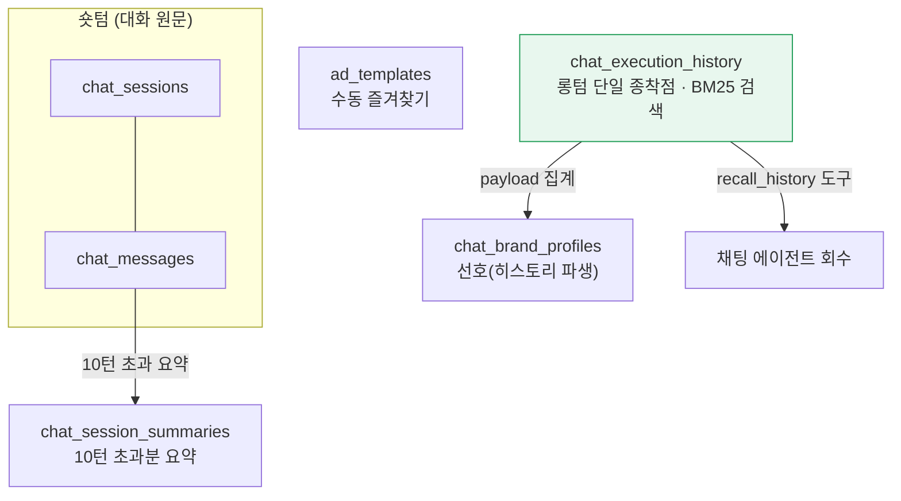
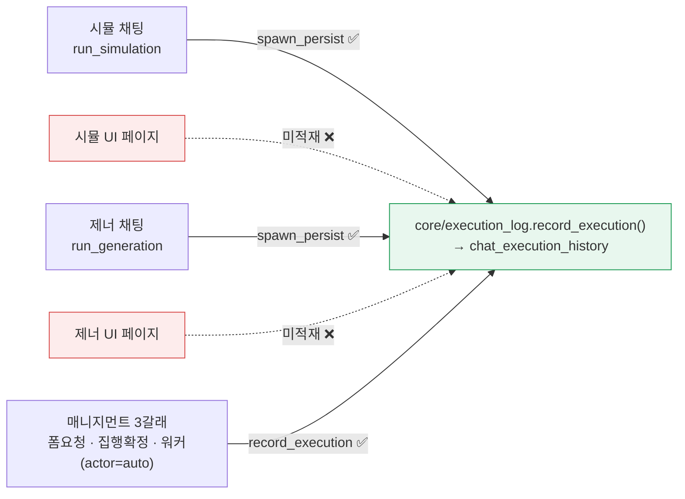
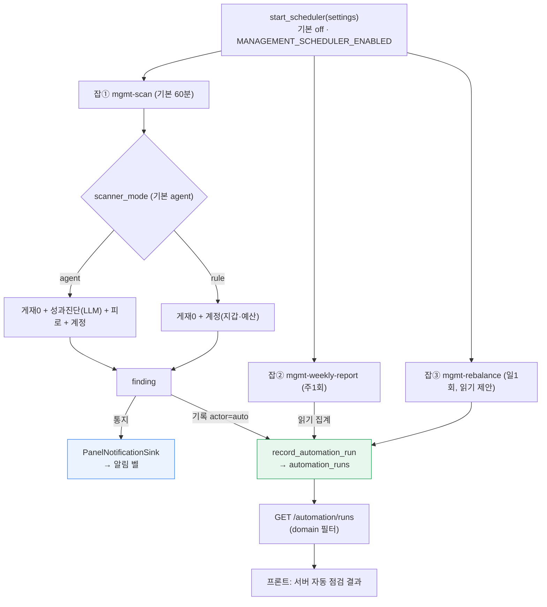
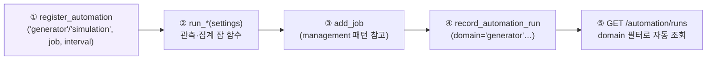

# 메모리 · 스케줄러 핸드오프 — 제너레이터 · 시뮬레이터용

작성 2026-07-04 · 매니지먼트(4-2)에서 확정한 **메모리 일원화**와 **APScheduler 워커** 구조를 gen/sim이 그대로 붙일 수 있게 정리 · 정본 [[2026-07-03-메모리-아키텍처-설계노트]] · [[2026-07-04-apscheduler-워커]]

> **두 줄 요약.**
> ① 메모리 — 롱텀은 `chat_execution_history` **한 테이블**. **쓰기 주체는 코드**(실행 확정 지점에서 `record_execution` 한 줄), LLM은 파생·읽기만.
> ② 스케줄러 — 사람 승인 없는 **관측·집계**만 워커에, 등록은 `register_automation` + `record_automation_run(domain=...)` 한 세트.

---

## 1. 메모리 — 어디에 쓰고, gen/sim은 뭘 하면 되나



**3개 도메인이 롱텀에 남기는 경로** — 종착점은 `chat_execution_history` 하나.



### ✅ 이미 되는 것 / ❌ gen·sim이 채울 것
- **채팅 경로**(sim_form·gen_form)로 실행하면 이미 `spawn_persist`가 롱텀에 남기고 선호(brand_profiles)까지 파생 — **손댈 것 없음**.
- **UI 페이지 실행은 미적재**(2026-07-04 dev 기준 `domain/simulation`·`domain/generator`에 `record_execution` 호출 0건). → **각 도메인 서비스 완료 지점에 한 줄만** 추가:

```python
from core.execution_log import record_execution
await record_execution(
    project_id, "simulation"|"generator", action,   # 예: "run_simulation"
    summary,                                          # BM25 검색 대상 문장
    payload={...},                                    # 회수·선호 파생용
)
```
> 그러면 "지난번/며칠에 뭐 돌렸지" 회수·선호 파생이 UI 실행분까지 자동 커버. **원본이 있으니 파생은 언제든 재계산** — 이것이 일원화의 핵심.

---

## 2. 스케줄러 — 워커 구조와 gen/sim 자동화 붙이는 법



### 확장 seam — 제너레이터·시뮬레이터 자동화 등록 (5단계)



| 단계 | 위치 | 비고 |
|---|---|---|
| ① 등록 | 도메인 모듈 로드 시 `core.automation.register_automation(...)` | management는 `anomaly_scan`·`weekly_report` 등록됨. gen/sim 현재 0건=대기 |
| ② 잡 함수 | 각 도메인에 `run_*(settings)` | **관측·집계·읽기 위주** |
| ③ 배선 | `add_job("interval", ...)` | `domain/management/scheduler.py:start_scheduler` 참고 |
| ④ 적재 | `core.automation.record_automation_run(domain=..., job_name=..., ...)` | actor 등 payload 규약 동일 |
| ⑤ 조회 | `api/routers/automation.py`의 `GET /runs` | **domain 파라미터로 이미 일반화 — 코드 수정 불필요** |

### 워커에 넣어도 되는 것 / 안 되는 것 (원칙)
- 🟢 **넣는다** — 시간 트리거만으로 의미 있는 **관측·감지·집계·기록**(예: 주기 성과 요약, 이상 감지).
- 🔴 **안 넣는다** — 돈·게재에 영향 주는 **write(집행)** 는 항상 사람 승인. 요청·입력 시점 로직(생성 시 검증·입력 계산)은 요청 경로.
- 기준: **"자율 트리거(시간)만으로 의미 있으면 워커, 특정 순간(요청·입력·집행)에만 의미면 워커 밖."**

---

## 3. 현재 실측 상태 (2026-07-04, NeonDB)

| 항목 | 실측 |
|---|---|
| 채팅 대화 저장 | chat_sessions 21 · chat_messages 143(user 55/assistant 88) — 원문 영속 보존 |
| 롱텀 일원화 | `chat_execution_history` 단일 + BM25(search_tsv), 폐기 테이블(user_memory·long_term_memory) 부재 |
| 워커 적재 | `automation_runs`에 스케줄러 자율 발화분 `actor=auto` 적재 확인 |
| 알림 벨 | `management_notifications` — 캠페인 consult + 계정 alert(campaign_id=NULL) |
| gen/sim seam | `registered_automations('generator'|'simulation')` = **빈 상태(등록만 하면 붙음)** |

> gen/sim이 위 1·2를 따르면 **매니지먼트와 완전히 같은 파이프라인**(롱텀 회수·선호 파생 / 워커 자동화·프론트 조회)에 별도 인프라 없이 편입된다.
