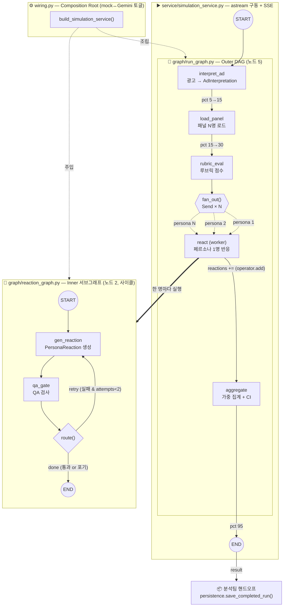
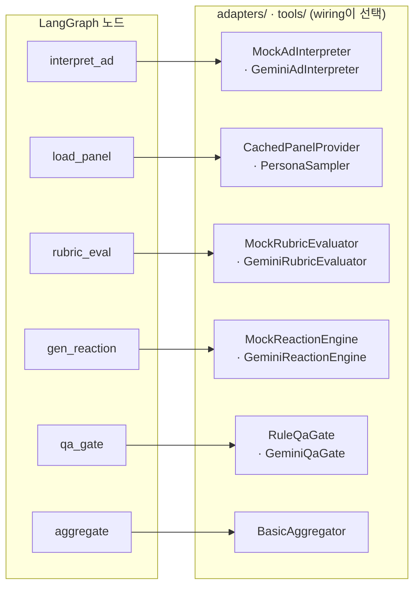

# 시뮬레이터 LangGraph 노드 구성 & 워크플로우 다이어그램

> `backend/domain/simulation/`의 하이브리드 LangGraph 구조 — Outer DAG(5노드) + Inner 반응 서브그래프(2노드)의 토폴로지·파일 위치·흐름을 시각화한다.
> 코드 기준: `graph/run_graph.py` · `graph/reaction_graph.py` · `service/simulation_service.py` · `wiring.py`.

## 노드 총 7개 = Outer 5 + Inner 2

## 전체 워크플로우 (Outer + Inner)

## 노드 ↔ 어댑터 매핑 (덕타이핑 주입)

## 노드 명세

### Outer 그래프 — `graph/run_graph.py` (노드 5)

| # | 노드 | 하는 일 | 호출 어댑터(주입) |
|---|---|---|---|
| 1 | `interpret_ad` | 광고 해석(VLM) → `AdInterpretation` | `interpreter.interpret` (Mock / `GeminiAdInterpreter`) |
| 2 | `load_panel` | 고정 패널 로드 or 샘플링 → `[Persona]` | `panel.get_or_build` (`CachedPanelProvider` / `PersonaSampler`) |
| 3 | `rubric_eval` | 루브릭 차원 평가 → `[RubricScore]` | `rubric.evaluate` (Mock / `GeminiRubricEvaluator`) |
| 4 | `react` | fan-out 워커 — 페르소나 1명당 1개 디스패치, 내부에서 inner 그래프 실행 | inner 그래프(`reaction_graph`) |
| 5 | `aggregate` | QA 통과분만 가중 집계 → `SimulationAggregate` | `aggregator.aggregate` (`BasicAggregator`) |

`react`는 단일 노드지만 `fan_out()`이 `Send("react", …)`를 페르소나 수(N)만큼 발사 → map-reduce. 결과는 `reactions: Annotated[list, operator.add]` 리듀서로 fan-in 수집.

### Inner 반응 서브그래프 — `graph/reaction_graph.py` (노드 2, 사이클)

| # | 노드 | 하는 일 | 호출 어댑터(주입) |
|---|---|---|---|
| 1 | `gen_reaction` | 반응 생성(4-b) → `PersonaReaction` | `reactor.react` (Mock / `GeminiReactionEngine`) |
| 2 | `qa_gate` | QA 검사 → `qa_passed` 갱신 | `qa.check` (`RuleQaGate` / `GeminiQaGate`) |

`route()` 조건부 엣지로 재시도 루프 — 실패 & 시도 여유 있으면 `gen_reaction`으로 되돌아감(`MAX_ATTEMPTS=2`).

## 파일 위치 요약

| 영역 | 파일 | 노드/역할 |
|---|---|---|
| Outer 그래프 | `graph/run_graph.py` | `interpret_ad`·`load_panel`·`rubric_eval`·`react`·`aggregate` (5) |
| Inner 서브그래프 | `graph/reaction_graph.py` | `gen_reaction`·`qa_gate` (2, 사이클) |
| 구동 | `service/simulation_service.py` | `astream` + SSE 진행률 |
| 조립 | `wiring.py` | mock↔Gemini 주입 유일 지점 |
| 어댑터 | `adapters/mock_engine.py`, `adapters/gemini/` | 실 LLM/QA 구현체 |
| 순수 엔진 | `tools/sampling/`, `tools/aggregation/`, `tools/panel/` | 샘플러·집계·패널(LLM✗) |

## 핵심 설계 포인트

- 값싼 preamble 3개(`interpret_ad`·`load_panel`·`rubric_eval`)는 직렬 — 불균등 깊이 join을 피하려는 의도(`run_graph.py` 주석).
- 비싼 N개 반응만 병렬 fan-out — LLM 콜은 여기서만 N배 발생.
- 노드는 어댑터를 모름 — 전부 덕타이핑 주입, mock↔실 Gemini 교체는 `wiring.py` 한 곳에서만.
- Inner 그래프의 사이클(retry 루프)이 LangGraph를 쓰는 진짜 이유 — 나머지 80%는 선형이라 과설계 회피(`context-notes.md §3`).
