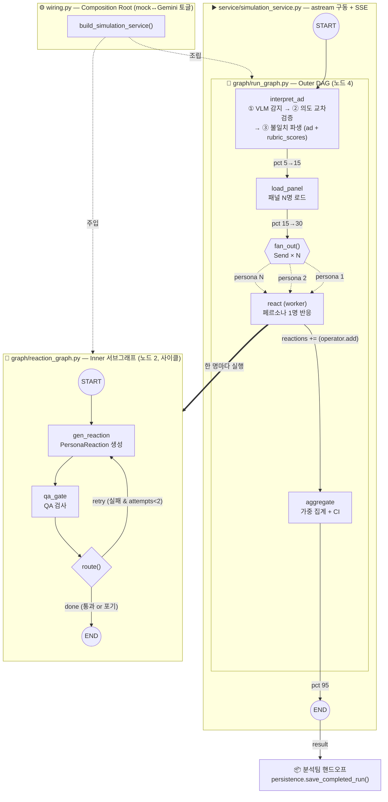
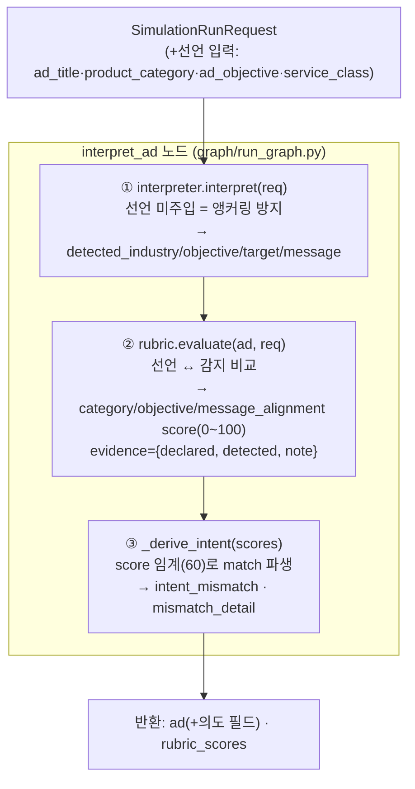
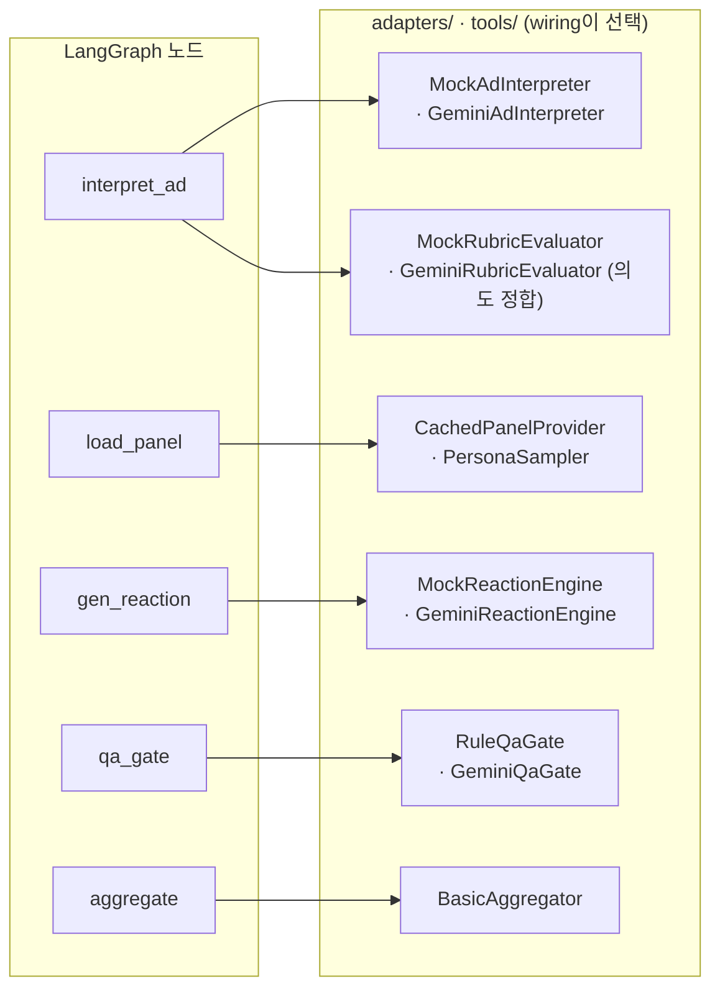

# 시뮬레이터 LangGraph 노드 구성 & 워크플로우 다이어그램

> `backend/domain/simulation/`의 하이브리드 LangGraph 구조 — Outer DAG(4노드) + Inner 반응 서브그래프(2노드)의 토폴로지·파일 위치·흐름을 시각화한다.
> 코드 기준: `graph/run_graph.py` · `graph/reaction_graph.py` · `service/simulation_service.py` · `wiring.py`.
> **v2 (의도 교차검증 반영):** `rubric_eval` 노드가 `interpret_ad`로 흡수됨(노드 7→6). 루브릭 = 의도 정합 점수(ANALYSIS §3.5-3).

## 노드 총 6개 = Outer 4 + Inner 2

## 전체 워크플로우 (Outer + Inner)

## interpret_ad 내부 — 감지 + 의도 교차검증 (2 LLM 콜)

## 노드 ↔ 어댑터 매핑 (덕타이핑 주입)

## 노드 명세

### Outer 그래프 — `graph/run_graph.py` (노드 4)

| # | 노드 | 하는 일 | 호출 어댑터(주입) |
|---|---|---|---|
| 1 | `interpret_ad` | ① VLM 감지(선언 미주입) → ② 의도 교차검증(정합 채점) → ③ `intent_mismatch`·`mismatch_detail` 파생. `ad` + `rubric_scores` 동시 산출 | `interpreter.interpret` + `rubric.evaluate(ad, request)` |
| 2 | `load_panel` | 고정 패널 로드 or 샘플링 → `[Persona]` | `panel.get_or_build` (`CachedPanelProvider` / `PersonaSampler`) |
| 3 | `react` | fan-out 워커 — 페르소나 1명당 1개 디스패치, 내부에서 inner 그래프 실행 | inner 그래프(`reaction_graph`) |
| 4 | `aggregate` | QA 통과분만 가중 집계 → `SimulationAggregate` | `aggregator.aggregate` (`BasicAggregator`) |

`react`는 단일 노드지만 `fan_out()`이 `Send("react", …)`를 페르소나 수(N)만큼 발사 → map-reduce. 결과는 `reactions: Annotated[list, operator.add]` 리듀서로 fan-in 수집. 불일치 파생은 같은 파일의 순수 함수 `_derive_intent()`(임계 60)가 담당.

### Inner 반응 서브그래프 — `graph/reaction_graph.py` (노드 2, 사이클)

| # | 노드 | 하는 일 | 호출 어댑터(주입) |
|---|---|---|---|
| 1 | `gen_reaction` | 반응 생성(4-b) → `PersonaReaction` | `reactor.react` (Mock / `GeminiReactionEngine`) |
| 2 | `qa_gate` | QA 검사 → `qa_passed` 갱신 | `qa.check` (`RuleQaGate` / `GeminiQaGate`) |

`route()` 조건부 엣지로 재시도 루프 — 실패 & 시도 여유 있으면 `gen_reaction`으로 되돌아감(`MAX_ATTEMPTS=2`).

## 파일 위치 요약

| 영역 | 파일 | 노드/역할 |
|---|---|---|
| Outer 그래프 | `graph/run_graph.py` | `interpret_ad`·`load_panel`·`react`·`aggregate` (4) + `_derive_intent()` |
| Inner 서브그래프 | `graph/reaction_graph.py` | `gen_reaction`·`qa_gate` (2, 사이클) |
| 구동 | `service/simulation_service.py` | `astream` + SSE 진행률(`rubric_scores`는 `interpret_ad` 출력에서 수집) |
| 조립 | `wiring.py` | mock↔Gemini 주입 유일 지점 |
| 어댑터 | `adapters/mock_engine.py`, `adapters/gemini/` | 실 LLM/QA 구현체(루브릭 = 의도 정합) |
| 순수 엔진 | `tools/sampling/`, `tools/aggregation/`, `tools/panel/` | 샘플러·집계·패널(LLM✗) |
| 계약 | `contracts/schemas.py` | `SimulationRunRequest`(선언 입력) · `AdInterpretation`(`detected_objective`·`intent_mismatch`·`mismatch_detail`) |

## 핵심 설계 포인트

- **노드 7→6 (v2).** `rubric_eval`(별도 노드)이 `interpret_ad`로 흡수 — "감지→교차검증 한 노드, 하나의 비교 두 출력"(ANALYSIS §3.5-3).
- **`interpret_ad`가 LLM 2콜.** ① 감지(선언 모름) + ② 비교(선언 주입). 한 콜에 선언을 같이 넣으면 LLM이 선언에 끌려가(confirmation bias) 불일치를 축소 보고 → 의도적 분리(앵커링 방지).
- **루브릭 = 의도 정합 점수.** 광고 솜씨 절대평가가 아니라 선언 ↔ 감지 정합도(`category/objective/message_alignment`). `intent_mismatch`는 score 임계로 파생.
- **비싼 N개 반응만 병렬 fan-out** — LLM 콜은 여기서만 N배 발생. 값싼 preamble은 직렬.
- **노드는 어댑터를 모름** — 전부 덕타이핑 주입, mock↔실 Gemini 교체는 `wiring.py` 한 곳에서만.
- **Inner 그래프의 사이클**(retry 루프)이 LangGraph를 쓰는 진짜 이유 — 나머지는 선형이라 과설계 회피(`context-notes.md §3`).
