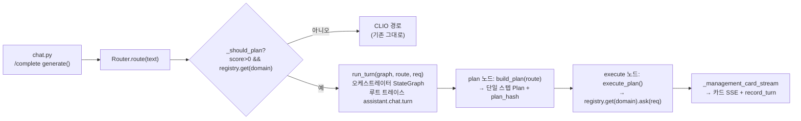

# S1 — Plan-then-Execute 오케스트레이터 셸 Implementation Plan

> **For agentic workers:** REQUIRED SUB-SKILL: Use superpowers:subagent-driven-development (recommended) or superpowers:executing-plans to implement this plan task-by-task. Steps use checkbox (`- [ ]`) syntax for tracking.

**Goal:** 챗 한 턴을 `Router → (고정 Plan) → Plan Executor`로 흘려, management 단일 스텝이 LangSmith 루트 트레이스(`assistant.chat.turn`) 아래에서 E2E로 동작하게 한다(기존 챗 동작 회귀 0).

**Architecture:** 기존 `api/orchestration`(Router·Registry·DomainAgent 계약)은 그대로 두고, 위에 세 개의 작은 순수 모듈을 얹는다 — `plan.py`(구조화 Plan + plan_hash), `planner.py`(RouteDecision → 단일 스텝 Plan), `executor.py`(Plan 스텝을 Registry로 디스패치). `turn.py`가 **LangGraph `StateGraph`(plan·execute 노드)** 로 둘을 묶고, `run_turn`이 `assistant.chat.turn` 루트 트레이스로 호출한다. `chat.py`의 management 분기를 이 경로로 교체하되, 카드 SSE·관측 적재(`_management_card_stream`)는 그대로 재사용해 출력이 동일하게 유지된다.

**Tech Stack:** Python 3.12, FastAPI, **LangGraph `StateGraph`**(이미 의존성), LangSmith(config 추적), pytest(`@pytest.mark.asyncio`), uv. 오케스트레이터 코어는 도메인 타입을 import하지 않는다(`Any`로 일반화 — import 순수성 유지).

**범위 메모(YAGNI):** 진입 게이트(첨부·복합/순차·애매·약신호)는 도메인이 2개 이상 등록되는 **S2**에서 구현한다(S1은 단일 도메인이라 게이트가 무의미). **LangGraph `StateGraph`는 S1부터 도입**하되 **stateless(checkpointer 없음)·노드 plan·execute 선형**까지만. 조건분기(게이트)·사이클(replan)은 **S4**, `interrupt`(HITL)는 **S5**, `checkpointer`(STM)는 **M**에서 같은 그래프에 얹는다. 멀티스텝(스텝 간 산출 전달)은 S2+.



> 점선 밖(generator·simulation·게이트·HITL)은 S2~S5에서 이 `execute_plan` 루프를 멀티스텝으로 확장하며 붙는다. S1은 위 단일 경로만.

---

## File Structure

| 파일 | 책임 | 신규/수정 |
|---|---|---|
| `backend/api/orchestration/plan.py` | `PlanStep`·`Plan` 구조 + `plan_hash` 계산 | 신규 |
| `backend/api/orchestration/planner.py` | `RouteDecision` → 단일 스텝 `Plan` | 신규 |
| `backend/api/orchestration/executor.py` | `Plan` 스텝을 `AgentRegistry`로 순차 디스패치 | 신규 |
| `backend/api/orchestration/turn.py` | LangGraph `StateGraph`(plan·execute 노드) 빌드 + `run_turn`(루트 트레이스 `assistant.chat.turn`) | 신규 |
| `backend/api/routers/chat.py` | management 분기를 plan→execute 경로로 교체 | 수정 |
| `backend/tests/orchestration/test_plan.py` | plan_hash 결정론·순서민감 | 신규 |
| `backend/tests/orchestration/test_planner.py` | build_plan 단일 스텝 | 신규 |
| `backend/tests/orchestration/test_executor.py` | 디스패치·미등록·빈 Plan | 신규 |
| `backend/tests/orchestration/test_turn.py` | run_turn E2E(fake registry) | 신규 |
| `backend/tests/orchestration/test_chat_wiring.py` | `_resolve_domain` 테스트 → `_should_plan`으로 교체 | 수정 |
| `backend/tests/orchestration/test_import_purity.py` | `_CORE`에 신규 파일 추가 | 수정 |

---

## Task 1: Plan 계약 (plan.py)

**Files:**
- Create: `backend/api/orchestration/plan.py`
- Test: `backend/tests/orchestration/test_plan.py`

- [ ] **Step 1: Write the failing test**

`backend/tests/orchestration/test_plan.py`:

```python
# Plan 구조 — plan_hash 결정론·스텝 순서 민감성 검증
from api.orchestration.plan import Plan, PlanStep, compute_plan_hash, make_plan


def _steps():
    return [
        PlanStep(domain="generator", action="generate", inputs={"q": "광고"}),
        PlanStep(domain="simulation", action="simulate", inputs={}),
    ]


def test_make_plan_sets_matching_hash():
    plan = make_plan(_steps())
    assert isinstance(plan, Plan)
    assert plan.steps == tuple(_steps())
    assert plan.plan_hash == compute_plan_hash(tuple(_steps()))


def test_plan_hash_is_deterministic():
    assert compute_plan_hash(tuple(_steps())) == compute_plan_hash(tuple(_steps()))


def test_plan_hash_is_order_sensitive():
    forward = compute_plan_hash(tuple(_steps()))
    reversed_ = compute_plan_hash(tuple(reversed(_steps())))
    assert forward != reversed_
```

- [ ] **Step 2: Run test to verify it fails**

Run: `cd backend && uv run pytest tests/orchestration/test_plan.py -v`
Expected: FAIL (`ModuleNotFoundError: api.orchestration.plan`)

- [ ] **Step 3: Write minimal implementation**

`backend/api/orchestration/plan.py`:

```python
# Plan-then-Execute의 고정 실행 계획 — 구조화 스텝 + 변조탐지 해시(plan_hash)
from __future__ import annotations

import hashlib
import json
from dataclasses import dataclass, field


@dataclass(frozen=True)
class PlanStep:
    domain: str  # "management" | "simulation" | "generator"
    action: str  # "answer" | "generate" | "simulate" | "execute" ...
    inputs: dict = field(default_factory=dict)


@dataclass(frozen=True)
class Plan:
    steps: tuple[PlanStep, ...]
    plan_hash: str


def compute_plan_hash(steps: tuple[PlanStep, ...]) -> str:
    canonical = json.dumps(
        [{"domain": s.domain, "action": s.action, "inputs": s.inputs} for s in steps],
        sort_keys=True,
        ensure_ascii=False,
        separators=(",", ":"),
    )
    return hashlib.sha256(canonical.encode("utf-8")).hexdigest()


def make_plan(steps: list[PlanStep]) -> Plan:
    frozen = tuple(steps)
    return Plan(steps=frozen, plan_hash=compute_plan_hash(frozen))
```

- [ ] **Step 4: Run test to verify it passes**

Run: `cd backend && uv run pytest tests/orchestration/test_plan.py -v`
Expected: PASS (3 passed)

- [ ] **Step 5: Ruff + Commit**

```bash
cd backend && uv run ruff format api/orchestration/plan.py tests/orchestration/test_plan.py && uv run ruff check api/orchestration/plan.py tests/orchestration/test_plan.py --fix
git add backend/api/orchestration/plan.py backend/tests/orchestration/test_plan.py
git commit -m "add: Plan 계약(plan_hash 결정론·순서민감) — 오케스트레이터 S1"
```

---

## Task 2: Planner 셸 (planner.py)

**Files:**
- Create: `backend/api/orchestration/planner.py`
- Test: `backend/tests/orchestration/test_planner.py`

- [ ] **Step 1: Write the failing test**

`backend/tests/orchestration/test_planner.py`:

```python
# Planner 셸 — RouteDecision을 단일 스텝 Plan으로(LLM 분해는 후속 슬라이스)
from api.orchestration.planner import build_plan
from api.orchestration.routing import KeywordMatcher, Router


def test_build_plan_makes_single_step_for_resolved_domain():
    route = Router([KeywordMatcher("management", frozenset({"캠페인"}))]).route("캠페인 예산")
    plan = build_plan(route, query="캠페인 예산")
    assert len(plan.steps) == 1
    step = plan.steps[0]
    assert step.domain == "management"
    assert step.action == "answer"
    assert step.inputs == {"query": "캠페인 예산"}
    assert plan.plan_hash  # 해시가 채워짐


def test_build_plan_uses_route_domain():
    route = Router([KeywordMatcher("simulation", frozenset({"시뮬"}))]).route("시뮬 돌려")
    plan = build_plan(route, query="시뮬 돌려")
    assert plan.steps[0].domain == "simulation"
```

- [ ] **Step 2: Run test to verify it fails**

Run: `cd backend && uv run pytest tests/orchestration/test_planner.py -v`
Expected: FAIL (`ModuleNotFoundError: api.orchestration.planner`)

- [ ] **Step 3: Write minimal implementation**

`backend/api/orchestration/planner.py`:

```python
# Planner 셸 — RouteDecision으로 고정 Plan을 만든다(S1: 단일 도메인 1스텝)
from __future__ import annotations

from api.orchestration.plan import Plan, PlanStep, make_plan
from api.orchestration.routing import RouteDecision


def build_plan(route: RouteDecision, *, query: str) -> Plan:
    # S1: 해석된 도메인으로 1스텝 Plan. CLIO 분기·멀티스텝 LLM 분해는 호출자/후속 슬라이스.
    step = PlanStep(domain=route.domain, action="answer", inputs={"query": query})
    return make_plan([step])
```

- [ ] **Step 4: Run test to verify it passes**

Run: `cd backend && uv run pytest tests/orchestration/test_planner.py -v`
Expected: PASS (2 passed)

- [ ] **Step 5: Ruff + Commit**

```bash
cd backend && uv run ruff format api/orchestration/planner.py tests/orchestration/test_planner.py && uv run ruff check api/orchestration/planner.py tests/orchestration/test_planner.py --fix
git add backend/api/orchestration/planner.py backend/tests/orchestration/test_planner.py
git commit -m "add: Planner 셸(RouteDecision→단일 스텝 Plan) — 오케스트레이터 S1"
```

---

## Task 3: Plan Executor (executor.py)

**Files:**
- Create: `backend/api/orchestration/executor.py`
- Test: `backend/tests/orchestration/test_executor.py`

오케스트레이터 코어 순수성을 위해 `req`/반환은 `Any`로 둔다(도메인 타입 import 금지).

- [ ] **Step 1: Write the failing test**

`backend/tests/orchestration/test_executor.py`:

```python
# Plan Executor — 단일 스텝을 Registry로 디스패치, 미등록/빈 Plan은 명시적 실패
import pytest

from api.orchestration.executor import PlanExecutionError, execute_plan
from api.orchestration.plan import PlanStep, make_plan
from api.orchestration.registry import AgentRegistry


class _FakeAgent:
    def __init__(self, domain: str, answer: str) -> None:
        self.domain = domain
        self._answer = answer
        self.seen = None

    async def ask(self, req):
        self.seen = req
        return {"answer": self._answer}


@pytest.mark.asyncio
async def test_execute_single_step_dispatches_to_registry_agent():
    agent = _FakeAgent("management", "ok")
    registry = AgentRegistry()
    registry.register(agent)
    plan = make_plan([PlanStep(domain="management", action="answer", inputs={})])

    result = await execute_plan(plan, req="REQ", registry=registry)

    assert result == {"answer": "ok"}
    assert agent.seen == "REQ"


@pytest.mark.asyncio
async def test_execute_unregistered_domain_raises():
    plan = make_plan([PlanStep(domain="generator", action="generate", inputs={})])
    with pytest.raises(PlanExecutionError):
        await execute_plan(plan, req="REQ", registry=AgentRegistry())


@pytest.mark.asyncio
async def test_execute_empty_plan_raises():
    empty = make_plan([])
    with pytest.raises(PlanExecutionError):
        await execute_plan(empty, req="REQ", registry=AgentRegistry())
```

- [ ] **Step 2: Run test to verify it fails**

Run: `cd backend && uv run pytest tests/orchestration/test_executor.py -v`
Expected: FAIL (`ModuleNotFoundError: api.orchestration.executor`)

- [ ] **Step 3: Write minimal implementation**

`backend/api/orchestration/executor.py`:

```python
# Plan Executor — 고정 Plan의 스텝을 순차 집행(S1: 단일 스텝을 Registry로 디스패치)
from __future__ import annotations

from typing import Any

from api.orchestration.plan import Plan
from api.orchestration.registry import AgentRegistry


class PlanExecutionError(RuntimeError):
    """미등록 도메인 스텝·빈 Plan 등 집행 불가 상태(조용한 폴백 금지)."""


async def execute_plan(plan: Plan, *, req: Any, registry: AgentRegistry) -> Any:
    # S1: 단일 스텝만 디스패치. 멀티스텝(스텝 간 산출 전달)은 후속 슬라이스.
    result: Any = None
    executed = False
    for step in plan.steps:
        agent = registry.get(step.domain)
        if agent is None:
            raise PlanExecutionError(f"미등록 도메인 스텝: {step.domain}")
        result = await agent.ask(req)
        executed = True
    if not executed:
        raise PlanExecutionError("빈 Plan은 집행할 수 없다")
    return result
```

- [ ] **Step 4: Run test to verify it passes**

Run: `cd backend && uv run pytest tests/orchestration/test_executor.py -v`
Expected: PASS (3 passed)

- [ ] **Step 5: Ruff + Commit**

```bash
cd backend && uv run ruff format api/orchestration/executor.py tests/orchestration/test_executor.py && uv run ruff check api/orchestration/executor.py tests/orchestration/test_executor.py --fix
git add backend/api/orchestration/executor.py backend/tests/orchestration/test_executor.py
git commit -m "add: Plan Executor(단일 스텝 Registry 디스패치) — 오케스트레이터 S1"
```

---

## Task 4: Turn 그래프 오케스트레이터 (turn.py)

LangGraph `StateGraph`로 plan·execute 두 노드를 묶는다. **stateless compile**(checkpointer 없음 — STM은 M 슬라이스). `run_turn`이 `assistant.chat.turn` 루트 트레이스로 그래프를 호출한다.

**Files:**
- Create: `backend/api/orchestration/turn.py`
- Test: `backend/tests/orchestration/test_turn.py`

- [ ] **Step 1: Write the failing test**

`backend/tests/orchestration/test_turn.py`:

```python
# run_turn — 오케스트레이터 StateGraph(plan→execute)가 단일 스텝 Plan을 집행해 에이전트 결과 반환
import pytest

from api.orchestration.registry import AgentRegistry
from api.orchestration.routing import KeywordMatcher, Router
from api.orchestration.turn import build_orchestrator_graph, run_turn


class _FakeAgent:
    domain = "management"

    async def ask(self, req):
        return {"answer": f"handled:{req}"}


@pytest.mark.asyncio
async def test_run_turn_graph_executes_single_step_plan():
    route = Router([KeywordMatcher("management", frozenset({"캠페인"}))]).route("캠페인 예산")
    registry = AgentRegistry()
    registry.register(_FakeAgent())
    graph = build_orchestrator_graph(registry)

    result = await run_turn(graph, route, req="REQ")

    assert result == {"answer": "handled:REQ"}
```

- [ ] **Step 2: Run test to verify it fails**

Run: `cd backend && uv run pytest tests/orchestration/test_turn.py -v`
Expected: FAIL (`ModuleNotFoundError: api.orchestration.turn`)

- [ ] **Step 3: Write minimal implementation**

`backend/api/orchestration/turn.py`:

```python
# 오케스트레이션 턴 그래프 — plan·execute 노드를 LangGraph로 묶어 트레이스·STM·HITL 토대를 만든다
from __future__ import annotations

from typing import Any, TypedDict

from langgraph.graph import END, START, StateGraph

from api.orchestration.executor import execute_plan
from api.orchestration.planner import build_plan
from api.orchestration.registry import AgentRegistry


class TurnState(TypedDict, total=False):
    route: Any
    req: Any
    plan: Any
    result: Any


def build_orchestrator_graph(registry: AgentRegistry):
    # registry를 노드 클로저에 바인딩 — 그래프는 한 번 빌드해 재사용(호출자가 캐시).
    async def plan_node(state: TurnState) -> dict:
        query = getattr(state["req"], "question", "")
        return {"plan": build_plan(state["route"], query=query)}

    async def execute_node(state: TurnState) -> dict:
        return {"result": await execute_plan(state["plan"], req=state["req"], registry=registry)}

    g = StateGraph(TurnState)
    g.add_node("plan", plan_node)
    g.add_node("execute", execute_node)
    g.add_edge(START, "plan")
    g.add_edge("plan", "execute")
    g.add_edge("execute", END)
    # S1: stateless(checkpointer 없음). STM 체크포인터는 M 슬라이스에서 compile 인자로 추가.
    return g.compile()


async def run_turn(graph, route: Any, *, req: Any) -> Any:
    # 루트 트레이스 — 노드(plan·execute)가 assistant.chat.turn 아래 자식 run으로 중첩된다.
    final = await graph.ainvoke(
        {"route": route, "req": req},
        config={"run_name": "assistant.chat.turn", "tags": ["assistant"]},
    )
    return final["result"]
```

- [ ] **Step 4: Run test to verify it passes**

Run: `cd backend && uv run pytest tests/orchestration/test_turn.py -v`
Expected: PASS (1 passed)

- [ ] **Step 5: Ruff + Commit**

```bash
cd backend && uv run ruff format api/orchestration/turn.py tests/orchestration/test_turn.py && uv run ruff check api/orchestration/turn.py tests/orchestration/test_turn.py --fix
git add backend/api/orchestration/turn.py backend/tests/orchestration/test_turn.py
git commit -m "add: Turn 그래프 오케스트레이터(LangGraph StateGraph plan·execute) — 오케스트레이터 S1"
```

---

## Task 5: import 순수성 가드 확장 (test_import_purity.py)

신규 코어 파일이 `domain.management`를 import하지 않음을 잠근다.

**Files:**
- Modify: `backend/tests/orchestration/test_import_purity.py:5`

- [ ] **Step 1: Update the guard test (this is the failing test)**

`backend/tests/orchestration/test_import_purity.py`의 `_CORE` 줄을 교체:

```python
_CORE = ("routing.py", "contracts.py", "registry.py", "plan.py", "planner.py", "executor.py", "turn.py")
```

- [ ] **Step 2: Run test to verify current code passes the expanded guard**

Run: `cd backend && uv run pytest tests/orchestration/test_import_purity.py -v`
Expected: PASS (신규 파일 모두 `domain.management` 미import). 만약 FAIL이면 해당 파일의 도메인 import를 제거(`Any`로 일반화).

- [ ] **Step 3: Commit**

```bash
git add backend/tests/orchestration/test_import_purity.py
git commit -m "edit: import 순수성 가드에 plan/planner/executor/turn 추가 — 오케스트레이터 S1"
```

---

## Task 6: chat.py 와이어링 교체

management 분기를 `route → run_turn(plan→execute)`로 바꾼다. 카드 SSE·관측은 `_management_card_stream`을 그대로 재사용해 출력 동일(회귀 0). `_resolve_domain`은 `_should_plan`으로 교체.

**Files:**
- Modify: `backend/api/routers/chat.py:73-76`(`_resolve_domain` 제거·`_should_plan` 추가), `chat.py:202-221`(generate 분기 교체), import 추가
- Modify: `backend/tests/orchestration/test_chat_wiring.py`(전체 교체)

- [ ] **Step 1: Write the failing test**

`backend/tests/orchestration/test_chat_wiring.py` 전체를 교체:

```python
# chat._should_plan — 라우터 판정 + 등록 여부로 Plan 경로 진입을 결정(에이전트 빌드 없이 주입)
from api.orchestration.registry import AgentRegistry
from api.orchestration.routing import KeywordMatcher, Router


class _FakeAgent:
    domain = "management"

    async def ask(self, req):
        return req


def test_should_plan_true_for_registered_resolved_domain(monkeypatch):
    import api.routers.chat as chat

    router = Router([KeywordMatcher("management", frozenset({"캠페인"}))])
    registry = AgentRegistry()
    registry.register(_FakeAgent())
    monkeypatch.setattr(chat, "_orchestration", (router, registry))

    route = router.route("이번 캠페인 예산?")
    assert chat._should_plan(route, registry) is True


def test_should_plan_false_for_default_clio(monkeypatch):
    import api.routers.chat as chat

    router = Router([KeywordMatcher("management", frozenset({"캠페인"}))])
    registry = AgentRegistry()
    registry.register(_FakeAgent())
    monkeypatch.setattr(chat, "_orchestration", (router, registry))

    route = router.route("안녕")  # score 0 → clio
    assert chat._should_plan(route, registry) is False


def test_should_plan_false_when_domain_unregistered(monkeypatch):
    import api.routers.chat as chat

    router = Router([KeywordMatcher("management", frozenset({"캠페인"}))])
    empty = AgentRegistry()  # management 미등록
    monkeypatch.setattr(chat, "_orchestration", (router, empty))

    route = router.route("이번 캠페인 예산?")
    assert chat._should_plan(route, empty) is False
```

- [ ] **Step 2: Run test to verify it fails**

Run: `cd backend && uv run pytest tests/orchestration/test_chat_wiring.py -v`
Expected: FAIL (`AttributeError: module 'api.routers.chat' has no attribute '_should_plan'`)

- [ ] **Step 3: Edit chat.py — imports**

`backend/api/routers/chat.py` 상단 import 블록(다른 `from api.orchestration...` 줄 옆)에 추가:

```python
from api.orchestration.registry import AgentRegistry
from api.orchestration.routing import RouteDecision
from api.orchestration.turn import build_orchestrator_graph, run_turn
```

- [ ] **Step 4: Edit chat.py — `_resolve_domain` 제거·`_should_plan` 추가**

`chat.py`의 다음 블록(약 73-76行):

```python
def _resolve_domain(text: str) -> str:
    router, _ = _get_orchestration()
    return router.route(text).domain
```

을 아래로 교체(`_should_plan` + 컴파일된 그래프 캐시 헬퍼):

```python
def _should_plan(route: RouteDecision, registry: AgentRegistry) -> bool:
    # 도메인이 해석되고(score>0) 그 도메인이 등록돼 있으면 Plan 경로. 아니면 CLIO.
    return route.score > 0.0 and registry.get(route.domain) is not None


_orchestrator_graph = None


def _get_orchestrator_graph():
    # 컴파일된 StateGraph는 한 번만 빌드해 재사용(Router·Registry와 동일 lazy 패턴).
    global _orchestrator_graph
    if _orchestrator_graph is None:
        _, registry = _get_orchestration()
        _orchestrator_graph = build_orchestrator_graph(registry)
    return _orchestrator_graph
```

- [ ] **Step 5: Edit chat.py — generate() 분기 교체**

`chat.py` generate() 안의 다음 블록(약 202-221行):

```python
        # MVP 임시 분기 — sim/gen 도메인 에이전트 등록 전까지 management만 카드 스트림에 연결한다.
        # (도메인 추가 시 이 분기를 레지스트리 디스패치로 일반화)
        _, registry = _get_orchestration()
        domain = _resolve_domain(last_message)
        if domain == "management":
            agent = registry.get(domain)
            if agent is None:  # 정상 bootstrap이면 반드시 존재 — 없으면 설정 오류, 조용한 폴백 금지
                raise RuntimeError(
                    "management로 라우팅됐으나 에이전트 미등록 — bootstrap 설정 오류"
                )
            async for chunk in _management_card_stream(
                question=last_message,
                session_id=body.session_id,
                ad_id=body.context_ad_id,
                assistant=agent.ask,
                record=_record_management_turn,
            ):
                yield chunk
            return
```

을 아래로 교체:

```python
        # 오케스트레이션 — 도메인이 해석·등록되면 고정 Plan 경로(turn 그래프)로, 아니면 CLIO.
        # run_turn이 plan→execute를 assistant.chat.turn 루트 트레이스로 묶는다.
        router, registry = _get_orchestration()
        route = router.route(last_message)
        if _should_plan(route, registry):
            graph = _get_orchestrator_graph()

            async def _assistant(req):
                return await run_turn(graph, route, req=req)

            async for chunk in _management_card_stream(
                question=last_message,
                session_id=body.session_id,
                ad_id=body.context_ad_id,
                assistant=_assistant,
                record=_record_management_turn,
            ):
                yield chunk
            return
```

- [ ] **Step 6: Run wiring test + full orchestration suite**

Run: `cd backend && uv run pytest tests/orchestration/ -v`
Expected: PASS (신규 `_should_plan` 3건 + 기존 routing/registry/bootstrap/turn/plan/planner/executor/purity 전부 통과)

- [ ] **Step 7: Ruff + Commit**

```bash
cd backend && uv run ruff format api/routers/chat.py tests/orchestration/test_chat_wiring.py && uv run ruff check api/routers/chat.py tests/orchestration/test_chat_wiring.py --fix
git add backend/api/routers/chat.py backend/tests/orchestration/test_chat_wiring.py
git commit -m "edit: 챗 management 분기를 Plan-then-Execute 경로로 교체 — 오케스트레이터 S1"
```

---

## Task 7: 회귀 확인 (전체 챗 경로)

- [ ] **Step 1: management·orchestration 관련 테스트 전체 실행**

Run: `cd backend && uv run pytest tests/orchestration/ tests/management/ -v`
Expected: PASS (기존 management 카드·집행 테스트가 깨지지 않음 — 출력 AskResult 동일).

- [ ] **Step 2: import·전체 수집 확인**

Run: `cd backend && uv run pytest --collect-only -q`
Expected: 수집 에러 없음(순환 import·누락 없음).

- [ ] **Step 3: 실패 시**

`systematic-debugging` 스킬로 전체 에러·스택을 읽고 원인 확정 후 수정·재실행. "흔한 수정" 추정 금지.

---

## Self-Review (작성자 체크)

- **스펙 커버리지** — 본 계획은 에픽 §11의 **S1**(Plan 계약 + Planner 셸 + StateGraph 단일 스텝 E2E + 턴 루트 트레이스)만 다룬다. 진입 게이트(§3)=S2, 조건분기·사이클=S4, HITL `interrupt`=S5, STM `checkpointer`=M 슬라이스로 명시 분리(YAGNI). S1 인수기준("management 단일스텝 Plan E2E·회귀 0·assistant.turn 루트") → Task 4·6·7로 충족.
- **Placeholder** — 없음. 모든 step에 실제 코드·명령·기대출력 포함.
- **타입 정합** — `PlanStep`·`Plan`·`make_plan`·`compute_plan_hash`(Task1) → `build_plan(route, query)`(Task2) → `execute_plan(plan, req, registry)`(Task3) → `build_orchestrator_graph(registry)`·`run_turn(graph, route, req)`(Task4) → `_should_plan(route, registry)`·`_get_orchestrator_graph()`·`_assistant(req)`(Task6) 시그니처가 일관. 코어는 도메인 타입 미import(`Any`), 순수성은 Task5가 잠금(turn.py는 langgraph만 import).
