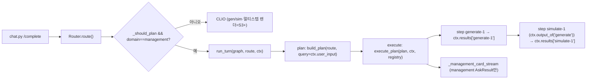

# S2 — 멀티스텝 오케스트레이션 (등록 + 블랙보드 executor) Implementation Plan

> **For agentic workers:** REQUIRED SUB-SKILL: Use superpowers:subagent-driven-development (recommended) or superpowers:executing-plans to implement this plan task-by-task. Steps use checkbox (`- [ ]`) syntax for tracking.

**Goal:** S1의 단일 스텝 Plan-then-Execute 골격을, 블랙보드 컨텍스트로 스텝 산출을 주고받는 **멀티스텝 순차 집행**으로 확장하고 generator·simulation을 스텁 어댑터로 등록한다(management 단일 경로 회귀 0).

**Architecture:** `policy.py`(임계·순차마커·파이프라인 단일 출처)와 `context.py`(`TurnContext` 블랙보드)를 신설하고, `plan.py`에 스텝 고유 `id`(`{action}-{n}`)를 더한다. `planner.build_plan`은 게이트 B(복합/순차)면 파이프라인 순서로 멀티스텝 Plan을, 아니면 단일 스텝을 만든다. `executor.execute_plan`은 스텝을 순차 집행하며 `ctx.results[step.id]`에 산출을 누적하고, DomainAgent 계약은 `ask(ctx, step)`로 바뀐다. `turn.py`가 그래프 state에 `ctx`를 싣고, `bootstrap`이 gen/sim 스텁 + 매처를 등록한다. `chat.py`는 management 단일 경로만 라이브 카드로 렌더한다(gen/sim·멀티스텝 렌더링은 S3+).

**Tech Stack:** Python 3.12, FastAPI, LangGraph `StateGraph`(이미 의존성), pytest(`@pytest.mark.asyncio`), uv. 오케스트레이터 코어는 도메인 타입을 import하지 않는다(`Any` 일반화).

**범위 메모(YAGNI):** 실제 gen 이미지 파이프라인·게이트 A(첨부)=**S3**, KPI 게이트·replan 사이클=**S4**, HITL `interrupt`·신규 게재=**S5**, LLM Planner·게이트 C·D=후속, STM `checkpointer`=**M**. 본 계획은 **멀티스텝 기계 + 등록**만 다룬다. 스텝별 LangSmith run 네이밍(`assistant.plan.step.{action}`)은 스텝이 그래프 노드가 되는 **S4**로 미룬다(S2는 S1처럼 turn 루트 + plan/execute 노드 중첩만).



---

## File Structure

| 파일 | 책임 | 신규/수정 |
|---|---|---|
| `backend/api/orchestration/policy.py` | 순차마커·라우터 마진·파이프라인·도메인→액션 단일 출처 | 신규 |
| `backend/api/orchestration/context.py` | `TurnContext` 블랙보드(`output_of`) | 신규 |
| `backend/api/orchestration/routing.py` | ambiguous 마진을 policy에서 읽음 | 수정 |
| `backend/api/orchestration/plan.py` | `PlanStep.id` + `make_plan`이 `{action}-{n}` 부여 | 수정 |
| `backend/api/orchestration/planner.py` | 게이트 B면 멀티스텝, 아니면 단일 `build_plan` | 수정 |
| `backend/api/orchestration/executor.py` | 멀티스텝 순차 집행 + `ask(ctx, step)` | 수정 |
| `backend/api/orchestration/contracts.py` | `DomainAgent.ask(ctx, step)` 시그니처 | 수정 |
| `backend/api/orchestration/turn.py` | 그래프 state에 `ctx`, `run_turn(..., ctx=)` | 수정 |
| `backend/api/orchestration/bootstrap.py` | gen/sim 스텁 + 매처 등록 · management 어댑터 ctx 번역 | 수정 |
| `backend/api/routers/chat.py` | `_assistant`가 `TurnContext` 빌드 · 카드 경로 management 한정 | 수정 |
| `backend/tests/orchestration/test_policy.py` | policy 상수 형태 | 신규 |
| `backend/tests/orchestration/test_context.py` | `output_of` 최신·격리 | 신규 |
| `backend/tests/orchestration/test_routing.py` | 마진이 policy에서 옴 | 수정 |
| `backend/tests/orchestration/test_plan.py` | id 부여·plan_hash 무관 | 수정 |
| `backend/tests/orchestration/test_planner.py` | 멀티스텝·fallback·도메인별 액션 | 수정 |
| `backend/tests/orchestration/test_executor.py` | 멀티스텝 디스패치·블랙보드·fail-loud | 수정 |
| `backend/tests/orchestration/test_turn.py` | `run_turn(ctx=)` 단일·멀티 | 수정 |
| `backend/tests/orchestration/test_bootstrap.py` | gen/sim 등록·어댑터 ctx 계약 | 수정 |
| `backend/tests/orchestration/test_import_purity.py` | `_CORE`에 policy·context 추가 | 수정 |

---

## Task 1: policy.py (단일 출처)

**Files:**
- Create: `backend/api/orchestration/policy.py`
- Test: `backend/tests/orchestration/test_policy.py`

- [ ] **Step 1: Write the failing test**

`backend/tests/orchestration/test_policy.py`:

```python
# 오케스트레이션 정책 상수 — 형태·키 보장(하드코딩 단일 출처)
from api.orchestration import policy


def test_sequential_markers_nonempty():
    assert "그리고" in policy.SEQUENTIAL_MARKERS
    assert len(policy.SEQUENTIAL_MARKERS) >= 3


def test_router_ambiguity_margin_is_float():
    assert isinstance(policy.ROUTER_AMBIGUITY_MARGIN, float)
    assert 0.0 < policy.ROUTER_AMBIGUITY_MARGIN < 1.0


def test_domain_to_action_covers_three_domains():
    assert policy.DOMAIN_TO_ACTION["management"] == "answer"
    assert policy.DOMAIN_TO_ACTION["generator"] == "generate"
    assert policy.DOMAIN_TO_ACTION["simulation"] == "simulate"


def test_pipeline_is_ordered_domain_action_pairs():
    # S2 파이프라인 = generate→simulate (execute는 S5에서 추가)
    assert policy.PIPELINE == (("generator", "generate"), ("simulation", "simulate"))
```

- [ ] **Step 2: Run test to verify it fails**

Run: `cd backend && uv run pytest tests/orchestration/test_policy.py -v`
Expected: FAIL (`ModuleNotFoundError: api.orchestration.policy`)

- [ ] **Step 3: Write minimal implementation**

`backend/api/orchestration/policy.py`:

```python
# 오케스트레이션 정책 단일 출처 — 임계값·순차마커·파이프라인(하드코딩 금지, 여기서만)
from __future__ import annotations

# 복합/순차 의도 마커 — 게이트 B 진입 판정에 사용(자연어 휴리스틱).
SEQUENTIAL_MARKERS: frozenset[str] = frozenset(
    {"괜찮으면", "하고", "그다음", "그리고", "후에", "한 뒤"}
)

# 라우터 ambiguous 판정 마진 — top-runner 차가 이 값 미만이면 애매(routing.py가 읽음).
ROUTER_AMBIGUITY_MARGIN: float = 0.15

# 단일 스텝일 때 도메인 → 기본 액션.
DOMAIN_TO_ACTION: dict[str, str] = {
    "management": "answer",
    "generator": "generate",
    "simulation": "simulate",
}

# 멀티스텝 정규 순서 (domain, action). S5에서 ("management", "execute") 추가.
PIPELINE: tuple[tuple[str, str], ...] = (
    ("generator", "generate"),
    ("simulation", "simulate"),
)
```

- [ ] **Step 4: Run test to verify it passes**

Run: `cd backend && uv run pytest tests/orchestration/test_policy.py -v`
Expected: PASS (4 passed)

- [ ] **Step 5: Ruff + Commit**

```bash
cd backend && uv run ruff format api/orchestration/policy.py tests/orchestration/test_policy.py && uv run ruff check api/orchestration/policy.py tests/orchestration/test_policy.py --fix
git add backend/api/orchestration/policy.py backend/tests/orchestration/test_policy.py
git commit -m "add: 오케스트레이션 policy 단일 출처(마커·마진·파이프라인) — S2"
```

---

## Task 2: routing.py가 policy 마진을 읽음

하드코딩된 `0.15`를 `policy.ROUTER_AMBIGUITY_MARGIN`으로 교체(단일 출처). `route()` 호출 시점에 읽어 monkeypatch가 반영되게 한다.

**Files:**
- Modify: `backend/api/orchestration/routing.py`
- Test: `backend/tests/orchestration/test_routing.py` (추가)

- [ ] **Step 1: Write the failing test**

`backend/tests/orchestration/test_routing.py` 끝에 추가:

```python
def test_router_ambiguity_margin_comes_from_policy(monkeypatch):
    # 마진을 policy에서 읽는지 — 큰 값으로 패치하면 평소 비애매 케이스가 애매가 된다.
    from api.orchestration import policy

    monkeypatch.setattr(policy, "ROUTER_AMBIGUITY_MARGIN", 0.9)
    r = Router(
        [KeywordMatcher("a", frozenset({"x", "y", "z"})), KeywordMatcher("b", frozenset({"x"}))]
    )
    d = r.route("x y z")  # a=3hit→1.0, b=1hit→0.333, 차=0.667 < 0.9 → ambiguous
    assert d.ambiguous is True
```

- [ ] **Step 2: Run test to verify it fails**

Run: `cd backend && uv run pytest tests/orchestration/test_routing.py::test_router_ambiguity_margin_comes_from_policy -v`
Expected: FAIL (현재 0.15 하드코딩 → 0.667 차는 애매 아님, `ambiguous is False`)

- [ ] **Step 3: Edit routing.py**

상단 import에 추가:

```python
from api.orchestration import policy
```

`route()` 안의 ambiguous 계산 줄을 교체:

```python
        ambiguous = runner > 0.0 and (top.score - runner) < policy.ROUTER_AMBIGUITY_MARGIN
```

(기존: `... < 0.15`)

- [ ] **Step 4: Run tests to verify pass**

Run: `cd backend && uv run pytest tests/orchestration/test_routing.py -v`
Expected: PASS (기존 6건 + 신규 1건). 기본 마진 0.15에서 기존 동작 동일.

- [ ] **Step 5: Ruff + Commit**

```bash
cd backend && uv run ruff format api/orchestration/routing.py tests/orchestration/test_routing.py && uv run ruff check api/orchestration/routing.py tests/orchestration/test_routing.py --fix
git add backend/api/orchestration/routing.py backend/tests/orchestration/test_routing.py
git commit -m "edit: 라우터 ambiguous 마진을 policy 단일 출처로 — S2"
```

---

## Task 3: PlanStep.id + make_plan 액션별 1-based

`PlanStep`에 `id` 필드를 더하고 `make_plan`이 `{action}-{n}`(action별 1-based)로 부여한다. `compute_plan_hash`는 id를 **포함하지 않는다**(domain/action/inputs만).

**Files:**
- Modify: `backend/api/orchestration/plan.py`
- Test: `backend/tests/orchestration/test_plan.py` (수정)

- [ ] **Step 1: Update tests (failing)**

`backend/tests/orchestration/test_plan.py`를 아래로 교체:

```python
# Plan 구조 — plan_hash 결정론·순서민감·id 무관 + inputs 불변성 + 액션별 1-based id
from dataclasses import replace

import pytest

from api.orchestration.plan import Plan, PlanStep, compute_plan_hash, make_plan


def _steps():
    return [
        PlanStep(domain="generator", action="generate", inputs={"q": "광고"}),
        PlanStep(domain="simulation", action="simulate", inputs={}),
    ]


def test_make_plan_returns_plan_with_matching_hash():
    plan = make_plan(_steps())
    assert isinstance(plan, Plan)
    assert plan.plan_hash == compute_plan_hash(plan.steps)


def test_plan_hash_is_deterministic():
    assert compute_plan_hash(tuple(_steps())) == compute_plan_hash(tuple(_steps()))


def test_plan_hash_is_order_sensitive():
    forward = compute_plan_hash(tuple(_steps()))
    reversed_ = compute_plan_hash(tuple(reversed(_steps())))
    assert forward != reversed_


def test_make_plan_assigns_per_action_1based_ids():
    plan = make_plan(
        [
            PlanStep(domain="generator", action="generate", inputs={}),
            PlanStep(domain="simulation", action="simulate", inputs={}),
            PlanStep(domain="generator", action="generate", inputs={"v": 2}),
        ]
    )
    assert [s.id for s in plan.steps] == ["generate-1", "simulate-1", "generate-2"]


def test_plan_hash_ignores_id():
    # id가 달라도 domain/action/inputs가 같으면 plan_hash는 동일.
    step = make_plan([PlanStep(domain="generator", action="generate", inputs={})]).steps[0]
    relabeled = replace(step, id="generate-99")
    assert compute_plan_hash((step,)) == compute_plan_hash((relabeled,))


def test_plan_step_inputs_are_read_only():
    step = PlanStep(domain="management", action="answer", inputs={"query": "x"})
    with pytest.raises(TypeError):
        step.inputs["query"] = "mutated"


def test_plan_step_copies_source_dict():
    src = {"query": "x"}
    step = PlanStep(domain="management", action="answer", inputs=src)
    src["query"] = "mutated"
    assert step.inputs["query"] == "x"
```

- [ ] **Step 2: Run test to verify it fails**

Run: `cd backend && uv run pytest tests/orchestration/test_plan.py -v`
Expected: FAIL (`test_make_plan_assigns_per_action_1based_ids` — `PlanStep`에 `id` 없음)

- [ ] **Step 3: Edit plan.py**

import 줄에 `replace` 추가:

```python
from dataclasses import dataclass, field, replace
```

`PlanStep`에 `id` 필드 추가(`inputs` 다음 줄):

```python
    inputs: Mapping[str, Any] = field(default_factory=dict)
    id: str = ""  # make_plan이 {action}-{n}(action별 1-based)로 채움. plan_hash 비포함.
```

`make_plan`을 교체:

```python
def make_plan(steps: list[PlanStep]) -> Plan:
    # 스텝 인스턴스 고유 키 — action별 1-based 순번. 저장은 step.id, 접근은 TurnContext.output_of(action).
    counts: dict[str, int] = {}
    rebuilt: list[PlanStep] = []
    for s in steps:
        counts[s.action] = counts.get(s.action, 0) + 1
        rebuilt.append(replace(s, id=f"{s.action}-{counts[s.action]}"))
    frozen = tuple(rebuilt)
    return Plan(steps=frozen, plan_hash=compute_plan_hash(frozen))
```

`compute_plan_hash`는 **그대로**(domain/action/inputs만 직렬화 — id 비포함).

- [ ] **Step 4: Run test to verify it passes**

Run: `cd backend && uv run pytest tests/orchestration/test_plan.py -v`
Expected: PASS (7 passed)

- [ ] **Step 5: Ruff + Commit**

```bash
cd backend && uv run ruff format api/orchestration/plan.py tests/orchestration/test_plan.py && uv run ruff check api/orchestration/plan.py tests/orchestration/test_plan.py --fix
git add backend/api/orchestration/plan.py backend/tests/orchestration/test_plan.py
git commit -m "edit: PlanStep.id(액션별 1-based)·make_plan 부여, plan_hash는 id 무관 — S2"
```

---

## Task 4: TurnContext 블랙보드 (context.py)

**Files:**
- Create: `backend/api/orchestration/context.py`
- Test: `backend/tests/orchestration/test_context.py`

- [ ] **Step 1: Write the failing test**

`backend/tests/orchestration/test_context.py`:

```python
# TurnContext 블랙보드 — step.id로 저장, output_of(action)는 해당 action의 최신 산출 반환
from api.orchestration.context import TurnContext


def test_output_of_returns_none_when_absent():
    assert TurnContext(user_input="q").output_of("generate") is None


def test_output_of_returns_latest_for_action():
    ctx = TurnContext(user_input="q")
    ctx.results["generate-1"] = {"ad_id": "a1"}
    ctx.results["generate-2"] = {"ad_id": "a2"}
    assert ctx.output_of("generate") == {"ad_id": "a2"}


def test_output_of_isolates_by_action():
    ctx = TurnContext(user_input="q")
    ctx.results["generate-1"] = {"x": 1}
    ctx.results["simulate-1"] = {"y": 2}
    assert ctx.output_of("simulate") == {"y": 2}
    assert ctx.output_of("generate") == {"x": 1}


def test_defaults_are_independent_per_instance():
    a = TurnContext(user_input="a")
    b = TurnContext(user_input="b")
    a.results["generate-1"] = {"x": 1}
    assert b.results == {}  # 기본 dict가 인스턴스 간 공유되지 않음
```

- [ ] **Step 2: Run test to verify it fails**

Run: `cd backend && uv run pytest tests/orchestration/test_context.py -v`
Expected: FAIL (`ModuleNotFoundError: api.orchestration.context`)

- [ ] **Step 3: Write minimal implementation**

`backend/api/orchestration/context.py`:

```python
# 오케스트레이션 턴 블랙보드 — 스텝 산출을 step.id로 누적, output_of로 역할(action) 최신 조회
from __future__ import annotations

from dataclasses import dataclass, field
from typing import Any


@dataclass
class TurnContext:
    user_input: str
    session_id: str = ""
    ad_id: str | None = None
    attachments: tuple[Any, ...] = ()  # 자리만 — S3 멀티모달에서 채움
    results: dict[str, Any] = field(default_factory=dict)  # step.id -> output (점진 누적)

    def output_of(self, action: str) -> Any | None:
        # 저장은 고유 step.id({action}-{n}), 접근은 의미역 — 해당 action의 최신(n 최대) 산출.
        matched = [
            (int(suffix), value)
            for key, value in self.results.items()
            if "-" in key
            for head, _, suffix in [key.rpartition("-")]
            if head == action and suffix.isdigit()
        ]
        if not matched:
            return None
        return max(matched, key=lambda pair: pair[0])[1]
```

- [ ] **Step 4: Run test to verify it passes**

Run: `cd backend && uv run pytest tests/orchestration/test_context.py -v`
Expected: PASS (4 passed)

- [ ] **Step 5: Ruff + Commit**

```bash
cd backend && uv run ruff format api/orchestration/context.py tests/orchestration/test_context.py && uv run ruff check api/orchestration/context.py tests/orchestration/test_context.py --fix
git add backend/api/orchestration/context.py backend/tests/orchestration/test_context.py
git commit -m "add: TurnContext 블랙보드(step.id 저장·output_of 최신 조회) — S2"
```

---

## Task 5: planner.py 멀티스텝 build_plan

게이트 B(복합/순차)면 `policy.PIPELINE` 순서로 멀티스텝(파이프라인 도메인 2개+ 매칭 시), 아니면 단일 스텝. 시그니처 `build_plan(route, *, query)`는 유지(turn.py·기존 테스트 호환).

**Files:**
- Modify: `backend/api/orchestration/planner.py`
- Test: `backend/tests/orchestration/test_planner.py` (수정)

- [ ] **Step 1: Update tests (failing)**

`backend/tests/orchestration/test_planner.py`를 아래로 교체:

```python
# Planner — 단일/멀티스텝 build_plan(게이트 B), 도메인별 액션, fallback
from api.orchestration.planner import build_plan
from api.orchestration.routing import KeywordMatcher, Router


def test_single_step_management_uses_answer_action():
    route = Router([KeywordMatcher("management", frozenset({"캠페인"}))]).route("캠페인 예산")
    plan = build_plan(route, query="캠페인 예산")
    assert len(plan.steps) == 1
    assert plan.steps[0].domain == "management"
    assert plan.steps[0].action == "answer"
    assert plan.steps[0].inputs == {"query": "캠페인 예산"}


def test_single_step_generator_uses_generate_action():
    route = Router([KeywordMatcher("generator", frozenset({"시안"}))]).route("시안 만들어")
    plan = build_plan(route, query="시안 만들어")
    assert len(plan.steps) == 1
    assert plan.steps[0].action == "generate"


def test_two_pipeline_domains_make_multistep_in_pipeline_order():
    router = Router(
        [
            KeywordMatcher("simulation", frozenset({"시뮬"})),  # 등록 순서를 일부러 뒤집어도
            KeywordMatcher("generator", frozenset({"시안"})),
        ]
    )
    route = router.route("시안 만들고 시뮬 돌려")
    plan = build_plan(route, query="시안 만들고 시뮬 돌려")
    # PIPELINE 순서(generate→simulate)로 정렬되어야 한다(라우터 점수/등록순 무관)
    assert [(s.domain, s.action) for s in plan.steps] == [
        ("generator", "generate"),
        ("simulation", "simulate"),
    ]


def test_sequential_marker_with_one_pipeline_domain_falls_back_to_single():
    # 순차마커 있어도 파이프라인 도메인이 1개면 단일 fallback(과생성·빈 Plan 방지)
    route = Router([KeywordMatcher("generator", frozenset({"시안"}))]).route("시안 그리고 뭐")
    plan = build_plan(route, query="시안 그리고 뭐")
    assert len(plan.steps) == 1
    assert plan.steps[0].domain == "generator"
```

- [ ] **Step 2: Run test to verify it fails**

Run: `cd backend && uv run pytest tests/orchestration/test_planner.py -v`
Expected: FAIL (`test_two_pipeline_domains_make_multistep...` — 현재 단일 스텝·action 항상 "answer")

- [ ] **Step 3: Edit planner.py**

`backend/api/orchestration/planner.py` 전체 교체:

```python
# Planner — RouteDecision으로 고정 Plan을 만든다(S2: 게이트 B면 멀티스텝, 아니면 단일)
from __future__ import annotations

from api.orchestration import policy
from api.orchestration.plan import Plan, PlanStep, make_plan
from api.orchestration.routing import RouteDecision


def build_plan(route: RouteDecision, *, query: str) -> Plan:
    nonzero = {c.domain for c in route.candidates if c.score > 0.0}
    sequential = any(marker in query for marker in policy.SEQUENTIAL_MARKERS)

    if len(nonzero) >= 2 or sequential:  # 게이트 B 진입
        steps = [
            PlanStep(domain=domain, action=action, inputs={"query": query})
            for domain, action in policy.PIPELINE
            if domain in nonzero
        ]
        if len(steps) >= 2:  # 파이프라인 도메인 2개+ 매칭 시에만 멀티스텝
            return make_plan(steps)
        # 게이트 B지만 파이프라인 매칭 <2 → 아래 단일 스텝으로 fallback

    step = PlanStep(
        domain=route.domain,
        action=policy.DOMAIN_TO_ACTION[route.domain],
        inputs={"query": query},
    )
    return make_plan([step])
```

> 주의 — `build_plan`은 도메인이 해석된 경우(`route.score > 0`)에만 호출된다(`chat._should_plan` 가드).
> 따라서 `route.domain`은 항상 등록 도메인이며 `DOMAIN_TO_ACTION[route.domain]`은 KeyError가 나지 않는다.

- [ ] **Step 4: Run test to verify it passes**

Run: `cd backend && uv run pytest tests/orchestration/test_planner.py -v`
Expected: PASS (4 passed)

- [ ] **Step 5: Ruff + Commit**

```bash
cd backend && uv run ruff format api/orchestration/planner.py tests/orchestration/test_planner.py && uv run ruff check api/orchestration/planner.py tests/orchestration/test_planner.py --fix
git add backend/api/orchestration/planner.py tests/orchestration/test_planner.py
git commit -m "edit: build_plan 게이트 B 멀티스텝(파이프라인 순서)·도메인별 액션·단일 fallback — S2"
```

---

## Task 6: 멀티스텝 executor + ask(ctx, step) 계약 + turn ctx

**조정 변경** — `execute_plan` 시그니처·`DomainAgent.ask` 계약·`turn.py` state가 함께 바뀐다(한 커밋으로 그린 유지). 코어는 도메인 타입 미import(`Any`).

**Files:**
- Modify: `backend/api/orchestration/executor.py`
- Modify: `backend/api/orchestration/contracts.py`
- Modify: `backend/api/orchestration/turn.py`
- Test: `backend/tests/orchestration/test_executor.py` (수정), `backend/tests/orchestration/test_turn.py` (수정)

- [ ] **Step 1: Update test_executor.py (failing)**

`backend/tests/orchestration/test_executor.py` 전체 교체:

```python
# Plan Executor — 멀티스텝 순차 디스패치 + 블랙보드 누적, 빈/미등록 Plan은 명시적 실패
import pytest

from api.orchestration.context import TurnContext
from api.orchestration.executor import PlanExecutionError, execute_plan
from api.orchestration.plan import PlanStep, make_plan
from api.orchestration.registry import AgentRegistry


class _FakeAgent:
    def __init__(self, domain: str, payload) -> None:
        self.domain = domain
        self._payload = payload
        self.seen: list = []

    async def ask(self, ctx, step):
        self.seen.append((ctx, step))
        return self._payload


class _SimReadsGenerate:
    domain = "simulation"

    async def ask(self, ctx, step):
        upstream = ctx.output_of("generate")
        return {"sim_for": upstream["ad_id"]}


@pytest.mark.asyncio
async def test_single_step_writes_blackboard_and_returns_output():
    agent = _FakeAgent("management", {"answer": "ok"})
    registry = AgentRegistry()
    registry.register(agent)
    plan = make_plan([PlanStep(domain="management", action="answer", inputs={})])
    ctx = TurnContext(user_input="q")

    result = await execute_plan(plan, ctx, registry=registry)

    assert result == {"answer": "ok"}
    assert ctx.results["answer-1"] == {"answer": "ok"}
    assert agent.seen[0][1].id == "answer-1"  # 에이전트가 step을 받는다


@pytest.mark.asyncio
async def test_multi_step_threads_blackboard_in_order():
    gen = _FakeAgent("generator", {"ad_id": "ad-1"})
    registry = AgentRegistry()
    registry.register(gen)
    registry.register(_SimReadsGenerate())
    plan = make_plan(
        [
            PlanStep(domain="generator", action="generate", inputs={}),
            PlanStep(domain="simulation", action="simulate", inputs={}),
        ]
    )
    ctx = TurnContext(user_input="q")

    result = await execute_plan(plan, ctx, registry=registry)

    assert ctx.results["generate-1"] == {"ad_id": "ad-1"}
    assert result == {"sim_for": "ad-1"}  # 마지막 스텝 산출 반환


@pytest.mark.asyncio
async def test_unregistered_domain_raises():
    plan = make_plan([PlanStep(domain="generator", action="generate", inputs={})])
    with pytest.raises(PlanExecutionError):
        await execute_plan(plan, TurnContext(user_input="q"), registry=AgentRegistry())


@pytest.mark.asyncio
async def test_empty_plan_raises():
    empty = make_plan([])
    with pytest.raises(PlanExecutionError):
        await execute_plan(empty, TurnContext(user_input="q"), registry=AgentRegistry())
```

- [ ] **Step 2: Run test to verify it fails**

Run: `cd backend && uv run pytest tests/orchestration/test_executor.py -v`
Expected: FAIL (현재 `execute_plan(plan, *, req, registry)` 시그니처·단일 스텝 가드)

- [ ] **Step 3: Edit executor.py**

`backend/api/orchestration/executor.py` 전체 교체:

```python
# Plan Executor — 고정 Plan의 스텝을 순차 집행, 산출을 블랙보드(step.id)에 누적(S2 멀티스텝)
from __future__ import annotations

from typing import Any

from api.orchestration.context import TurnContext
from api.orchestration.plan import Plan
from api.orchestration.registry import AgentRegistry


class PlanExecutionError(RuntimeError):
    """빈 Plan·미등록 도메인 등 집행 불가 상태(조용한 폴백 금지)."""


async def execute_plan(plan: Plan, ctx: TurnContext, *, registry: AgentRegistry) -> Any:
    # 1스텝 이상 순차 집행. 0스텝·미등록은 명시적 실패(fail-loud).
    if not plan.steps:
        raise PlanExecutionError("빈 Plan은 집행할 수 없다")
    out: Any = None
    for step in plan.steps:
        agent = registry.get(step.domain)
        if agent is None:
            raise PlanExecutionError(f"미등록 도메인 스텝: {step.domain}")
        out = await agent.ask(ctx, step)
        ctx.results[step.id] = out  # 블랙보드 누적 — 다음 스텝이 output_of로 읽는다
    return out  # 마지막 스텝 산출
```

- [ ] **Step 4: Edit contracts.py**

`backend/api/orchestration/contracts.py`의 Protocol 시그니처 교체:

```python
# 오케스트레이터 ↔ 도메인 경계 계약 — 도메인 내부를 import하지 않는다(의존성 역전)
from __future__ import annotations

from typing import Any, Protocol


class DomainAgent(Protocol):
    domain: str

    async def ask(self, ctx: Any, step: Any) -> Any: ...
```

- [ ] **Step 5: Update test_turn.py (failing)**

`backend/tests/orchestration/test_turn.py` 전체 교체:

```python
# run_turn — StateGraph(plan→execute)가 ctx로 단일·멀티 Plan을 집행
import pytest

from api.orchestration.context import TurnContext
from api.orchestration.registry import AgentRegistry
from api.orchestration.routing import KeywordMatcher, Router
from api.orchestration.turn import build_orchestrator_graph, run_turn


class _FakeManagement:
    domain = "management"

    async def ask(self, ctx, step):
        return {"answer": f"handled:{ctx.user_input}"}


class _Gen:
    domain = "generator"

    async def ask(self, ctx, step):
        return {"ad_id": "ad-9"}


class _Sim:
    domain = "simulation"

    async def ask(self, ctx, step):
        return {"sim_for": ctx.output_of("generate")["ad_id"]}


@pytest.mark.asyncio
async def test_run_turn_executes_single_step_plan():
    route = Router([KeywordMatcher("management", frozenset({"캠페인"}))]).route("캠페인 예산")
    registry = AgentRegistry()
    registry.register(_FakeManagement())
    graph = build_orchestrator_graph(registry)

    result = await run_turn(graph, route, ctx=TurnContext(user_input="캠페인 예산"))

    assert result == {"answer": "handled:캠페인 예산"}


@pytest.mark.asyncio
async def test_run_turn_executes_multi_step_plan_threads_blackboard():
    router = Router(
        [KeywordMatcher("generator", frozenset({"시안"})), KeywordMatcher("simulation", frozenset({"시뮬"}))]
    )
    route = router.route("시안 만들고 시뮬 돌려")
    registry = AgentRegistry()
    registry.register(_Gen())
    registry.register(_Sim())
    graph = build_orchestrator_graph(registry)

    result = await run_turn(graph, route, ctx=TurnContext(user_input="시안 만들고 시뮬 돌려"))

    assert result == {"sim_for": "ad-9"}


@pytest.mark.asyncio
async def test_run_turn_fails_loud_when_ctx_lacks_user_input():
    # ctx에 .user_input이 없으면 조용한 폴백 없이 AttributeError(plan_node fail-loud)
    route = Router([KeywordMatcher("management", frozenset({"캠페인"}))]).route("캠페인 예산")
    registry = AgentRegistry()
    registry.register(_FakeManagement())
    graph = build_orchestrator_graph(registry)
    with pytest.raises(AttributeError):
        await run_turn(graph, route, ctx=object())  # .user_input 없음
```

- [ ] **Step 6: Edit turn.py**

`backend/api/orchestration/turn.py` 전체 교체:

```python
# 오케스트레이션 턴 그래프 — plan·execute 노드를 LangGraph로 묶어 트레이스·STM·HITL 토대를 만든다
from __future__ import annotations

from typing import Any, TypedDict

from langgraph.graph import END, START, StateGraph

from api.orchestration.executor import execute_plan
from api.orchestration.planner import build_plan
from api.orchestration.registry import AgentRegistry


class TurnState(TypedDict, total=False):
    route: Any
    ctx: Any
    plan: Any
    result: Any


def build_orchestrator_graph(registry: AgentRegistry):
    # registry를 노드 클로저에 바인딩 — 그래프는 한 번 빌드해 재사용(호출자가 캐시).
    async def plan_node(state: TurnState) -> dict:
        # ctx.user_input 직접 접근 — 폴백 없음(ctx 비정상이면 AttributeError로 fail-loud).
        return {"plan": build_plan(state["route"], query=state["ctx"].user_input)}

    async def execute_node(state: TurnState) -> dict:
        return {"result": await execute_plan(state["plan"], state["ctx"], registry=registry)}

    g = StateGraph(TurnState)
    g.add_node("plan", plan_node)
    g.add_node("execute", execute_node)
    g.add_edge(START, "plan")
    g.add_edge("plan", "execute")
    g.add_edge("execute", END)
    # S2: stateless(checkpointer 없음). STM 체크포인터는 M 슬라이스에서 compile 인자로 추가.
    return g.compile()


async def run_turn(graph, route: Any, *, ctx: Any) -> Any:
    # 루트 트레이스 — 노드(plan·execute)가 assistant.chat.turn 아래 자식 run으로 중첩된다.
    final = await graph.ainvoke(
        {"route": route, "ctx": ctx},
        config={"run_name": "assistant.chat.turn", "tags": ["assistant"]},
    )
    return final["result"]
```

- [ ] **Step 7: Run both suites to verify pass**

Run: `cd backend && uv run pytest tests/orchestration/test_executor.py tests/orchestration/test_turn.py -v`
Expected: PASS (executor 4 + turn 3 = 7 passed)

- [ ] **Step 8: Ruff + Commit**

```bash
cd backend && uv run ruff format api/orchestration/executor.py api/orchestration/contracts.py api/orchestration/turn.py tests/orchestration/test_executor.py tests/orchestration/test_turn.py && uv run ruff check api/orchestration/executor.py api/orchestration/contracts.py api/orchestration/turn.py tests/orchestration/test_executor.py tests/orchestration/test_turn.py --fix
git add backend/api/orchestration/executor.py backend/api/orchestration/contracts.py backend/api/orchestration/turn.py backend/tests/orchestration/test_executor.py backend/tests/orchestration/test_turn.py
git commit -m "edit: executor 멀티스텝+블랙보드, DomainAgent.ask(ctx,step), turn ctx state — S2"
```

---

## Task 7: import 순수성 가드에 policy·context 추가

신규 코어 파일이 `domain.management`를 import하지 않음을 잠근다.

**Files:**
- Modify: `backend/tests/orchestration/test_import_purity.py:5`

- [ ] **Step 1: Update the guard (this is the failing test)**

`backend/tests/orchestration/test_import_purity.py`의 `_CORE` 줄을 교체:

```python
_CORE = (
    "routing.py",
    "contracts.py",
    "registry.py",
    "plan.py",
    "planner.py",
    "executor.py",
    "turn.py",
    "policy.py",
    "context.py",
)
```

- [ ] **Step 2: Run test to verify current code passes the expanded guard**

Run: `cd backend && uv run pytest tests/orchestration/test_import_purity.py -v`
Expected: PASS (policy·context 모두 `domain.management` 미import). FAIL이면 해당 파일의 도메인 import 제거.

- [ ] **Step 3: Commit**

```bash
git add backend/tests/orchestration/test_import_purity.py
git commit -m "edit: import 순수성 가드에 policy·context 추가 — S2"
```

---

## Task 8: bootstrap — gen/sim 스텁 + 매처 등록, management 어댑터 ctx 번역

generator·simulation 스텁 어댑터와 매처를 등록(라우터 코드 무수정). `ManagementDomainAgent.ask`를 `(ctx, step)` → `AskRequest` 번역으로 바꾼다. 스텁은 결정론(`hashlib`).

**Files:**
- Modify: `backend/api/orchestration/bootstrap.py`
- Test: `backend/tests/orchestration/test_bootstrap.py` (수정)

- [ ] **Step 1: Update test_bootstrap.py (failing)**

`backend/tests/orchestration/test_bootstrap.py` 전체 교체:

```python
# bootstrap — 어댑터 ctx 계약 만족 + gen/sim 등록·라우팅(빌더는 stub)
import pytest

import api.orchestration.bootstrap as bootstrap
from api.orchestration.bootstrap import (
    MGMT_KEYWORDS,
    GeneratorStubAgent,
    ManagementDomainAgent,
    SimulationStubAgent,
    build_orchestration,
)
from api.orchestration.context import TurnContext
from api.orchestration.plan import PlanStep


def _patch_builder(monkeypatch):
    # 실제 management 에이전트 빌드를 우회 — composition root는 '등록'만 검증한다.
    async def _echo_ask(req):
        return req

    monkeypatch.setattr(bootstrap, "build_management_agent", lambda settings: _echo_ask)


@pytest.mark.asyncio
async def test_management_adapter_translates_ctx_to_ask_request():
    captured = {}

    async def _ask(req):
        captured["req"] = req
        return req

    agent = ManagementDomainAgent(_ask)
    ctx = TurnContext(user_input="캠페인 예산", session_id="s1", ad_id="ad-7")
    step = PlanStep(domain="management", action="answer", inputs={"query": "캠페인 예산"})

    result = await agent.ask(ctx, step)

    assert agent.domain == "management"
    assert captured["req"].question == "캠페인 예산"
    assert captured["req"].ad_id == "ad-7"
    assert captured["req"].thread_id == "mgmt-s1"
    assert result is captured["req"]


@pytest.mark.asyncio
async def test_generator_stub_returns_ad_id_deterministically():
    agent = GeneratorStubAgent()
    ctx = TurnContext(user_input="시안 만들어")
    step = PlanStep(domain="generator", action="generate", inputs={})
    a = await agent.ask(ctx, step)
    b = await GeneratorStubAgent().ask(TurnContext(user_input="시안 만들어"), step)
    assert a["ad_id"] == b["ad_id"]  # 같은 입력 → 같은 ad_id(결정론)
    assert a["ad_id"].startswith("stub-ad-")


@pytest.mark.asyncio
async def test_simulation_stub_reads_generate_ad_id_from_blackboard():
    ctx = TurnContext(user_input="시뮬 돌려")
    ctx.results["generate-1"] = {"ad_id": "ad-42"}
    out = await SimulationStubAgent().ask(ctx, PlanStep(domain="simulation", action="simulate", inputs={}))
    assert out["ad_id"] == "ad-42"
    assert "kpi" in out


def test_build_orchestration_registers_and_routes_three_domains(monkeypatch):
    _patch_builder(monkeypatch)
    router, registry = build_orchestration(settings=object())
    assert router.route("이번 캠페인 예산 어때").domain == "management"
    assert router.route("시안 만들어줘").domain == "generator"
    assert router.route("시뮬 돌려줘").domain == "simulation"
    assert registry.get("management") is not None
    assert registry.get("generator").domain == "generator"
    assert registry.get("simulation").domain == "simulation"


def test_build_orchestration_non_keyword_is_default(monkeypatch):
    _patch_builder(monkeypatch)
    router, _ = build_orchestration(settings=object())
    assert router.route("안녕하세요").domain == "clio"


def test_mgmt_keywords_nonempty():
    assert "캠페인" in MGMT_KEYWORDS and len(MGMT_KEYWORDS) >= 10
```

- [ ] **Step 2: Run test to verify it fails**

Run: `cd backend && uv run pytest tests/orchestration/test_bootstrap.py -v`
Expected: FAIL (`ImportError: GeneratorStubAgent` · 어댑터 시그니처 불일치)

- [ ] **Step 3: Edit bootstrap.py**

import 블록에 추가(상단, `from __future__` 다음):

```python
import hashlib

from api.orchestration import policy
```

키워드 상수 — `MGMT_KEYWORDS` 정의 아래에 추가:

```python
# generator/simulation 라우팅 키워드(도메인 소유 분리는 후속).
GEN_KEYWORDS: frozenset[str] = frozenset(
    {"시안", "생성", "만들어", "제작", "크리에이티브", "카피"}
)
SIM_KEYWORDS: frozenset[str] = frozenset(
    {"시뮬", "시뮬레이션", "반응", "예측", "테스트", "검증"}
)


def _stub_id(prefix: str, seed: str) -> str:
    # 결정론 더미 id — builtin hash()는 PYTHONHASHSEED 의존이라 금지, sha1로 안정화.
    return f"{prefix}-{hashlib.sha1(seed.encode('utf-8')).hexdigest()[:8]}"
```

`ManagementDomainAgent.ask`를 ctx 번역으로 교체:

```python
class ManagementDomainAgent:
    """기존 build_management_agent(함수 반환)를 DomainAgent 계약으로 감싸는 어댑터."""

    domain = "management"

    def __init__(self, ask: Callable[[AskRequest], Awaitable[AskResult]]) -> None:
        self._ask = ask

    async def ask(self, ctx, step) -> AskResult:
        # 블랙보드 ctx/step → 기존 AskRequest로 번역(단일 계약, 출력은 S1과 동일).
        question = step.inputs.get("query") or ctx.user_input
        thread_id = f"mgmt-{ctx.session_id}" if ctx.session_id else None
        req = AskRequest(question=question, ad_id=ctx.ad_id, thread_id=thread_id)
        return await self._ask(req)
```

gen/sim 스텁 에이전트를 `ManagementDomainAgent` 아래에 추가:

```python
class GeneratorStubAgent:
    """generator 스텁 — 결정론 ad_id 반환(실 이미지 파이프라인은 S3)."""

    domain = "generator"

    async def ask(self, ctx, step) -> dict:
        return {"ad_id": _stub_id("stub-ad", ctx.user_input), "candidates": []}


class SimulationStubAgent:
    """simulation 스텁 — 블랙보드에서 generate ad_id를 읽어 KPI 더미 반환(실 KPI·게이트는 S4)."""

    domain = "simulation"

    async def ask(self, ctx, step) -> dict:
        upstream = ctx.output_of("generate")
        ad_id = upstream["ad_id"] if upstream else None
        return {
            "simulation_id": _stub_id("stub-sim", str(ad_id)),
            "ad_id": ad_id,
            "kpi": {"click_intent": [0.10, 0.22], "reject_rate": 0.18},
        }
```

`build_orchestration`을 교체(매처/에이전트 한 줄씩 추가):

```python
def build_orchestration(settings) -> tuple[Router, AgentRegistry]:
    """라우터 + 레지스트리를 합성한다. 도메인 추가 = 여기 매처/에이전트 한 줄."""
    router = Router(
        [
            KeywordMatcher("management", MGMT_KEYWORDS),
            KeywordMatcher("generator", GEN_KEYWORDS),
            KeywordMatcher("simulation", SIM_KEYWORDS),
        ]
    )
    registry = AgentRegistry()
    registry.register(ManagementDomainAgent(build_management_agent(settings)))
    registry.register(GeneratorStubAgent())
    registry.register(SimulationStubAgent())
    return router, registry
```

> `policy` import는 현재 미사용처럼 보일 수 있으나 키워드/액션 정합 확인용으로 둔다. ruff가 미사용으로 빼면
> 제거해도 무방(키워드는 bootstrap 소유, 액션 매핑은 planner가 policy에서 읽음). **불확실하면 import 제거.**

- [ ] **Step 4: Run test to verify it passes**

Run: `cd backend && uv run pytest tests/orchestration/test_bootstrap.py -v`
Expected: PASS (7 passed)

- [ ] **Step 5: Ruff + Commit**

```bash
cd backend && uv run ruff format api/orchestration/bootstrap.py tests/orchestration/test_bootstrap.py && uv run ruff check api/orchestration/bootstrap.py tests/orchestration/test_bootstrap.py --fix
git add backend/api/orchestration/bootstrap.py backend/tests/orchestration/test_bootstrap.py
git commit -m "add: generator·simulation 스텁 어댑터+매처 등록, management 어댑터 ctx 번역 — S2"
```

---

## Task 9: chat.py 와이어링 — TurnContext 빌드 + 카드 경로 management 한정

`_assistant`가 `TurnContext`를 만들어 `run_turn(ctx=)`를 호출하고, 라이브 카드 경로는 `route.domain == "management"`로 한정한다(gen/sim 스텁의 비-AskResult 산출이 management 카드 컴포저에 닿지 않게 — 회귀 0).

**Files:**
- Modify: `backend/api/routers/chat.py` (import 1줄, generate() 분기 약 217-235行)

- [ ] **Step 1: Edit chat.py — import 추가**

`backend/api/routers/chat.py`의 orchestration import 블록(약 17-20行)에 추가:

```python
from api.orchestration.context import TurnContext
```

- [ ] **Step 2: Edit chat.py — generate() 분기 교체**

`generate()` 안의 다음 블록(약 217-235行):

```python
        # 오케스트레이션 — 도메인이 해석·등록되면 고정 Plan 경로(turn 그래프)로, 아니면 CLIO.
        # run_turn이 plan→execute를 assistant.chat.turn 루트 트레이스로 묶는다.
        router, registry = _get_orchestration()
        route = router.route(last_message)
        if _should_plan(route, registry):
            graph = _get_orchestrator_graph()

            async def _assistant(req: Any) -> Any:
                return await run_turn(graph, route, req=req)

            async for chunk in _management_card_stream(
                question=last_message,
                session_id=body.session_id,
                ad_id=body.context_ad_id,
                assistant=_assistant,
                record=_record_management_turn,
            ):
                yield chunk
            return
```

을 아래로 교체:

```python
        # 오케스트레이션 — 도메인이 해석·등록되면 고정 Plan 경로(turn 그래프)로, 아니면 CLIO.
        # S2: 라이브 카드 렌더는 management 단일 경로만(회귀 0). gen/sim·멀티스텝 렌더링은 S3+.
        router, registry = _get_orchestration()
        route = router.route(last_message)
        if _should_plan(route, registry) and route.domain == "management":
            graph = _get_orchestrator_graph()

            async def _assistant(req: AskRequest) -> AskResult:
                # 블랙보드 컨텍스트로 변환 — management 어댑터가 ctx/step→AskRequest로 되번역.
                ctx = TurnContext(
                    user_input=req.question,
                    session_id=body.session_id,
                    ad_id=req.ad_id,
                )
                return await run_turn(graph, route, ctx=ctx)

            async for chunk in _management_card_stream(
                question=last_message,
                session_id=body.session_id,
                ad_id=body.context_ad_id,
                assistant=_assistant,
                record=_record_management_turn,
            ):
                yield chunk
            return
```

- [ ] **Step 3: Run chat wiring + app import check**

Run: `cd backend && uv run pytest tests/orchestration/test_chat_wiring.py -v && uv run python -c "import api.routers.chat"`
Expected: PASS (`_should_plan` 3건 그대로) · import 에러 없음.

- [ ] **Step 4: Ruff + Commit**

```bash
cd backend && uv run ruff format api/routers/chat.py && uv run ruff check api/routers/chat.py --fix
git add backend/api/routers/chat.py
git commit -m "edit: 챗 _assistant가 TurnContext 빌드·카드 경로 management 한정 — S2"
```

---

## Task 10: 회귀 확인 (전체 오케스트레이션 + management)

- [ ] **Step 1: 오케스트레이션 + management 테스트 전체 실행**

Run: `cd backend && uv run pytest tests/orchestration/ tests/management/ -v`
Expected: PASS. 특히 — management 카드·집행 테스트 무파손(어댑터 출력 AskResult 동일), 기존 routing/registry/plan 회귀 0.

- [ ] **Step 2: 전체 수집 + import 확인**

Run: `cd backend && uv run pytest --collect-only -q`
Expected: 수집 에러 없음(순환 import·누락 없음).

- [ ] **Step 3: 실패 시**

`systematic-debugging` 스킬로 전체 에러·스택을 읽고 원인 확정 후 수정·재실행. "흔한 수정" 추정 금지.

---

## Self-Review (작성자 체크)

**1. 스펙 커버리지** — 스펙 §1~§7 매핑:
- §1 범위 In ① gen/sim 등록 → Task 8 ② 멀티스텝 executor → Task 6 ③ 멀티스텝 build_plan → Task 5 ④ 게이트 B → Task 5 ⑤ policy.py → Task 1 ⑥ PlanStep.id → Task 3 ⑦ ask(ctx, step) → Task 6.
- §2 TurnContext·output_of → Task 4 / step.id 키잉 → Task 3·6 / execute_plan → Task 6.
- §3 계약·management 어댑터·gen/sim 스텁·등록 → Task 6·8.
- §4 policy·게이트 B·build_plan·routing 마진 → Task 1·2·5.
- §5 추적 — turn 루트+노드 중첩(S1 유지). **스텝별 run 네이밍은 S4로 명시 연기**(아래 deviation).
- §6 협업/리스크 — 계약 변경은 Task 6·8에 집중, 회귀는 Task 10이 잠금.
- §7 테스트 11개 → 1·2(executor/turn multi+blackboard) · 3(make_plan id) · 4(plan_hash id 무관) · 5(planner 게이트 B/fallback) · 6(management 회귀=Task10) · 7(executor fail-loud) · 8(bootstrap 등록) · 9(routing 마진 policy) · 10(import 순수성) 매핑. 11(추적)은 graph 파생(S1 선례대로 별도 단위테스트 안 함).

**2. Placeholder 스캔** — 없음. 모든 코드 step에 실제 코드·명령·기대출력 포함.

**3. 타입/시그니처 정합** — `PlanStep(+id)`·`make_plan`(Task3) → `TurnContext.output_of`(Task4) → `build_plan(route, *, query)`(Task5) → `execute_plan(plan, ctx, *, registry)`·`DomainAgent.ask(ctx, step)`·`run_turn(graph, route, *, ctx)`(Task6) → `ManagementDomainAgent.ask(ctx, step)`·`GeneratorStubAgent`·`SimulationStubAgent`(Task8) → chat `_assistant`가 `TurnContext` 빌드(Task9) 일관. 코어는 도메인 타입 미import(Task7 잠금).

**4. 스펙 대비 의도적 deviation(투명 고지)** — ① `PIPELINE`을 (domain, action) 쌍으로 구현(스펙의 PIPELINE_ORDER를 gen→sim 부분집합으로 실현, execute=S5). ② 스텝별 LangSmith run 네이밍(`assistant.plan.step.{action}`)은 스텝이 그래프 노드가 되는 S4로 연기 — S2는 turn 루트+plan/execute 노드 중첩만. ③ **라이브 챗 출력은 management 단일 경로만**(gen/sim·멀티스텝 카드 렌더링은 실 어댑터가 오는 S3+); gen/sim 등록·멀티스텝 executor는 오케스트레이션 테스트 계층에서 증명. 모두 슬라이스 경계(S3/S4/S5)와 정합.
