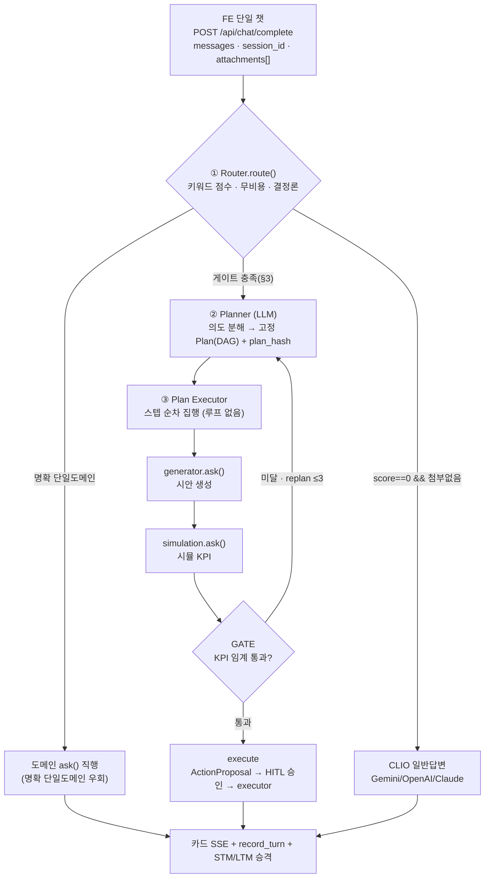
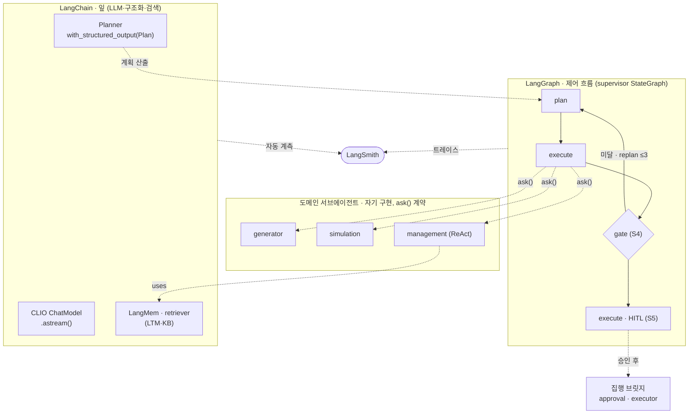
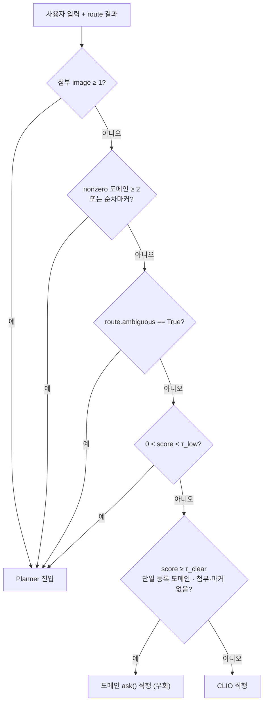
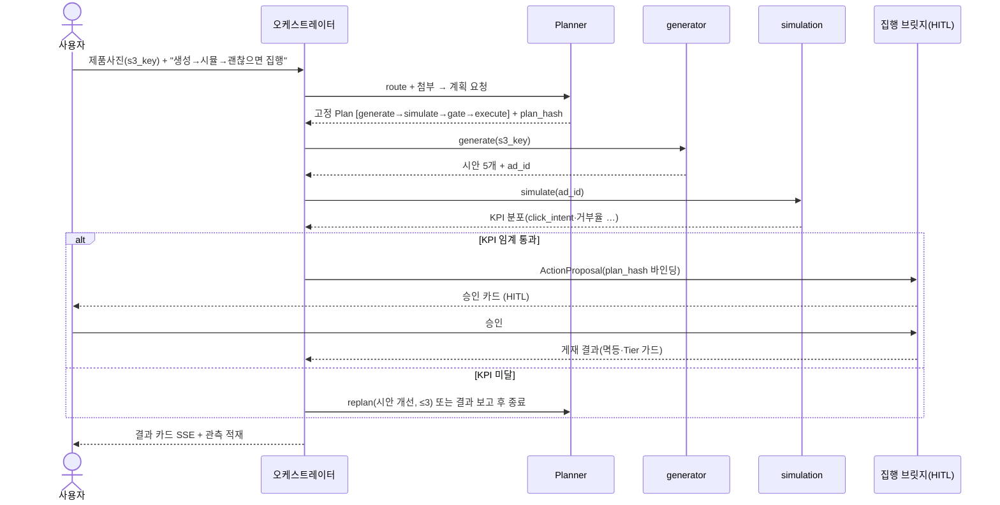

# E2E 챗 오케스트레이션 — Plan-then-Execute 설계 (에픽)

| | |
|---|---|
| Date | 2026-06-26 |
| Domain | 공통부 (cross-team) · 레퍼런스 구현은 management(🅱) |
| Branch | feat/chat-boeun |
| Status | Draft (설계 합의) |

> ⚠️ 공통부 변경 — Planner·Plan 계약·오케스트레이터는 세 팀(simulation·management·generator)
> 공유 영역이다. 확정은 팀 합의가 필요하다(협업 규칙: 타 도메인 내부 import 금지, 교환은 계약으로만).
> 본 문서는 **에픽(큰 단계)** 이며, 실제 구현은 아래 §11 슬라이스(S1~S5)로 쪼개 각자 별도 계획·PR로 간다.

---

## 1. 목표 (에픽 정의)

한 챗 문장 — 제품사진 + "광고 시안 생성 → 시뮬 → 괜찮으면 집행" — 을 **Plan-then-Execute**
오케스트레이션으로 끝까지 처리한다. CLAUDE.md가 "후순위(미정)"로 둔 오케스트레이터 본체에 해당하며,
기존 `2026-06-24-multi-domain-chat-orchestration-design.md`(키워드 라우터 MVP)·
`2026-06-24-management-agentic-rag-memory-eval.md`(에이전틱 RAG·메모리)를 잇는 상위 통합 설계다.

### Definition of Done

제품사진 → 시안 생성 → 시뮬 → 조건 게이트(KPI) → **HITL 승인 후 실게재**까지 E2E 데모가 동작한다.

### 핵심 원칙

- **단일 자율 ReAct 루프 금지** → **고정 Plan(DAG) + 순차 집행**(추적·안전·결정론).
- **모든 실지출은 항상 HITL 승인** 통과(자동 집행 없음).
- **기존 자산 최대 재사용** — 라우터·집행 브릿지(approval·executor·Tier·멱등·TTL)·S3·generator/simulation 서비스.

### 비목표 (Non-Goals)

- 멀티에이전트 swarm/네트워크 통신.
- 2단계 LLM 분류기의 정교화(인터페이스 자리만, 후속).
- LTM 3티어 병합·우선순위 로직(스키마만 개방, 후속).
- 캘리브레이션된 실측 CTR 환산(시뮬 KPI는 분포·신뢰구간 표기 유지).
- escalation 사다리와 Plan 영속의 통합(병렬 유지 — §10).

---

## 2. 아키텍처 (4계층)

```
FE 단일 챗 ── POST /api/chat/complete
                { messages, session_id, attachments:[{s3_key, kind:image}] }
   │
[1] Router.route(text)        기존 키워드 점수 — 단일 명확 도메인이면 그대로(무비용·결정론)
   │   └ Planner 진입 게이트(§3) 충족 → Planner
[2] Planner (LLM)             의도 분해 → 고정 Plan(DAG) + plan_hash (§4)
   │                          예: [generate] → [simulate] → (gate) → [execute]
[3] Plan Executor             Plan을 순차 집행(루프 없음, 각 스텝 = 도메인 ask())
   │   generate ─► simulate ─► GATE(KPI 임계, §5) ─► execute(HITL, §5)
[4] 도메인 서브에이전트        동일 계약 ask(AskRequest) -> AskResult
       generator · simulation · management(집행)
   │
출력: 카드 SSE(compose/stream_card) + 관측 record_turn + STM(체크포인터) + LTM 승격(§7)
```

- **라우터 1단계는 그대로 두고** 그 위에 Planner/Executor를 얹는다(기존 `api/orchestration` 무파손 확장).
- **오케스트레이터를 LangGraph로 구현한다**(§6) — 추적·STM·HITL이 같은 메커니즘에서 따라온다.



### LangGraph 사용 범위 (슬라이스별)

LangGraph 풀 기능을 쓰되 **전부 이 supervisor 그래프 하나에** 점진적으로 얹는다(새 그래프를 여럿 만들지 않음).

| 슬라이스 | 도입 기능 | 목적 |
|---|---|---|
| S1 | `StateGraph` + 노드(plan·execute), 선형, **stateless compile** | 그래프 골격 + 트레이스 자동 중첩 |
| S2 | 노드의 registry 디스패치 일반화 · executor 멀티스텝 | 여러 도메인 스텝 순차 집행 |
| S4 | **`add_conditional_edges`(게이트) + 사이클(replan 루프)** | KPI 통과→execute / 미달→replan(≤3) |
| S5 | **`interrupt`(HITL)** | 집행 전 사람 승인 일시정지·재개 |
| M | **`compile(checkpointer=AsyncPostgresSaver)`** + `thread_id` | STM 영속(멀티턴·HITL 재개) |
| T | LangSmith config(`run_name`·`metadata`) | 추적(그래프면 거의 공짜) |

**경계 — LangGraph로 흡수하지 않는 것.**

- 도메인 서브에이전트 내부(management 자체 ReAct 그래프·generator 5단계 그래프·simulation 서비스)는
  `ask()` 계약으로 **호출만** 한다(그래프 안에 그래프를 박지 않음).
- 비동기 백그라운드 잡(gen/sim SSE)을 장기 실행 노드로 가두지 않고 트리거·상관(§6)으로 처리.
- deepagents 하네스·가상 파일시스템 메모리 미사용. swarm/네트워크 통신 없음(supervisor 단일 통제).

### LangChain 사용 범위 (어디에 무엇을)

원칙 — **"잎(leaf)은 LangChain, 제어 흐름은 LangGraph, raw SDK는 0."** LLM 호출·구조화 출력·프롬프트·
검색 같은 말단만 LangChain으로, 노드 간 흐름·분기·HITL은 LangGraph가 소유한다. (LangChain은 이미
부분 도입 — management 풀모드 `ChatOpenAI`·`langchain_core.messages` 등. 본 항목은 확대·표준화.)

| 어디에 | 무엇을 | 슬라이스 |
|---|---|---|
| CLIO | raw SDK(google.generativeai/openai/anthropic) → `ChatX` + `.astream()` + provider 팩토리. **추적 누락 제거**(§6.3) | T |
| Planner LLM | `with_structured_output(PlanModel)` → 타입 보장 Plan 산출 | S2/S4 |
| 프롬프트 | CLIO·Planner 프롬프트를 `ChatPromptTemplate`로 중앙화·버전화 | T·S2 |
| 메모리/검색 | LTM=LangMem, KB=retriever(management 하이브리드 보유) | M |
| 도메인 내부 | management는 이미 LangChain tool-calling. generator/sim은 자기 구현 유지(계약으로만 연결) | 변경 없음 |

> 안 하는 것 — 오케스트레이터 제어 흐름을 LCEL `Runnable` 체인으로 짜지 않음(LangGraph가 소유).
> 도메인 서비스 내부를 LangChain으로 갈아엎지 않음(경계 규칙).

### 계층 구조 — 잎(LangChain) · 제어(LangGraph) · 도메인 · 추적(LangSmith)



---

## 3. Planner 진입 게이트

`route = Router.route(text)`, `nonzero = score>0 후보`라 할 때, **아래 중 하나라도 참이면 Planner 진입**.

| 조건 | 술어 |
|---|---|
| A. 첨부 존재 | `attachments`에 image 1개 이상 |
| B. 복합/순차 의도 | `len(nonzero 도메인) >= 2` **또는** 순차 마커 존재(`policy.sequential_markers`) |
| C. 애매(단일도메인 미확정) | `route.ambiguous == True` (top − runner < `policy.router_ambiguity_margin` && runner > 0) |
| D. 약한 신호 | `0 < route.score < policy.router_low_confidence_threshold` |

**Planner 우회(빠른 경로) — 딱 두 경우.**

1. **명확 단일 도메인** — `len(nonzero)==1 && route.score >= policy.router_clear_threshold && 첨부 없음 && 순차마커 없음` → 해당 도메인 `ask()` 직행.
2. **순수 조언/잡담** — `route.score == 0 && 첨부 없음` → CLIO 직행.

- **A가 우회조건2보다 우선** — `score==0`이라도 첨부가 있으면 Planner로(이미지가 생성/분석/시뮬의 강한 구조 신호).
- 임계값(`router_low_confidence_threshold`·`router_clear_threshold`·`router_ambiguity_margin`)과
  `sequential_markers`는 **하드코딩 금지** → `contracts/policy.py` 단일 출처.



---

## 4. Plan 객체와 안전장치

`Plan`/`PlanStep`을 **구조화 DAG**로 신설(자연어 아님 → 기계 검증 가능). 기존 `ActionProposal`의 안전
규율을 차용(plan-then-execute 보안 연구 권고와 일치).

- **plan_hash** — 확정 Plan을 해시·바인딩(변조 탐지, "Signed Plan Commitment"). 집행 로그를 hash에 묶는다.
- **bounded replan ≤ 3** — 시뮬 미달 시 시안 재생성 재계획 횟수 제한(무한루프·의도 drift 차단).
- **TTL/승인 SLA** — 기존 proposal TTL(10분) 재사용. 만료 승인 무효.
- **툴콜 검증** — 각 스텝은 Plan에 명시된 액션만 실행(계획 밖 호출 거부).

> Plan 계약은 **management-local 레퍼런스(A단계) → 공용 contracts 승격(B단계)** 순으로 간다
> (기존 멀티도메인 설계의 계약 승격 패턴 재사용).

---

## 5. 조건 게이트("괜찮으면")와 집행

- **게이트 = Review/Critique** — generator=생성자, simulation=비평자. 시뮬 `AggregateResult` KPI를
  **사전정의 임계**(`policy.py`, 예: click_intent CI 하한·거부율 상한)와 비교.
  - 통과 → execute 스텝.
  - 미달 → replan(시안 개선, ≤3) 또는 사용자에게 결과 보고 후 종료.
- **execute = 기존 집행 브릿지 재사용** (`api/routers/chat_management.py` · `approval.py` · `executor.py`).
  - `ActionProposal(plan_hash 바인딩)` → **HITL 승인 카드** → `executor.execute`.
  - 멱등 claim · Tier 게이트 · tenant 검사 = 이미 구현된 것 그대로.
  - **신규** — "신규 광고 게재" action_type + writer 확장(현재는 예산/중지 등만). 실지출 경로라 가장 신중히(S5).
- **집행 자율도 = 항상 HITL**. KPI 통과해도 자동 집행하지 않는다. 오케스트레이터는 제안 카드까지,
  실지출은 사람이 승인 버튼을 눌러야 진행.

### E2E 시나리오 흐름 ("제품사진 → 생성 → 시뮬 → 괜찮으면 집행")



---

## 6. LangSmith 전수 추적

목표 — 모든 LLM 호출/응답이 LangSmith에 남고(누락 0), 한 대화의 턴이 스레드로 묶인다.

1. **1턴 = 1 루트 run** — `/complete` 한 턴을 `assistant.chat.turn` 루트로 감싸고, 하위(router·planner·각
   plan step·gate·execute)가 자동 중첩. 오케스트레이터가 LangGraph이므로 `graph.ainvoke(config=...)`
   한 번으로 트리가 형성된다.
2. **스레드 상관키** — 모든 run metadata에 `session_id`(+`user_id`·`project_id`·`plan_hash`).
   LangSmith threads로 멀티턴이 한 대화로 묶인다. management의 `thread_id=mgmt-{session_id}` 일반화.
3. **raw SDK 호출 제거(중요)** — 현재 CLIO는 `google.generativeai`/`openai`/`anthropic`을 직접 호출해
   **추적 누락**(원 스펙 D1 지적). → LangChain 챗모델(`ChatGoogleGenerativeAI`/`ChatOpenAI`/
   `ChatAnthropic`)로 교체해 자동 계측·토큰·비용까지 포착. Planner LLM도 동일.
4. **비동기 잡 상관** — generator/simulation은 SSE 백그라운드 잡이라 완전 부모-자식 중첩이 어렵다.
   → 잡에 동일 `session_id`+`plan_hash`를 metadata로 주입해 thread로 상관(완전 중첩 대신).
5. **네이밍 규약** — `assistant.turn` / `assistant.router` / `assistant.planner` /
   `assistant.plan.step.{generate|simulate|execute}` / `assistant.gate`. `tags=["assistant", domain]`.
   `LANGCHAIN_PROJECT=clickme` 유지.
6. **eval 훅** — 라우팅 정확도·plan 적합성을 LangSmith dataset으로(기존 management eval 패턴 확장).

---

## 7. 메모리 (STM / LTM)

업계 표준(CoALA 분류) 채택 + 협업용으로 스코프만 확장.

### 종류 (TYPE)

- **STM** = 작업 메모리 = **LangGraph 체크포인터**(현재 대화 메시지·현재 Plan+plan_hash·각 step 산출·
  interrupt 상태). 세션 단위, 종료 시 요약만 LTM 승격하고 원본 blob은 버린다.
- **LTM** = 세션을 넘는 장기 기억, 3종.
  - **semantic** — 브랜드 톤·기본 타깃·선호 플랫폼·예산 가드레일 등 안정 선호/기본값(작고 큐레이션됨).
  - **episodic** — 과거 결정의 **한 줄 요약 + artifact id 포인터**(generation_id/simulation_id/campaign_id/proposal_id).
  - **procedural** — 피드백(👍/👎, 기존 `kb_feedback`)에서 파생한 행동 선호.

### 스코프 (SCOPE)

- **`(org_id, project_id)` 중심으로 작게 시작** — 브랜드·과거시안 episodic은 project, 예산 가드레일 등
  org 기본값은 org 공유.
- **user 레이어는 스키마만 개방** — `user_id` nullable 컬럼 + `scope` enum(`org|project|user`)을 미리 두되,
  **읽기 병합·충돌 우선순위 로직은 만들지 않는다(YAGNI)**. 나중에 마이그레이션 없이 user 행을 쓰기 시작.

### 규칙

- **도메인 데이터 중복 금지** — 풀 시뮬결과·크리에이티브·KB문서·감사로그·예산 숫자는 도메인 테이블이
  정본. LTM은 **id로 참조만**.
- **쓰기(승격) 트리거 3개만** — ① 턴 종료 시 요약기가 선호/기본값 추출 ② gen/sim/execute 성공 시
  artifact 포인터 1줄 ③ 피드백. 매 토큰 승격 금지.
- **보안** — 테넌트 격리는 KB가 깐 RLS 패턴 재사용. 예산·크리에이티브 등 기밀은 평문 저장 금지(참조).
- **구현 도구** — LangMem(LangChain 생태계, namespace 튜플 = `(org_id, project_id, user_id)`) 채택을
  검토(직접 구현 대신). 단일 EC2·Postgres 백엔드와 호환.

---

## 8. 멀티모달 입력

- `ChatRequest`에 `attachments: [{s3_key, kind:image}]` **필드 추가**(append-only, 기존 무파손).
- 두 진입 방식이 같은 계약으로 수렴 — ① 챗에서 직접 업로드(FE가 S3 업로드 후 s3_key 전달) ②
  이미 업로드된 것 참조(s3_key만 전달). 백엔드는 동일.
- 업로드 인프라 재사용 — `tools/storage/s3.py`, generator `product_analysis`(이미지 소비), simulation
  `ad_image_store`.
- **새 작업** — generator 챗 슬롯(`domain/generator/chat/slot_agent.py`)이 현재 텍스트 슬롯만 가지므로
  **이미지 슬롯 추가** + Planner가 첨부 보고 generate 스텝 포함.

---

## 9. 도메인 서브에이전트 계약

각 도메인이 챗에 꽂히는 단일 진입점. 내부 구현 자유, 시그니처만 고정(기존 멀티도메인 설계 재사용).

```python
class DomainAgent(Protocol):
    domain: str                                   # "management" | "simulation" | "generator"
    async def ask(self, req: AskRequest) -> AskResult: ...
```

- management — `ManagementDomainAgent` 어댑터(구현됨).
- generator/simulation — 각 팀이 `ask()` 구현 + 매처/에이전트 한 줄 등록(라우터 코드 무수정).
- 등록은 composition root(bootstrap)에서만 — 오케스트레이터 코어는 도메인 내부를 직접 import 하지 않는다.

---

## 10. escalation 사다리와의 관계 (병렬 유지)

`EscalationController`(시간축 자동 회복 사다리, `domain/management/escalation.py`)는 이미 자율 멀티스텝·
전송 독립(SQS-ready)·HITL 보존·상태 영속(`EscalationStore`) 성격을 갖는다. 단 DB 영속 구현
**`DbEscalationStore`는 이름만 있고 미구현**(테이블 `RemediationEscalationRow`·마이그레이션 008은 준비됨,
`wiring.py`가 현재 `InMemoryEscalationStore` 반환).

**결정 — Plan 영속과 합치지 않고 병렬 유지(병렬, 옵션 나).**

- escalation = "시간축 자동 회복", 오케스트레이터 Plan = "사용자 1요청의 다단계" — 수명·트리거가 달라
  억지로 합치면 둘 다 복잡해진다.
- **둘은 같은 HITL/집행 브릿지(approval·executor·Tier·멱등)에서 만난다** — 제안을 만드는 경로만 다르고
  집행 안전판은 공유.
- `DbEscalationStore` 구현은 **이 에픽과 독립된 병렬 작업**으로 둔다(escalation 영속 완성 = 별도 슬라이스 E).

---

## 11. 슬라이스 (작은 단계)

각 슬라이스는 **독립 PR + 실패 테스트 선작성**, 앞 단계 회귀 0.

### 코어 E2E 경로

| 슬라이스 | 산출물 | 인수기준(핵심) |
|---|---|---|
| **S1** Plan 계약 + Planner 셸 + LangGraph 오케스트레이터 | `Plan`/`PlanStep`, `planner.py`, plan_hash, 턴 루트 트레이스 | management 단일스텝 Plan이 E2E 동작 · 기존 챗 회귀 0 · `assistant.turn` 루트 트레이스 형성 |
| **S2** generator·simulation `ask()` 등록 | 두 도메인 어댑터 + 매처 등록 | 매처 1줄로 라우팅 · 라우터 코드 무수정 |
| **S3** 멀티모달 첨부 + 챗→generator 이미지 경로 | `attachments` 필드 + generator 이미지 슬롯 | 사진 첨부 시 generate 스텝이 시안 생성 |
| **S4** 조건 게이트 + bounded replan | KPI 임계 정책 + critic 노드 | 미달→replan(≤3) · 통과→다음 스텝 |
| **S5** 신규 게재 집행 경로 | 신규 action_type + writer 확장 | HITL 승인 후 게재 · 멱등 10회=1집행 · Tier 가드 |

### 병렬/교차 슬라이스

| 슬라이스 | 산출물 | 인수기준(핵심) |
|---|---|---|
| **M (메모리)** | LTM 테이블((org,project)+nullable user/scope) + 승격 요약기 | org/project 선호가 다음 턴에 회상됨 · 도메인 데이터 미복제 |
| **T (추적)** | CLIO를 LangChain 챗모델로 교체 | CLIO 호출이 LangSmith에 남음(추적 누락 0) |
| **E (escalation 영속)** | `DbEscalationStore` 구현 + wiring 교체 | 재시작/멀티프로세스에서 사다리 상태 유지 · 기존 escalation 테스트 무파손 |

> 권장 순서 — S1 → S2 → S3 → S4 → S5(코어), T는 S1과 함께, M·E는 코어 동작 후 병렬.

---

## 12. 테스트 (성공 기준 → 실패 테스트)

1. 게이트 A — 첨부 image 있으면 `score==0`이라도 Planner 진입.
2. 게이트 B — 순차 마커("괜찮으면"·"하고")가 있으면 Planner 진입.
3. 게이트 C/D — `ambiguous` 또는 `0<score<τ_low`면 Planner, `score==0 && 첨부없음`이면 CLIO 직행.
4. 우회 — 명확 단일 management 질문(첨부·마커 없음)은 Planner 없이 `ask()` 직행(기존 회귀 0).
5. Plan 불변 — 확정 plan_hash가 step 실행 중 변하지 않음 · 계획 밖 액션 거부.
6. replan 경계 — 시뮬 미달 시 재계획 ≤ 3회 후 종료.
7. 집행 — KPI 통과해도 자동 집행 없음(HITL 승인 전 executor 미호출) · 승인 후 멱등 10회=1집행.
8. 추적 — 한 턴이 단일 루트 run으로 묶이고 router/planner/step이 자식으로 중첩 · CLIO 호출도 적재.
9. 메모리 — 같은 (org,project)의 다음 턴에서 LTM semantic이 회상됨 · user 행 미사용(스키마만).
10. 경계 — 오케스트레이터 코어가 도메인 내부 모듈을 직접 import 하지 않음(등록/bootstrap만 예외).
