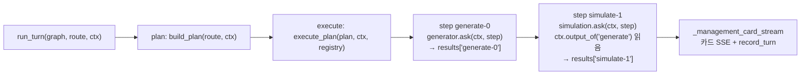

# S2 — 멀티스텝 오케스트레이션 (등록 + 블랙보드 executor) 설계

| | |
|---|---|
| Date | 2026-06-26 |
| Domain | 공통부 (cross-team) · 레퍼런스 구현은 orchestration core + management(🅱) |
| Branch | feat/chat-boeun |
| Status | Draft (설계 합의) |
| Slice | 에픽 §11 **S2** (`2026-06-26-e2e-chat-orchestration-plan-execute-design.md`) |

> ⚠️ 공통부 변경 — **DomainAgent 계약 시그니처가 바뀐다**(`ask(req)` → `ask(ctx, step)`).
> Planner·Executor·계약은 세 팀(simulation·management·generator) 공유 영역이므로 확정은 팀 합의가 필요하다
> (협업 규칙: 타 도메인 내부 import 금지, 교환은 계약으로만). 본 문서는 에픽의 **S2 슬라이스** 설계이며,
> 선행 S1(`2026-06-26-s1-plan-then-execute-orchestrator.md`)이 만든 `plan.py`·`planner.py`·`executor.py`·
> `turn.py`를 멀티스텝으로 확장한다.

---

## 1. 목표 (S2 정의)

S1이 만든 **단일 스텝** Plan-then-Execute 골격을 **멀티스텝 순차 집행**으로 확장한다. generator·simulation을
도메인 에이전트로 **등록**하고(매처 1줄·라우터 무수정), 스텝 간 산출을 **블랙보드 컨텍스트**로 전달해
`generate→simulate` 같은 결정론 멀티스텝 Plan이 E2E로 흐르게 한다.

### Definition of Done

복합/순차 의도(예: "시안 만들고 시뮬 돌려줘")가 **결정론 멀티스텝 Plan**으로 분해되어, generator·simulation
스텁 어댑터가 **블랙보드를 통해 산출을 주고받으며** 순차 집행되고, 기존 단일 도메인(management) 경로는
**회귀 0**이다. 각 스텝은 `assistant.chat.turn` 루트 트레이스 아래 자식 run으로 중첩된다.

### 범위 (In / Out)

**In**

1. generator·simulation **스텁 어댑터 + 매처** 등록(`bootstrap.py` 한 줄씩, 라우터 코드 무수정).
2. **멀티스텝 executor** — 블랙보드(`TurnContext`) 순차 집행.
3. **결정론 멀티스텝 `build_plan`** — 게이트 B 충족 시 nonzero 도메인을 정규 순서로 정렬해 멀티스텝 Plan.
4. **진입 게이트 §3 중 B조건만**(복합/순차).
5. **`policy.py` 신설** — 임계값·순차마커 단일 출처(하드코딩 제거).
6. **`PlanStep.id`** — 스텝 인스턴스 고유 키(`{action}-{index}`).
7. DomainAgent 계약을 **블랙보드 기반(`ask(ctx, step)`)** 으로 일반화.

**Out (뒷 슬라이스 소유)**

- 실제 generator 이미지 파이프라인 · 게이트 A(첨부) → **S3**.
- KPI 조건 게이트 · bounded replan 사이클 → **S4**.
- HITL `interrupt` · 신규 게재 집행 → **S5**.
- **LLM Planner**(`with_structured_output`) · 게이트 C(애매)·D(약신호) — LLM 분해가 전제라 후속.
- STM `checkpointer` → **M**.

---

## 2. 블랙보드 + 멀티스텝 executor

스텝 간 데이터 전달은 **블랙보드 컨텍스트**로 한다(선언적 ref·결과 체이닝 대신). 코어는 도메인 타입을
import하지 않고 generic 구조만 다룬다(순수성 유지).

### TurnContext (신규, 코어, 순수)

```python
@dataclass
class TurnContext:
    user_input: str
    attachments: tuple[Any, ...] = ()      # 자리만 — S3 멀티모달에서 채움
    results: dict[str, Any] = field(default_factory=dict)  # step.id -> output (점진 누적)

    def output_of(self, action: str) -> Any | None:
        # 역할 기반 읽기 — 해당 action의 "최신" 산출 반환(없으면 None).
        # 저장은 고유 step.id, 접근은 의미역. S4 replan(같은 action 반복) 시 최신값을 돌려준다.
        ...
```

### 스텝 인스턴스 고유 키

- `PlanStep`에 **`id: str`** 추가. `make_plan`이 **`{action}-{index}`** 로 결정론 부여(위치 기반·재현 가능).
- **`plan_hash`에는 id를 포함하지 않는다** — 해시는 `domain/action/inputs`만(순서는 이미 해시가 커버,
  id는 순서에서 파생되는 메타라 중복 산입 불필요). 즉 S1의 `compute_plan_hash` 로직·테스트는 무변경.
- 블랙보드 `results`는 **`step.id`로 키잉**(인스턴스 충돌 0). 어댑터는 생성된 id를 몰라도 되고
  `ctx.output_of(action)`로 역할 기반 접근.

### execute_plan (S1 단일 → 멀티스텝)

```python
async def execute_plan(plan, ctx: TurnContext, *, registry) -> Any:
    if not plan.steps:
        raise PlanExecutionError("빈 Plan")          # S1 그대로 fail-loud
    out = None
    for step in plan.steps:                          # 순차 — 루프 없음(DAG 선형)
        agent = registry.get(step.domain)
        if agent is None:
            raise PlanExecutionError(f"미등록 도메인 스텝: {step.domain}")  # fail-loud
        out = await agent.ask(ctx, step)
        ctx.results[step.id] = out                   # 블랙보드 누적
    return out                                        # 마지막 스텝 산출
```

- S1의 **"정확히 1스텝" 가드 → "1스텝 이상 순차"** 로 완화. **0스텝·미등록은 fail-loud 유지**.
- `run_turn`은 `ctx`를 만들어 그래프에 주입. `turn.py`의 plan·execute 노드는 ctx를 state로 들고 흐른다.



---

## 3. DomainAgent 계약 진화 + 스텁 어댑터 + 등록

### 계약 변경 (공통부 — 팀 합의 항목)

```python
class DomainAgent(Protocol):
    domain: str
    async def ask(self, ctx: TurnContext, step: PlanStep) -> Any: ...
```

- S1의 `ask(req)` → **`ask(ctx, step)`**. ctx로 블랙보드 접근, `step.inputs`로 자기 파라미터.
- **모든 도메인이 동일 계약**(management 포함). 분기 두 갈래(req vs ctx)를 만들지 않는다 — 단일 계약.

### management 어댑터 (회귀 0)

`ManagementDomainAgent.ask(ctx, step)`가 ctx/step → 기존 `AskRequest`로 **번역**한 뒤 기존 `_ask` 호출,
`AskResult`를 그대로 반환한다.

- `question = step.inputs.get("query") or ctx.user_input`.
- `ad_id`는 `ctx.output_of("simulate")` 등 블랙보드에서 끌어올 수 있으면 채우고, 없으면 기존대로 None.
- **S1 단일스텝 출력과 동일**(카드 SSE·관측 적재 `_management_card_stream` 재사용).

### generator / simulation 스텁 (결정론)

- **generator** — `{"ad_id": "stub-ad-<hash>", "candidates": [...]}` 결정론 반환(실 이미지 파이프라인=S3).
- **simulation** — `ctx.output_of("generate")["ad_id"]`를 **읽어** `{"simulation_id": ..., "kpi": {분포 더미}}`
  반환 → **블랙보드 핸드오프 실증**(실 KPI·게이트=S4).
- 스텁은 외부 LLM·DB 미접근(테스트 결정론·비용 0).

### 등록 (bootstrap.py — 라우터 무수정)

```python
router = Router([
    KeywordMatcher("management", MGMT_KEYWORDS),
    KeywordMatcher("generator", GEN_KEYWORDS),     # 신규 1줄
    KeywordMatcher("simulation", SIM_KEYWORDS),    # 신규 1줄
])
registry.register(ManagementDomainAgent(build_management_agent(settings)))
registry.register(GeneratorStubAgent())            # 신규 1줄
registry.register(SimulationStubAgent())           # 신규 1줄
```

- 키워드 집합은 `policy.py` 또는 bootstrap 상수. 도메인 소유 분리는 후속(YAGNI).

---

## 4. 결정론 멀티스텝 Planner + 진입 게이트 B + policy.py

### policy.py (단일 출처 — 하드코딩 제거)

```python
SEQUENTIAL_MARKERS: frozenset[str] = frozenset({"괜찮으면", "하고", "그다음", "그리고", "후에", "한 뒤"})
ROUTER_AMBIGUITY_MARGIN: float = 0.15              # routing.py에서 이관
PIPELINE_ORDER: tuple[str, ...] = ("generate", "simulate", "execute")  # 정규 도메인 순서
DOMAIN_TO_ACTION: dict[str, str] = {"generator": "generate", "simulation": "simulate", "management": "answer"}
```

- `routing.py`는 `ambiguous` 마진을 `policy.ROUTER_AMBIGUITY_MARGIN`에서 읽도록 수정(0.15 하드코딩 제거).

### 진입 게이트 — B조건만 구현

`route = Router.route(text)`, `nonzero = score>0 후보`일 때:

| 조건 | 술어 | S2 처리 |
|---|---|---|
| **B. 복합/순차** | `len(nonzero 도메인) >= 2` **또는** 순차마커(`policy.SEQUENTIAL_MARKERS`) 존재 | **멀티스텝 `build_plan`** |
| 명확 단일 | `len(nonzero)==1 && 첨부·마커 없음` | 결정론 단일스텝(S1 그대로) |
| score==0 | nonzero 없음 | CLIO 직답(Plan 없음) |

- **A(첨부)=S3, C(애매)·D(약신호)=후속** — C·D는 LLM Planner 진입이 목적인데 S2엔 LLM Planner가 없으므로
  도입하지 않는다(도입 시 결정론 경로로 잘못 새는 것을 막기 위해 **명시적으로 미구현**으로 둔다).

### build_plan (단일 → 멀티스텝)

```python
def build_plan(route, ctx) -> Plan:
    nonzero = [c for c in route.candidates if c.score > 0]
    sequential = any(m in ctx.user_input for m in policy.SEQUENTIAL_MARKERS)
    if len(nonzero) >= 2 or sequential:             # 게이트 B
        domains = {c.domain for c in nonzero}
        steps = [
            PlanStep(domain=_domain_for(action), action=action, inputs={"query": ctx.user_input})
            for action in policy.PIPELINE_ORDER
            if _domain_for(action) in domains
        ]
        return make_plan(steps)                      # PIPELINE_ORDER로 정렬된 멀티스텝
    step = PlanStep(domain=route.domain, action=policy.DOMAIN_TO_ACTION[route.domain], inputs={"query": ctx.user_input})
    return make_plan([step])                          # 단일(S1 동일)
```

- 멀티스텝도 `plan_hash`는 순서민감이라 그대로 적용(S1 `compute_plan_hash` 무변경).
- 순차마커만 있고 도메인이 1개로만 해석되면 → 해당 단일 도메인 멀티스텝이 안 나오므로 단일 스텝으로
  fallback(과생성 방지). 멀티스텝은 **PIPELINE_ORDER에 든 도메인이 2개 이상 매칭될 때만** 형성.

---

## 5. 추적 (LangSmith)

- `run_turn` 루트 `assistant.chat.turn` 유지(S1). 각 스텝은 자식 run **`assistant.plan.step.{action}`**.
- 그래프 `ainvoke` 한 번으로 트리 형성 — 멀티스텝이면 스텝 노드가 순차로 자식 run에 쌓인다.
- `tags=["assistant", domain]`, `LANGCHAIN_PROJECT=clickme` 유지. (CLIO raw SDK 추적 누락 제거는 T 슬라이스.)

---

## 6. 협업 / 리스크

- **DomainAgent 계약 변경(`ask(req)`→`ask(ctx, step)`)은 공통부** — 세 팀 공유. 합의 후 확정.
  management-local 레퍼런스(어댑터 번역) → contracts 승격 패턴(기존 멀티도메인 설계 재사용).
- 시그니처 변경이 **S1의 `turn.py`·`executor.py`·management 어댑터·관련 테스트**를 건드린다 → **회귀 0**
  검증 필수(`tests/orchestration/`·`tests/management/` 전체 통과).
- generator·simulation 팀은 S2에선 **스텁만** 제공받고, 실 `ask()`는 S3·S4에서 각자 채운다(계약은 동일).

---

## 7. 테스트 (성공 기준 → 실패 테스트)

1. **멀티스텝 디스패치 순서** — `generate→simulate` Plan이 등록 순서대로 집행, `ctx.results`에 둘 다 적재.
2. **블랙보드 핸드오프** — simulation 스텁이 `ctx.output_of("generate")["ad_id"]`를 읽어 결과에 반영.
3. **스텝 고유 키** — 같은 action 2회(인위적 멀티)면 `step.id`가 달라 results 충돌 없음 · `output_of`는 최신 반환.
4. **plan_hash 불변** — id 도입 후에도 `compute_plan_hash`는 domain/action/inputs만 반영(S1 테스트 그대로 통과).
5. **게이트 B** — nonzero 도메인 ≥ 2 **또는** 순차마커면 멀티스텝, 명확 단일은 단일 스텝(S1 회귀 0).
6. **단일 회귀 0** — 명확 management 질문이 기존과 동일 출력(`_management_card_stream` 카드·관측 동일).
7. **fail-loud** — 0스텝·미등록 도메인 스텝은 `PlanExecutionError`.
8. **등록 무수정** — generator·simulation 매처/에이전트 1줄 추가로 라우팅(라우터 코드 변경 0).
9. **policy 단일 출처** — routing.py가 `ROUTER_AMBIGUITY_MARGIN`을 policy에서 읽음(하드코딩 제거 확인).
10. **import 순수성** — `policy.py`·`TurnContext` 등 신규 코어가 `domain.*`를 직접 import 하지 않음.
11. **추적** — 멀티스텝 턴이 단일 루트 run으로 묶이고 `assistant.plan.step.{action}`이 순차 자식으로 중첩.

---

## Self-Review (작성자 체크)

- **스펙 커버리지** — 에픽 §11 **S2**(등록 + 멀티스텝 executor)와 LangGraph 표의 "registry 디스패치 일반화·
  executor 멀티스텝"을 다룬다. 게이트 A=S3, C·D·LLM Planner=후속, KPI 게이트·replan=S4, HITL=S5,
  STM=M으로 명시 분리(YAGNI).
- **Placeholder** — `TurnContext.output_of`·`build_plan` 본문은 설계 의도를 보이는 스케치이며 구현 계획에서
  완성. "TBD" 없음.
- **타입 정합** — `PlanStep(+id)`·`make_plan`(id 부여)·`compute_plan_hash`(id 비포함) → `TurnContext` →
  `execute_plan(plan, ctx, registry)` → `DomainAgent.ask(ctx, step)` → `build_plan(route, ctx)` 시그니처 일관.
  코어는 도메인 타입 미import(`Any`).
- **강건성** — ① 저장=고유 `step.id`, 접근=`output_of(action)` 최신(S4 replan 전방호환). ② executor는
  1스텝 이상 순차·0스텝/미등록 fail-loud(조용한 폴백 금지). ③ 게이트 C·D는 의도적 미구현(결정론 경로
  오용 방지). ④ 멀티스텝은 PIPELINE_ORDER 2개+ 매칭 시에만 형성(과생성 방지). ⑤ 임계·마커는 policy
  단일 출처.
- **회귀 안전** — 계약 시그니처 변경이 S1 자산을 건드리므로 §7-6(단일 회귀 0)·§7-4(plan_hash 불변)로 잠금.
