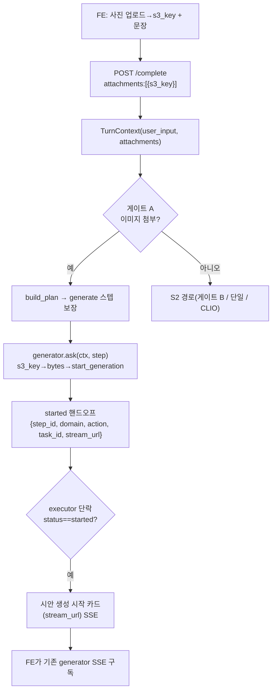

# S3 — 멀티모달 첨부 + generator 잡 핸드오프 설계

| | |
|---|---|
| Date | 2026-06-26 |
| Domain | 공통부(오케스트레이션 core) + generator(소유 어댑터) |
| Branch | feat/chat-boeun |
| Status | Draft (설계 합의) |
| Slice | 에픽 §11 **S3** (`2026-06-26-e2e-chat-orchestration-plan-execute-design.md`) |

> S2(`2026-06-26-s2-multistep-orchestration-design.md`)가 만든 `TurnContext`(블랙보드)·`PlanStep.id`·
> `ask(ctx, step)` 계약·게이트 B·`policy.py`를 전제로 한다. S3는 **게이트 A(첨부)** 와 **generator 실 어댑터**
> (S2 스텁 대체)를 추가한다. generator 어댑터는 generator 팀 소유(계약은 동일).

---

## 1. 목표 (S3 정의)

챗에 **제품 사진(s3_key)** 을 첨부해 "시안 만들어줘"라고 하면, 게이트 A로 Planner에 진입해 `generate`
스텝이 **실 generator 생성 잡을 트리거**하고, 챗은 진행을 구독할 **핸드오프 카드(stream_url)** 를 흘린다.

### Definition of Done

사진(s3_key) 첨부 + 생성 의도 → 게이트 A → `generate` 스텝이 실 `start_generation` 잡을 트리거 →
`status:"started"` 핸드오프 → 챗이 "시안 생성 시작" 카드(stream_url) SSE. management·S2 멀티스텝 경로 **회귀 0**.

> **명시 — S3는 "잡 시작(job start)"까지만 보장한다.** 실제 시안 5개 *완성* 은 보장하지 않는다(비동기 잡이
> 완료 후 기존 generator SSE로 전달). 즉 "generate 스텝 = 시안 산출"이 아니라 "generate 스텝 = 생성 잡
> 트리거 + 핸드오프"다.

### 범위 (In / Out)

**In**

1. `ChatRequest.attachments`(s3_key) 계약 + `TurnContext.attachments` 실사용(S2 placeholder 충족).
2. **게이트 A** — 첨부 이미지가 있으면 Planner 진입 + `generate` 스텝 보장(`score==0`이라도).
3. **generator 실 어댑터** — `s3_key → download_bytes → 최소 슬롯(문장+기본값) GenerationCreateRequest(CREATE)
   → start_generation` 트리거. S2 `GeneratorStubAgent` 대체.
4. **executor 단락(short-circuit)** — 스텝이 `status:"started"` 핸드오프를 반환하면 이후 스텝 미집행·종결.
5. **핸드오프 카드** — 챗이 `stream_url` 포함 SSE로 진행 구독을 유도(기존 generator SSE 재사용).

**Out (후속 슬라이스 소유)**

- **같은 턴 `generate→simulate` 비동기 재합류** → S4+ (잡 완료 후 ad_id로 simulate 재개).
- LLM 슬롯추출(파라미터 품질)·비전 분석으로 슬롯 유도 → 후속.
- 실 5시안 동기 await / KPI 조건 게이트·replan → S4.
- HITL `interrupt`·신규 게재 집행 → S5.
- 게이트 C(애매)·D(약신호) — LLM Planner 전제, 후속.

---

## 2. 멀티모달 계약

```python
# core/schemas.py — append-only(기존 무파손)
class Attachment(BaseModel):
    s3_key: str
    kind: Literal["image"] = "image"


class ChatRequest(BaseModel):
    ...
    attachments: list[Attachment] = Field(default_factory=list)
```

- `chat_complete`이 `TurnContext(user_input=last_message, attachments=tuple(body.attachments))` 구성 —
  S2의 `attachments` 자리를 실제로 채운다.
- 코어 순수성 — `TurnContext.attachments`는 `tuple[Any, ...]`라 도메인/스키마 타입에 의존하지 않는다(S2 그대로).
  `Attachment`는 전송 계층(`core/schemas`) 타입이고, 어댑터만 그 구조(`.s3_key`)를 안다.

---

## 3. 게이트 A (두 지점)

1. **chat.py `_should_plan`** — 첨부 이미지가 있으면 `route.score==0`이라도 Plan 경로(에픽 §3 A 우선).
   시그니처에 첨부 여부를 더한다: `_should_plan(route, registry, *, has_image)`.
   - `has_image and registry.get("generator") is not None` → Plan.
   - 그 외는 S2 규칙(`score>0 && 등록`) 유지.
2. **build_plan** — 첨부 있으면 `generate` 스텝을 Plan에 **보장**한다. 실제 S2 `build_plan(route, *, query)`는
   attachments를 받지 않으므로 **`attachments` 인자를 추가**하고 **`turn.py` plan_node가 `ctx.attachments`를
   넘기도록** 함께 수정한다(첨부면 `nonzero`에 generator 추가, 단일 fallback도 generator 우선).
   - 첨부 단독(복합/순차 신호 없음) → `[generate]` 단일 스텝.
   - 첨부 + 게이트 B(복합/순차, 예 "시안 만들고 시뮬 돌려줘") → `[generate, simulate]`(PIPELINE_ORDER).
     단, generate가 `started`를 반환하면 §5 executor 단락으로 **simulate는 집행되지 않는다**(S3 한계 명시).

---

## 4. generator 실 어댑터 (generator 소유 · bootstrap 등록)

S2 `GeneratorStubAgent`를 실 어댑터로 대체. 동일 계약 `ask(ctx, step)`.

```python
# domain/generator/.../chat_agent.py (generator 팀 소유)
class GeneratorDomainAgent:
    domain = "generator"

    async def ask(self, ctx, step):
        s3_key = _first_image_key(ctx.attachments)        # 없으면 텍스트-only 생성
        temp_key = None
        if s3_key:
            data = await download_bytes(s3_key)           # tools/storage/s3 (async, 공용)
            temp_key = await store_temp_image(data)       # 기존 인메모리 store 재사용(bridge, async)
        req = GenerationCreateRequest(
            mode=GenerationMode.CREATE,
            product_description=ctx.user_input or step.inputs.get("query", ""),
            product_name=_derive_product_name(ctx.user_input),   # 문장에서 추정/"상품"
            target_audience="전체",                                # 기본값(품질=후속 LLM)
            product_image_temp_key=temp_key,
        )
        generation_id = await start_generation(req)       # 기존 비동기 잡 → generation_id(str)
        return {
            "status": "started",
            "step_id": step.id,        # 예 "generate-1" — 재합류(S4)·카드·추적 상관용
            "domain": step.domain,     # "generator"
            "action": step.action,     # "generate"
            "task_id": generation_id,
            "stream_url": f"/api/generator/generations/{generation_id}/stream",
            "ad_id": None,             # 아직 없음(잡 완료 후 generator SSE로)
        }
```

- **s3_key → bytes → 기존 temp_key 브릿지** — generator 내부(`product_image_bytes` 소비)는 무변경.
  s3_key 계약은 챗 경계에서 충족하고, 어댑터가 다운로드해 기존 인메모리 store에 연결한다.
- **최소 슬롯 충족** — `product_description=user_input`, `product_name` 추정/"상품", `target_audience="전체"`로
  CREATE 검증 통과(파라미터 품질 향상은 후속 LLM 슬롯추출).
- 외부 모델 호출은 `start_generation`(기존)에 위임 → **테스트는 `start_generation`·`download_bytes`를
  monkeypatch**(결정론·비용 0).
- import 경계 — 어댑터는 generator 도메인 소유이므로 generator 내부 import 허용. **오케스트레이션 core
  (`core`·`plan`·`planner`·`executor`·`turn`)는 generator를 import하지 않는다**(등록은 bootstrap).

---

## 5. executor 단락 + 핸드오프 카드

### execute_plan 단락 규칙

```python
with _step_trace(step):              # 기존 S2
    out = await agent.ask(ctx, step)
ctx.results[step.id] = out           # 기존 S2 — 블랙보드 누적(remember() 없음)
if isinstance(out, dict) and out.get("status") == "started":
    return out          # 비동기 핸드오프 — 이후 스텝 미집행, 턴 종결
```

- 비동기 잡이 시작되면 동기 턴은 **그 지점에서 멈춘다**. 남은 스텝(예: simulate)은 잡 완료 후 재합류
  (S4+)에서 처리한다 — S3는 재합류를 구현하지 않는다(명시적 미구현).

### 출력 포맷 분기 (챗 plan 경로)

실제 S2 `generate()`는 plan 경로를 **`route.domain == "management"`로 잠가** 두었다(gen/sim 렌더는 S3+로 유보).
S3는 그 management 분기를 유지(`+ not has_image`)하고, **그 뒤·CLIO 앞에 generator 핸드오프 분기를 신설**한다
(management의 `_management_card_stream`은 `AskResult` 전용이라 핸드오프엔 재사용하지 않는다). 결과 타입 분기.

- **management** → `AskResult` → `_management_card_stream`/`compose_card`(기존, 회귀 0).
- **generator 핸드오프**(`status:"started"` dict) → **"시안 생성 시작" 핸드오프 카드** SSE(기존 `format_sse`
  envelope로 `stream_url`·`task_id` 포함). FE는 기존 generator SSE를 구독해 진행률·시안 결과를 받는다.
- 트리거된 잡엔 `session_id`+`plan_hash`를 metadata로 주입(추적 상관, 에픽 §6.4).



---

## 6. 추적 (LangSmith)

- `generate` 스텝 = 자식 run `assistant.plan.step.generate`(S2 규약). 트리거된 잡은 동기 트레이스에 완전
  중첩되지 않으므로 `session_id`+`plan_hash`로 상관(에픽 §6.4 한계·완화 그대로).
- 핸드오프 dict의 `step_id`도 잡 metadata에 실어 사후 추적·재합류 식별을 돕는다.

---

## 7. 테스트 (성공기준 → 실패테스트)

1. **계약** — `ChatRequest.attachments`가 파싱되고 `TurnContext.attachments`에 적재.
2. **게이트 A** — 첨부 이미지(키워드 score 0) → Plan 경로 + Plan에 `generate` 스텝 포함.
3. **generator 어댑터** — `download_bytes`·`start_generation` monkeypatch. s3_key → 최소 슬롯(`product_description=
   user_input`·`target_audience="전체"`)+이미지 temp_key로 `start_generation` 호출, `started` 핸드오프 반환
   (`step_id/domain/action/task_id/stream_url` 포함).
4. **executor 단락** — generate가 `started`면 반환 즉시 종결, 이후 스텝 agent.ask 미호출.
5. **첨부+simulate 미집행** — `[generate, simulate]` Plan에서 generate가 `started`면 **simulation.ask가
   호출되지 않음**(fake simulation 어댑터의 호출 카운트 0). S3 한계의 핵심 가드.
6. **핸드오프 카드** — generator 핸드오프 결과가 `stream_url`·`task_id` 포함 SSE로 흐름.
7. **회귀 0** — management 단일·S2 멀티스텝 스텁 경로 출력 동일(`compose_card`·블랙보드 핸드오프).
8. **import 순수성** — 오케스트레이션 core가 `domain.generator`를 직접 import 하지 않음(어댑터는 generator
   소유·bootstrap 등록만 예외).

---

## 8. 협업 / 리스크

- **generator 어댑터는 generator 팀 소유** — S2 스텁을 실 어댑터로 교체. 계약 `ask(ctx, step)`는 동일이라
  오케스트레이션 core·bootstrap 등록 한 줄 외 core 변경 없음.
- `ChatRequest.attachments`는 전송 계층 공통부(`core/schemas`) — append-only(기존 무파손).
- generator 내부 이미지 입력의 **s3_key 정식 전환**(스키마 주석 "추후 S3 전환")은 본 슬라이스에서 어댑터
  브릿지로 충족하되, generator 내부 `product_image_temp_key` → s3_key 정식화는 generator 팀 후속(YAGNI).
- 비동기 잡 진행률·실패는 기존 generator SSE 책임 — S3는 트리거·핸드오프까지.

---

## Self-Review (작성자 체크)

- **스펙 커버리지** — 에픽 §11 **S3**(멀티모달 첨부 + 챗→generator 이미지 경로 + 게이트 A)와 §8(멀티모달
  입력)을 다룬다. 같은 턴 비동기 재합류·KPI 게이트·replan=S4, HITL·집행=S5, LLM 슬롯추출=후속으로 명시 분리.
- **Placeholder** — `_derive_product_name`·핸드오프 카드 스키마는 구현 계획에서 확정. "TBD" 없음.
- **타입 정합** — `Attachment`/`ChatRequest.attachments` → `TurnContext.attachments`(S2) → `_should_plan(
  ..., has_image)` → `build_plan`(generate 보장) → `GeneratorDomainAgent.ask(ctx, step)` → `started` 핸드오프
  (`step_id/domain/action/task_id/stream_url/ad_id`) → `execute_plan` 단락 → 챗 출력 분기. 일관.
- **강건성** — ① S3는 **job start만 보장**(완성 비보장) 명시. ② 핸드오프는 self-describing(step_id/domain/
  action)으로 재합류·추적 전방호환. ③ executor는 `status:"started"`에서 단락(이후 스텝 미집행) — `[generate,
  simulate]`에서 simulate 미집행 테스트로 잠금. ④ s3_key→temp_key 브릿지로 generator 내부 무변경. ⑤
  최소 슬롯은 결정론, 품질은 후속 LLM과 분리.
- **회귀 안전** — management·S2 멀티스텝 경로 무변경(§7-7). core는 generator 미import(§7-8).
