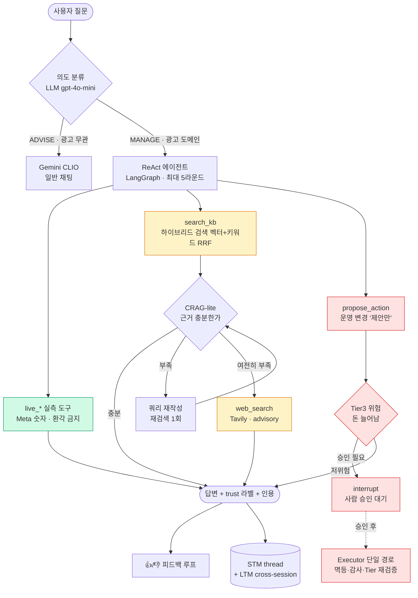
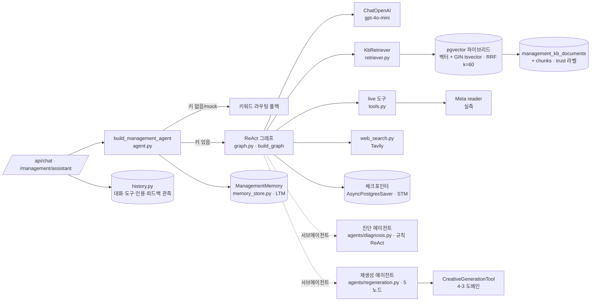
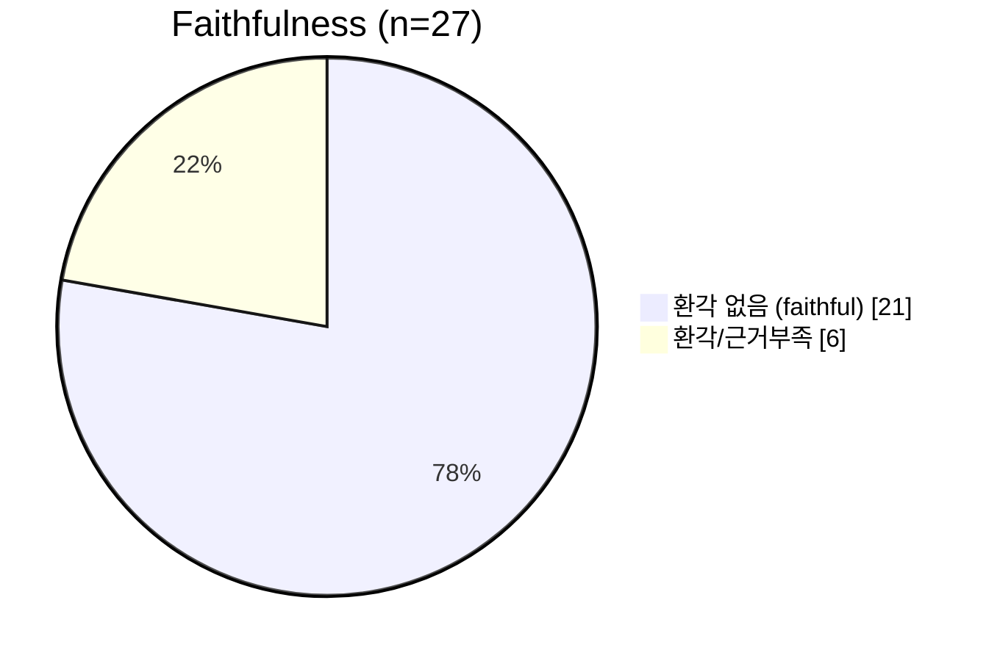
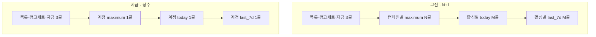

# 매니지먼트 에이전틱 RAG — 구조·지표

> 작성 2026-06-26 · 도메인 management(4-2) · 에이전틱 RAG 서브에이전트
> 이 문서의 모든 수치는 **출처와 검증 상태를 함께 표기**한다. 측정 파일로 입증되는 값만 "검증됨"으로 쓴다.

---

## 0. 데이터 출처 · 검증 상태 (먼저 읽기)

| 지표 | 값 | 출처 | 검증 |
| --- | --- | --- | --- |
| Faithfulness(환각 없음 비율) | **0.778** (21/27) | `evals/_faithfulness_results.jsonl` (6/24 22:47) | ✅ 결과 파일 |
| 평균 점수 / judge 표준편차 | 4.47/5 · std 0.28 | 같은 파일 | ✅ 결과 파일 |
| Meta 호출 수 절감 | 3+N+2M → 상수 ~6 | 본 브랜치 구현(`reader.py`·`management.py`) + 커밋 045d0b1 | ✅ 코드 |
| 검색 recall@3 0.93 | — | 같은 스펙 | ⚠️ **결과 파일 없음** |

> ⚠️ 스펙의 `recall@3 0.93`은 결과 파일에 없다. faithfulness는 저장된 단일 스냅샷 **0.778**만 검증되며, **before/after 개선 델타는 커밋 데이터로 재현되지 않는다**(judge 비결정성으로 회차별 ±2케이스 변동).

---

## 1. 에이전틱 RAG — 요청 한 건의 흐름



**핵심 원칙** — 숫자는 실측 도구(`live_*`)에서만, 해석·정책은 KB에서. 운영 변경은 제안만, 실행은 사람 승인 경로(Executor 단일 경로).

---

## 2. 컴포넌트 의존 구조



| 능력 | 상태 | 구현 |
| --- | --- | --- |
| 도구 사용·다단계 추론(ReAct) | ✅ | `graph.py` build_graph |
| 검색 여부 능동 판단 | ✅ | 에이전트가 도구 선택 |
| 검색 품질 자기교정(CRAG-lite) | ✅ | `_grade_kb` + 재작성·재검색 |
| 행동(answer 넘어 실행·HITL) | ✅ | `propose_action` → interrupt → Executor |
| 단기+장기 기억(영속) | ✅ | 체크포인터(STM) + ManagementMemory(LTM) |
| 근거·신뢰도(trust)·환각 방지 | ✅ | trust 라벨(system_backed/advisory/reference) |
| 측정·피드백 루프 | ✅ | `history.py` + evals |

### 2-1. 영속 계층 — 어느 컴포넌트가 어느 테이블에 쓰나 (2026-06-26 정리 반영)

| 컴포넌트 | 영속 위치 | 비고 |
| --- | --- | --- |
| KB 검색·평가·피드백 | `management_kb_documents` · `_chunks` · `_eval_cases` · `_feedback` | 하이브리드 검색·골든셋·👍👎 |
| 관측(`history.py`) | `management_chat_sessions` · `_messages` · `_agent_runs` | 대화·도구·인용·HITL |
| 장기기억(LTM) | `management_user_memory` | 세션 넘는 선호·결정 |
| 단기기억(STM) | `checkpoints` · `checkpoint_*` (LangGraph) | thread 상태·HITL 재개 |
| 거버넌스(제안→승인→실행) | `management_audit_events` · `management_idempotency_keys` | **감사·멱등만** 영속 |
| 제안·승인·실행·에스컬레이션 본 레코드 | **(인메모리)** | 미영속 — 미사용 테이블 제거(026) |
| 재생성 잡(REGEN 서브에이전트) | `management_regeneration_jobs` | 비동기 크리에이티브 재생성 잡 상태 |
| 외부연동·캠페인 | `management_meta_connections` · `management_created_campaigns` · `management_campaign_kpi_overrides` | 연결(암호화 토큰)·생성 캠페인·KPI 보정 |

> **2026-06-26 테이블 정리** — management 전용 테이블에 `management_` 접두사 정합(028), 미사용 거버넌스 4종(`action_proposals`·`approvals`·`execution_runs`·`remediation_escalations`)·죽은/orphan 6종 제거(026·027). 거버넌스 본 레코드는 인메모리로 동작하고 감사 흔적만 `management_audit_events`가 담당한다. 테이블별 역할 상세 → [매니지먼트 테이블 역할](2026-06-26-매니지먼트-테이블-역할.md).

---

## 3. 환각률 측정 — Faithfulness (검증됨)

> 측정 대상 = OpenAI gpt-4o-mini 에이전트 / judge = Gemini Flash ×3 평균(과반 투표).
> n=27 · `evals/_faithfulness_results.jsonl`.

### 3-1. 환각 없음 비율 — 21 / 27 = 0.778



### 3-2. 점수 분포 (1~5, 5=환각 전혀 없음)

```
5.0        ███████████████████  19  (70.4%)
4.0–4.9    ███                   3  (11.1%)
3.0–3.9    ██                    2  ( 7.4%)
2.0–2.9    ███                   3  (11.1%)
                                 ── 평균 4.47 / 5 · std 0.28
```

### 3-3. judge 합의도 (3회 투표)

```
3/3 일치   ████████████████████  20   강한 확신
2/3 합의   █                      1
1/3        ███                    3   약한 근거(환각 판정)
0/3        ███                    3   명백한 환각/근거부족
```

### 3-4. 남은 약점 6건 (환각 판정 케이스)

| # | 질문 | 점수 | 투표 | 약점 유형 |
| --- | --- | --- | --- | --- |
| 3 | 광고가 거절됐는데 어떻게 대응해야 해 | 2.0 | 0/3 | KB 근거 부족(거절 대응) |
| 13 | 예산이 너무 빨리 소진돼 | 2.0 | 0/3 | 예산소진 조치 근거 부족 |
| 26 | 증상별 권고 조치 알려줘 | 2.67 | 0/3 | 과대해석 |
| 27 | 성과 좋은 캠페인은 어떤 조치를 해 | 3.0 | 1/3 | 불완전 |
| 10 | CPM이 자꾸 오르는데 왜 그래 | 3.67 | 1/3 | CPM 원인 근거 결여 |
| 18 | 구매의도는 어떻게 측정해 | 4.0 | 1/3 | 미묘한 오류 |

> 약점은 대부분 **KB 갭**(거절 대응·CPM 원인·예산 페이스 조치). 모델보다 지식 보강이 다음 레버.

---

## 4. 리소스 절감 — Meta 호출 N+1 제거 (검증됨)

> 본 브랜치 구현(커밋 `045d0b1`). 캠페인 목록 조회를 **계정 단위 `level=campaign` insights**로 묶어 캠페인 수와 무관한 상수 호출로 전환.

### 4-1. 1회 새로고침 호출 수 (캠페인 20개 · 활성 10개 기준)

```
그전  ███████████████████████████████████████████  43   (3 + N + 2M)
지금  ██████                                         6   (상수)
                                                     ── 약 86% ↓
```

### 4-2. 호출 구조 변화



| 구분 | 그전 | 지금 | 효과 |
| --- | --- | --- | --- |
| 1회 새로고침 | 3 + N + 2M | 상수 ~6 | 캠페인 수와 무관 |
| 시간당(120초 폴링) | 약 1,290 | 약 180 | **Meta 쿼터 ~86% 절감** |
| 백엔드 동시 outbound 연결 | N개 | 1개 | 소켓·TLS 부담 N분의 1 |
| 화면·계산·표시값 | — | 동일 | 회귀 0 |

→ 삭제 후 자동 리로드·폴링이 모두 상수 호출이 되어 **"Meta 요청 한도" 배너 회피**. 데이터·정확도는 불변(스냅샷 일관성은 오히려 향상 — 모든 캠페인이 동일 쿼리 윈도로 측정).

---

## 5. 개선 여정 (작업 내역 — 수치 검증은 §3)

> 측정 기반 개선 루프를 돌렸다. 단, **before 시점 결과 파일이 저장되지 않아 개선 델타(before/after %)는 커밋 데이터로 재현되지 않는다.** 검증되는 수치는 §3의 단일 스냅샷 **0.778**뿐이다.

| 단계 | 한 일 | 결과 |
| --- | --- | --- |
| 베이스라인 | 엄격 judge 측정 → 과엄격·행동버그 식별 | 진단 |
| Grounding 게이트 | 시도 → 개선 없음 | **revert** (음성 결과도 결과) |
| judge 재보정 + 라우팅 수정 | 환각 중심 채점 + 개념질문→search_kb·live 덤프 금지 | 적용 |
| 재측정(저장됨) | n=27 · judge×3 | **0.778** ✅ `_faithfulness_results.jsonl` |

**개선 델타를 입증하려면** — before 시점(라우팅 수정 전) 코드로 eval을 한 번 더 돌려 결과 파일을 남기고, 현재(0.778)와 동일 judge·동일 n으로 비교해야 한다. 지금은 단일 스냅샷만 신뢰 가능.

---

## 부록 — 파일 참조

| 컴포넌트 | 파일 |
| --- | --- |
| ReAct 그래프 · CRAG-lite · HITL | `backend/domain/management/assistant/graph.py` |
| 진입점(폴백 분기) | `backend/domain/management/assistant/agent.py` |
| 하이브리드 검색 | `backend/domain/management/assistant/retriever.py` |
| 실측 도구 | `backend/domain/management/assistant/tools.py` |
| 진단/재생성 서브에이전트 | `backend/domain/management/agents/diagnosis.py`·`regeneration.py` |
| 환각률 측정 코드·결과 | `backend/domain/management/evals/faithfulness_eval.py`·`_faithfulness_results.jsonl` |
| Meta 배치 insights(리소스 절감) | `backend/domain/management/adapters/meta/reader.py` · `backend/api/routers/management.py` |
