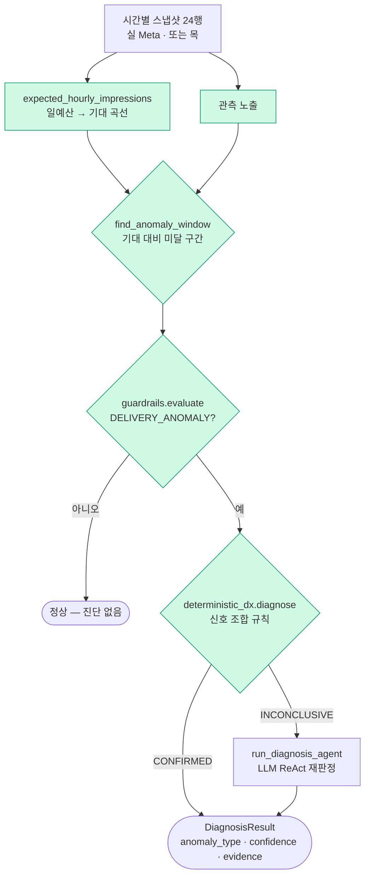
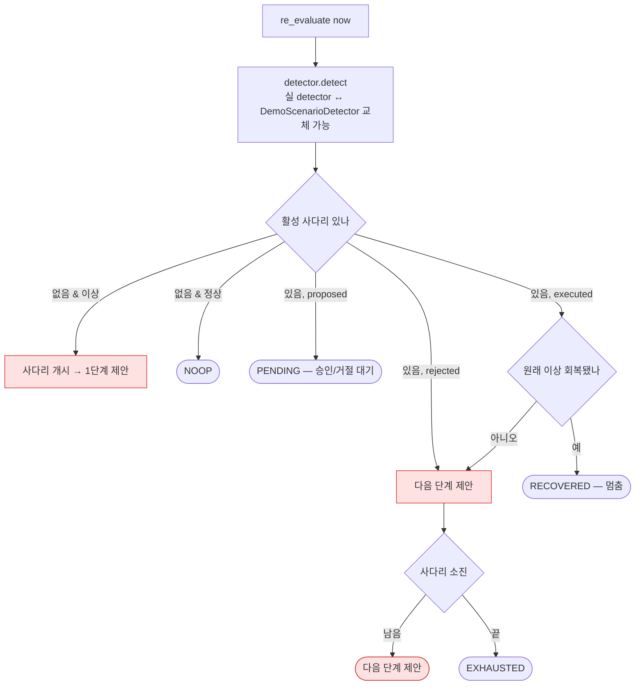

# 매니지먼트 이상감지 — 구조·실데이터/목 경계

> 작성 2026-06-26 · 도메인 management(4-2) · 게재 이상감지 + 시간축 에스컬레이션
> 핵심 — 탐지 로직·판정 기준은 **데이터 출처와 무관(source-agnostic)**. 실 Meta든 목이든 같은 기준이 돈다.

---

## 0. 한 장 요약

```
시간별 스냅샷(실 Meta or 목)
   │
   ▼  expected_hourly_impressions(일예산)  ← 기대 곡선
   ├─ 관측 vs 기대 → find_anomaly_window   ← 미달 구간
   ▼
가드레일(guardrails.evaluate) → DELIVERY_ANOMALY?
   │ 아니오 → 정상
   ▼ 예
결정론 진단(deterministic_dx.diagnose) ── CONFIRMED → DiagnosisResult
   │ INCONCLUSIVE
   ▼
진단 에이전트(run_diagnosis_agent, LLM ReAct)
```

`run_detection(tenant, campaign_id, snapshots, …)`는 **`snapshots`만 입력**으로 받는다(`detection_service.py:37`). 그래서 동일 로직이 **실데이터·목 양쪽**에 그대로 적용된다.

---

## 1. 탐지 파이프라인



> 초록 = 데이터 출처와 무관하게 도는 순수 로직(실데이터 그대로 적용 가능).

---

## 2. 판정 기준 (deterministic_dx)

| 이상 유형 | 판정 기준 | 출처 |
| --- | --- | --- |
| **REVIEW_DELAY** | 이상 구간 노출 0 → 이후 회복 & 마지막 공백 < 12시 | 0 노출 후 회복 패턴 |
| **REVIEW_REJECTED** | 이상 구간 전체 노출 0 (회복 없음) | 게재 중단 패턴 |
| **BID_LOSS** | 구간 평균 CPM ≥ **CPM 앵커 × 1.3** & 예산 남는데 노출 급감 | `meta-data-sources.md §5` 신호 매핑 |
| **AUDIENCE_TOO_NARROW** | 마지막 빈도 ≥ **3.0** (조기 포화) | 동상 |
| **SCHEDULE_GAP / 기타** | 규칙으로 못 가름 → INCONCLUSIVE → 진단 에이전트 | — |

> **CPM 앵커**는 실측 벤치마크(system_backed, 예 ₩10,800) → 그 ×1.3 배율과 빈도 3.0은 **도메인 신호 매핑 기준**(`detection/deterministic_dx.py:16-17`). 즉 *실 이상 데이터셋으로 통계 캘리브한 값이 아니라, 실측 앵커 + 도메인 임계*다. 발표 시 "도메인 근거로 잡은 임계"로 표현(과장 금지).

---

## 3. 실데이터 vs 목 — 무엇이 어디서 도나

| 부분 | 현재 | 실데이터? | 왜 |
| --- | --- | --- | --- |
| **캠페인 상세** (`/campaigns/{id}`) | 실 Meta hourly → 기대곡선 → `find_anomaly_window` → 진단 (`management.py:1217·1257·1261`) | ✅ **실데이터** | 연결 계정의 실제 시간별 게재에 기준 적용 |
| 탐지 로직·기준 | `run_detection`·`deterministic_dx` | ✅ source-agnostic | 입력만 스냅샷, 출처 무관 |
| `/run?fault=…` 데모 | `MockAdPlatform` 고장 주입 | ❌ 목 | 라이브 계정엔 BID_LOSS 등 *원할 때* 안 생김 |
| 에스컬레이션 사다리 (`re_evaluate`) | `DemoScenarioDetector` 목, `InMemoryEscalationStore` | ❌ 목 | 이상→조치→**회복** 시연엔 통제 가능한 고장이 필요 |
| eval 게이트 | `run_detection_for_fault` 목 | ❌ 목 | 결정론 재현(키 없이도) |

**목이어야만 하는 두 이유**
1. **온디맨드 이상이 없음** — 건강한 라이브 계정은 원하는 순간에 고장 나지 않는다.
2. **장중 부분 데이터** — 실 캠페인은 현재 시각까지만 시간행이 있어, 24시간 기대곡선과 직접 비교하면 *아직 안 온 시간*이 이상으로 오탐될 수 있다(풀 파이프라인 실데이터 적용 시 "경과 시간까지만 비교" 가드 필요).

---

## 4. 시간축 에스컬레이션 사다리 (re_evaluate)



**사다리 매트릭스** (파괴도 낮은 조치 먼저, 마지막은 항상 CREATE_CAMPAIGN)

| 이상 유형 | 사다리 |
| --- | --- |
| QUALITY_DEGRADED · REVIEW_REJECTED | REPLACE_CREATIVE → CREATE_CAMPAIGN |
| AUDIENCE_TOO_NARROW | EXPAND_AUDIENCE → CHANGE_BID_STRATEGY → CREATE_CAMPAIGN |
| BID_LOSS | CHANGE_BID_STRATEGY → EXPAND_AUDIENCE → CREATE_CAMPAIGN |

> **불변식** — Tier3은 항상 건별 사람 승인(HITL). "자동"은 *다음 단계 제안의 자동 생성*만 뜻하며, 승인 없는 집행은 없다. 회복 판정 = 재탐지로 원래 anomaly가 현재 목록에서 사라졌는지.
> **영속** — 사다리 상태·제안·승인·실행 본 레코드는 **인메모리**(`InMemoryEscalationStore`). 감사 흔적만 `management_audit_events`에 남는다(테이블 정리 026 반영). 데모 시연엔 인메모리가 더 견고(DB 의존 0).

---

## 5. 발표 서사 (3단, 정직)

1. **기준** — "도메인 신호 매핑 + 실측 CPM 앵커로 이상치 임계를 잡았다." → §2 표 제시.
2. **실데이터 적용** — "연결된 실 캠페인의 실제 시간별 게재에 그 기준을 적용 → 기대 vs 실측 · 이상 구간 · 진단." (`/campaigns/{id}`, 이미 작동) *건강하면 '이상 없음'이 나오는데, 그게 기준이 실데이터에서 오작동 안 함을 보여주는 정상 결과.*
3. **시나리오 재현(목)** — "이상→조치→회복의 시간축 사다리는 통제된 고장 주입으로 시연 — 라이브 계정은 원할 때 깨지지 않으므로."

---

## 6. 정직성 노트

- **임계 출처** — `deterministic_dx`의 CPM×1.3·빈도 3.0은 도메인 기준(신호 매핑) + 실측 앵커. "실 이상 데이터셋 통계 캘리브"가 아니므로 그렇게 주장하지 말 것.
- **목의 정당성** — 시나리오 재현·회복 시연은 통제 고장이 본질적으로 필요(라이브 비가용). 숨기지 말고 "통제된 재현"으로 명시.
- **실데이터 확장 시** — 풀 `run_detection`을 실 hourly에 태우려면 "경과 시간까지만 비교" 가드를 넣어 부분-데이터 오탐을 막아야 함.

---

## 부록 — 파일 참조

| 컴포넌트 | 파일 |
| --- | --- |
| 탐지 파이프라인 | `backend/domain/management/detection/service/detection_service.py` |
| 판정 기준(결정론) | `backend/domain/management/detection/deterministic_dx.py` |
| 기대 곡선·이상 구간 | `backend/domain/management/detection/exposure_model.py` |
| 가드레일 | `backend/domain/management/detection/guardrails.py` |
| 진단 에이전트(LLM) | `backend/domain/management/agents/diagnosis.py` · `diagnosis_llm.py` |
| 에스컬레이션 사다리 | `backend/domain/management/escalation.py` |
| 데모 detector(목) | `backend/domain/management/escalation_demo.py` |
| 실 탐지(캠페인 상세) | `backend/api/routers/management.py` (campaign detail) |
| 실 탐지 프로브(스크립트) | `backend/scripts/meta_metrics_probe.py` |
